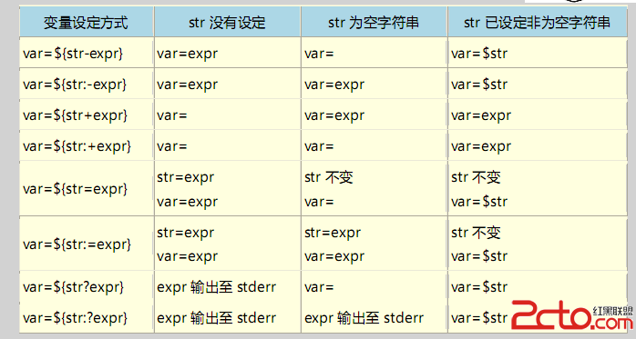

# 6.7 字符串处理
本节我们来学习 bash shell 编程的第七部分字符串处理，内容包括:
1. 字符串的切片，基于位置取子穿
2. 基于模式取子串
3. 查找和替换
4. 大小写转换
5. 变量赋值操作

bash 中获取变量的值可以使用 `${VARIABLE}`,字符串操作就是在此基础上的扩展。

## 1. 字符串操作
### 1.1 字符串切片：
`${string:offset:length}`
- 作用: 正向切片，offset 表示偏移量，lenght 表示截取的字符个数
- 注意: bash 中字符串和数组一样，下标从 0 开始

`${string: -length}`
- 作用: 反向切片，取尾部的指定个数的字符，`-` 前必须要有空格

```bash
tao@hp:shell$ a=01234

tao@hp:shell$ echo ${a:1:2}
12

tao@hp:shell$ echo ${a: -2}
34

```

### 1.2 基于模式取子串
需要特别注意的是，查找的关键字 word 只支持通配符

|语法|作用|
|:---|:---|
|`${variable#*word}`|自左而右，删除字符开始至第一次出现word|
|`${variable##*word}`|自左而右，删除字符开始至最后一次出现word|
|`${variable%word*}`|自右而左，删除第一次出现word至字串尾部|
|`${variable%%world*}`|自右而左，删除最后一次出现word至字串尾部|


```bash
tao@hp:~$ file='/var/log/messages'
tao@hp:~$ echo ${file#*/}
var/log/messages
tao@hp:~$ echo ${file##*/}
messages
tao@hp:~$ echo ${file%/*}
/var/log
tao@hp:~$ echo ${file%%/*}


tao@hp:~$ phonenumber='010-110-8'
tao@hp:~$ echo ${phonenumber%%-*}
010

tao@hp:~$ echo ${phonenumber%-*}
010-110

tao@hp:~$ echo ${phonenumber##*-}
8
```

### 1.3 查找替换：
需要注意的是，pattern 只能使用通配符，省略 `/SUBSTI` 时表示查找删除

|语法|作用|
|:---|:---|
|`${var/PATTERN/SUBSTI}`|查找，第一次被 PATTERN 匹配到的字符串，替换为SUBSTI|
|`${var//PATTERN/SUBSTI}`|查找，所有被PATTERN 匹配到的字符串，替换为SUBSTI|
|`${var/#PATTERN/SUBSTI}`|查找，行首被PATTERN 匹配到的字符串，替换为SUBSTI|
|`${var/%PATTERN/SUBSTI}`|查找，行尾被PATTERN 匹配到的字符串，替换为SUBSTI|


### 1.4 大小写转换：
- `${variable^^}`: 小-->大
- `${variable,,}`: 大-->小


## 2. 变量赋值操作
|变量设定方式|param 没有设定|param 为空|param 为非空字符串|
|: ---|: ---|: ---|: ---|
|var=${param-word}|var=word|var=|var=$param|
|var=${param:-word}|var=word|var=word|var=$param|
|var=${param+word}|var=|var=word|var=word|
|var=${param:+word}|var=|var=|var=word|
|var=${param=word}|var=word <br> param=word|var= <br> param=|var=$param <br> param 不变|
|var=${param:=word}|var=word <br> param=word|var=word <br> param=word|var=$param <br> param 不变|
|var=${param?word}|word 输出到stderr|var=|var=$param|
|var=${param:?word}|word 输出到stderr|word 输出到stderr|var=$param|



```bash
# 为脚本使用配置文件，并确保某变量有可用值的方式
variable=${variable:-default vaule}
```
