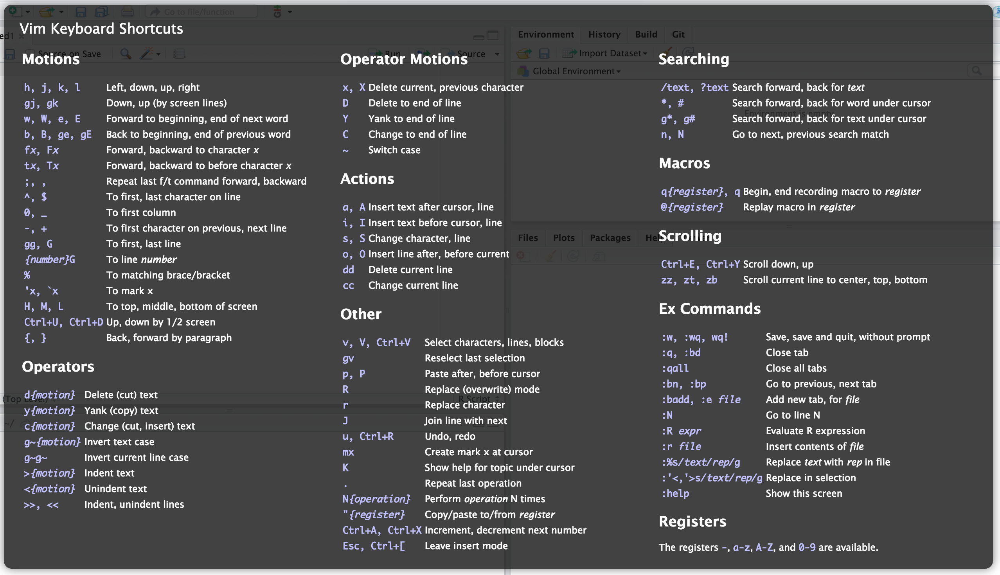
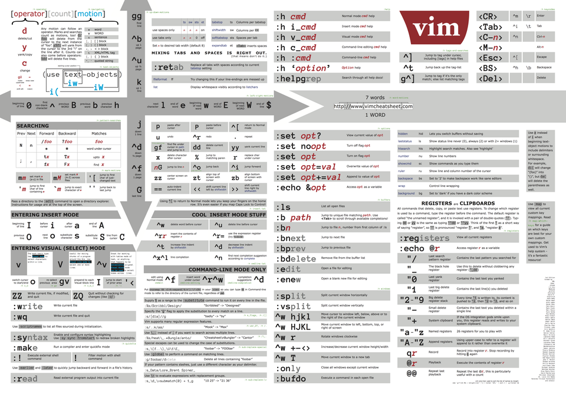
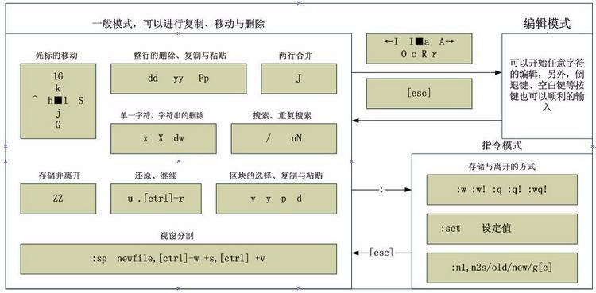

# 7.1 vim深入讲解
vim(vi) 是 Linux 下最常用的文本编辑器，拥有众多快捷键和命令，学习曲线很陡峭。下面两幅图是 vim 快捷键的便捷记忆图。本节内容如下:
1. 认识 vim 的三种模式
    - 编辑模式又称命令模式
    - 输入模式
    - 末行模式
2. vim 编辑模式的常用命令
3. vim 末行模式的使用
5. vim 高级用法
6. vim 配置







## 1. 认识 vim 的三种模式
### 1.1 vim 三种模式的转换
默认使用 vim 打开文件后会进入编辑模式，编辑模式下不能使用退格和键盘直接修改文本内容，但是可以使用特定命令实现编辑功能。输入模式即我们通常可以使用键盘直接文本的模式，而末行模式，则是我们可以在 vim 的最后一行输入 vim 特有的命令实现编辑功能。三种模式使用特定命令可以实现转换。

#### 编辑模式 --> 输入模式
|命令|作用|
|:---|:---|
|i|insert, 在光标所在处输入|
|a|append，在光标在处后方输入|
|o|在光标所在处的下方打开一个新行|
|I|在光标所在行的行首输入|
|A|在光标所在行的行尾输入|
|O|在光标所在处的上方打开一个新行|


#### 其他的模式转换
2. 编辑模式 --> 末行模式: `:`
1. 输入模式 --> 编辑模式: `ESC`
2. 末行模式 --> 编辑模式: `ESC`
4. 末行模式与输入模式不能直接转换


### 1.2 使用 vin 打开和关闭文件
#### 使用 vim 打开文件
`vim [OPTION] .... FILE .....`
- `+#`：打开文件后，光标定位到 `#` 行，不加行号默认定位到最后一行
- `+/PATTERN`: 打开文件后，光标处于 pattern 匹配到的第一行


#### vim 中保存文件
- `ZZ`: 在编辑模式下直接保存并退出；
- `:q `: 退出
- `:w`： 保存
- `:q!`: 强制退出，不保存此前的编辑操作
- `:wq`: 保存并退出；
- `:x `: 保存并退出；
- `:w /PATH/TO/SOMEFILE`


## 2. vim 编辑模式的常用命令
vim 编辑模式下的常用命令大体可以分为分为光标跳转，编辑命令，其他命令三类。大多数命令都可以使用类似 `nCOMMAND` 的方式，即在命令前加上数字，表示重复执行该命令 n 次。对于能这样使用的命令，下面将直接标注为 `nCOMMANDA`。

Linux 有个vim自带的练习教程叫 `vimtutor`

### 2.1 光标跳转
所谓光标跳转即让光标从当前位置迅速跳转到特定位置，包括字符跳转，单词跳转，行首行尾跳转，行间跳转，句间跳转，段落跳转。

#### 字符间跳转
`nCOMMAND` 跳转由 n 指定的个数的字符；
|命令|作用|
|:---|:---|
|h|左，支持 nCOMMAND|
|j|下，支持 nCOMMAND|
|k|上，支持 nCOMMAND|
|l|右，支持 nCOMMAND|
    

#### 单词间跳转
|命令|作用|
|:---|:---|
`nCOMMAND` 跳转由 n 指定的个数的单词
|w|下一个单词的词首，支持nCOMMAND|
|e|当前或后一个单词的词尾，支持nCOMMAND|
|b|当前或前一个单词的词首，支持nCOMMAND|

    
#### 行首行尾跳转
|命令|作用|
|:---|:---|
|^|跳转至行首的第一个非空白字符|
|0|跳转至行首|
|$|跳转至行尾|

#### 行间跳转
|命令|作用|
|:---|:---|
|nG|跳转至由 n 指定的行|
|1G, gg|跳转到第一行|
|G|跳转到最后一行|

#### 句间跳转：
- `)`: 跳转到句尾
- `(`: 跳转到句首
    
#### 段间跳转
- `}`: 跳转到段尾
- `{`: 跳转到段首


### 2.2 编辑命令
编辑命令指删除特定字词句，这部分命令可结合跳转命令实现批量修改。

#### 字符编辑：
|命令|作用|
|:---|:---|
|x|删除光标所在处的字符|
|nx|删除光标所在处起始的 n 个字符|
|xp|交换光标所在处的字符与其后面的字符的位置|
|rCHAR| replace,使用 CHAR 字符替换光标所在处的字符|
        
#### 删除命令
`d` delete 删除命令，可结合光标跳转字符，实现范围删除，支持 nCOMMANDA
|命令|作用|
|:---|:---|
|d$|删除光标到行尾|
|d^|删除光标到非空白首部|
|dw|删除光标到下个词词首|
|ndw|删除光标到下 n 个词词首|
|de|删除光标到当前词词尾|
|db|删除光标到当前词词首|
|dd|删除光标所在处的行|
|ndd|删除光标所处的行起始的共 n 行|

#### 粘贴命令：
`p` (put, paste) 粘贴命令
|命令|作用|
|:---|:---|
|p|缓冲区中的内容如果为整行，则粘贴在当前光标所在行的下方；否则，则粘贴至当前光标所在处的后方|
|P|缓冲区中的内容如果为整行，则粘贴在当前光标所在行的上方；否则，则粘贴至当前光标所在处的前方|

#### 复制命令
`y` yank 复制命令，工作行为相似于d命令；
|命令|作用|
|:---|:---|
|y$|复制光标到行尾|
|y^|复制光标到非空白首部|
|yw|复制光标到下个词词首|
|nyw|复制除光标到下 n 个词词首|
|ye|复制光标到当前词词尾|
|yb|复制光标到当前词词首|
|yy|复制光标所在处的行|
|nyy|复制除光标所处的行起始的共 n 行|
            
#### 改变命令
`c` change 改变命令，功能同 `d` 命令，操作完成后会从编辑模式切换到输入模式
|命令|作用|
|:---|:---|
|c$|删除光标到行尾|
|c^|删除光标到非空白首部|
|cw|删除光标到下个词词首|
|ncw|删除光标到下 n 个词词首|
|ce|删除光标到当前词词尾|
|cb|删除光标到当前词词首|
|cd|删除光标所在处的行|
|ncc|删除光标所处的行起始的共 n 行|

### 2.3 其它编辑操作
其他编辑操作如下几个命名

#### 可视化模式
- `v`: 按字符选定；
- `V`: 按行选定；
- 附注: 结合编辑命令 `d, c, y`，实现选定区域的删除复制
        
#### 撤销和重复执行
|命令|作用|
|:---|:---|
|`u`|undo 撤销此前的操作|
|`#u`|撤销此前的`#`个操作|
|`Ctrl+r`| recover 撤销此前的撤销|
|`.`|重复执行前一个编辑操作|
       


## 3. vim 末行模式的使用
vim末行模式，是 vim 内建的命令行接口，通过地址定界和之前介绍的编辑命令，可实现批量操作。所谓地址定界即选择出特定范围的行。除此之外 vim 还能实现保存，查找，替换等诸多功能。
        
### 3.1 地址定界
地址定界的格式是 `:start_pos[,end_pos]`，位置的表示可以是数字也可以是正则表达式，具有多种表达方式
|位置表示|作用|
|:---|:---|
|#|数字，表示特定的第#行，例如5即第5行|
|#,#|指定行范围，左侧为起始行，右侧为结束行|
|#,+#|：指定行范围，左侧为超始行绝对编号，右侧为相对左侧行号的偏移量；例如：3,+7|
|.|表示当前行|
|$|最后一行|
|.,$-1|当前行到倒数第二行|
|1,$|第一行到最后一行，即全文|
|%|全文，等同于 1,$| 
|/pattern/|从光标所在处起始向文件尾部第一次被模式所匹配到的行, 例如/first/,$|
|/pat1/,/pat2/|从光标所在处起始，第一次由pat1匹配到的行开始，至第一次由pat2匹配到的行结束之间的所有行|
                
地址定界可同编辑命令 `d,y,c`一同使用，实现编辑操作。例如 `:1,20d` 删除 1 到 20 行。

### 3.2 保存和加载
末行模式中保存和加载其他文件的常用命令如下
|命令|作用|
|:---|:---|
|`:q `|退出|
|`:w`|保存|
|`:q!`|强制退出，不保存此前的编辑操|
|`:wq`|保存并退出|
|`:x `|保存并退出|
|`:w /PATH/TO/SOMEFILE`|将文本保存至指定的文件中，可通过地址定界选定保存的文本范围|
|`:r /PATH/FROM/SOMEFILE`|将指定的文件中的文本读取并插入至指定位置|
                
### 3.3 查找
通过 `/ 或 ？` 命令，可在 vim 中实现查找
- `/PATTERN`：从当前光标所在处向文件尾部查找能够被当前模式匹配到的所有字符串；
- `?PATTERN`：从当前光标所在处向文件首部查找能够被当前模式匹配到的所有字符串；

查找后，可使用 `n`，`N` 查找下一个
- `n`：查找下一个，表示与命令方向相同的下一个；
- `N`：查找上一个，表示与命令方向相反的上一个；
                
### 3.4 查找并替换
通过 `s` 命令可实现替换功能  
`:地址定界s/要查找的内容/替换为的内容/修饰符`
- 要查找的内容：可使用正则表达式；
- 替换为的内容：不能使用下则表达式，但可以引用；
- 修饰符：
    - `i`：忽略大小写；
    - `g`：全局替换，意味着一行中如果匹配到多次，则均替换；
- 分隔符`/`:可把替换为其它非常用字符`@ 或 #`：
    - `s@@@`
    - `s###`
- 引用:
    - 如果"要查找的内容"部分在模式中使用了分组符号可在"替换为的内容"中使用后向引用；
    - 直接引用查找模式匹配到的全部文本，要使用&符号；
- 示例:
    - `%s@\<t\([[:alpha:]]\+\)\>@T\1@g`: 将以小写 t 开头的字母替换为大写 T开头
    - `%s@\<t[[:alpha:]]\+\>@&er@g`: 在所哟单词后面加上 er

```           
练习：
# 1. 复制/etc/grub2.cfg文件至/tmp目录中，用查找替换命令删除/tmp/grub2.cfg文件中以空白字符开头的行的行首的空白字符；
> %s@^[[:space:]]\+@@ 
> %s/^[[:space:]]\+//

# 2. 复制/etc/rc.d/init.d/functions文件至/tmp目录中，用查找替换命令为/tmp/functions文件的每个以空白字符开头的行的行首加上#；
> %s@^[[:space:]]\+[^[:space:]]@#&@g
> %s/^([[:space:]]\+)/#&/g

# 3. 为/tmp/grub2.cfg文件的前三行的行首加上#号；
> 1,3s/.*/#&/g

# 4. 将/etc/yum.repos.d/CentOS-Base.repo文件中所有的enabled=0替换为enabled=1，所有gpgcheck=0替换为gpgcheck=1；
> %s/\(enabled\|gpgcheck\)=0/\1=1/g
> %s@\(enabled\|gpgcheck\)=0@\1=1@g
```


## 4. vim 高级用法
### 多文件模式
`vim /tmp/{file1，file2}`
- `:next`: 切换至下一文件
- `:prev`: 切换至上一个文件
- `:last`: 切换至最后一个文件
- `:first`: 切换至第一个文件
- `:wall`：保存所有
- `:qall`：退出所有
- `wqall`: 保存并退出所有

### 窗口分割
`vim -o FILE1 FILE2....` 水平分割  
`vim -O FILE1 FILE2....` 垂直分割  
- `Ctrl + w` 松开后，加箭头: 切换窗口
- `Ctrl + w, s`: 水平分割当前文件
- `Ctrl + w, v`: 垂直分割当前文件

## 5. vim 配置
vim 的配置可在末行模式下设定，此时仅对当前vim进程有效；要想永久有效可编辑配置文件
1. 全局配置：`/etc/vimrc`
2. 用户个人配置：`～/.vimrc`

#### vim 中常见的配置选项
|作用|配置|
|:---|:---|
|行号|显示：set number, 简写为set nu <br>取消显示：set nomber, set nonu|
|括号匹配高亮|匹配：set showmatch, set sm<br>取消：set nosm|
|自动缩进|启用：set ai<br>禁用：set noai|
|高亮搜索|启用：set  hlsearch<br>禁用：set nohlsearch|
|语法高亮|启用：syntax on<br>禁用：syntax off| 
|忽略字符大小写|启用：set ic<br>禁用：set noic|