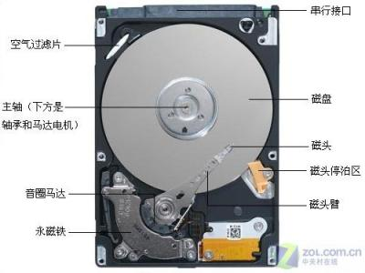

# 8.1 磁盘使用与文件系统管理介绍
磁盘是计算的五大基本组件之一，主要提供持久化存储功能。Linux 为管理磁盘，便于程序员扩展系统和用户读写磁盘数据，将磁盘管理划分成了多个层次。如同网络协议栈一样，各层级之间通过协议和接口进行规范，这样就能便于管理和扩展。这是编程领域常用的技术手段，如果两个层次无法衔接，就添加一个中间层。Linux 的磁盘管理大体分成了以下几个层次

```
--------------------------------
|      虚拟文件系统              | ---> 提供了读写文件的统一接口
-------------------------------
|      特定的文件系统            | ---> 抽象了对不同设备驱动程序的调用接口
-------------------------------- ---> 磁盘设备文件，提供了管理磁盘的统一接口
|      磁盘设备的驱动程序         | ---> 将对磁盘适配器的机器指令转换为系统调用
--------------------------------   
|磁盘          |        磁盘适配器|   
---------------------------------
```

本节我们将围绕此结构，逐层讲解各层，内容如下:
1. 抽象层次的理解
2. 磁盘的组成和磁盘分区
3. 文件系统的组成

## 1. 抽象层次的理解
磁盘通常包括两个部分，一是存储数据的磁盘，另一个是与磁盘相对应的磁盘适配器，适配器相当于磁盘的控制单元，可以接收指令，并控制磁盘的寻道和读写。适配器的指令是与硬件相关的简单机器指令，与生产磁盘的硬件厂商密切相关。

所以为管理磁盘，包括其他硬件设备，都需要生产厂商提供与操作系统相适应的驱动程序。需要强调的是硬件的驱动程序是硬件厂商提供的，而不是内核开发者提供，因为硬件设备千千万万，只有厂商才最清楚他们生产的硬件设备是什么样。因此磁盘管理从发送与磁盘相关的机器指令变成了调用了相应驱动程序的系统调用。

我们知道越底层的东西越丑陋，也就越难用，想想如果你想创建一个文件，竟然需要写一个程序去调用系统调用，该多么费劲。文件系统的作用就是帮助我们管理磁盘，我们只需要调用文件系统的一条命令，就可以读写文件，而不用管数据到写到了磁盘何处。

此处还有一个问题，Linux 上的文件系统有很多，他们调用 api 可能都不一样，想想如果换一个文件系统，创建文件的函数就变了，大概编写 touch 命令的程序员就疯了，他要为所有文件系统都写一段代码。因此Linux 为统一管理所有的文件系统，创建了虚拟文件系统 vfs。可以将 vfs 理解为一个统一的框架，比如创建文件的命令就叫做 writer，此时不管什么文件系统，都要将其创建文件的调用向 vfs 注册。这样当我们调用 writer 时，vfs 就知道特定的文件系统创建文件的函数是什么，进而由 vfs 调用该函数创建文件。

因此，程序员只要调用 vfs 提供的标准接口就可以在所有的文件系统上读写文件了。了解了整个层次结构，接下来我们就来了解各个层次结构的细节。

## 1. 磁盘
分区的作用就是将一个完成的磁盘，划分成逻辑上独立的管理单元。由于磁盘特殊的寻址特点，因此分区与磁盘的硬件结构密切相关。所以我们先来了解磁盘的硬件结构，然后再来看磁盘是如何分区的。
### 1.1 磁盘的类型
磁盘按照生产工艺可以分为机械硬盘，固态硬盘，按照接口类型可以分为
1. IDE(ata)：并口，133MB/s
2. SCSI：并口，Ultrascsi320, 320MB/S, UltraSCSI640, 640MB/S
3. SATA：串口，6gbps
4. SAS：串口，6gbps
5. USB：串口，480MB/s

并口指的是同一线缆可以接多块设备；串口则是同一线缆只可以接一个设备。对于电脑的硬件架构，大家可以找不用的台式机拆开看看，这样就会有更加具体的理解。由于机械硬盘更容易理解，我们首先来看机械式硬盘的硬件结构


### 1.2 机械式硬盘的硬件结构


### 1.3 磁盘的分区结构


上面几幅图是机械硬盘结构和分区的示意图，如果不能理解可以参阅此博客 https://blog.csdn.net/u012758088/article/details/76668465  Centos5-6 中分区是以柱面为单位进行划分，而 Centos7 中分区划分的基本单位则是扇区

### 1.4 磁盘设备文件
#### 设备文件的主次设备号
Linux 中一切接文件，所有设备都组成了设备文件,放置在 `/dev` 目录下，用于关联至设备的驱动程序，是设备的访问入口，能利用 Linux 中的统一接口进行管理。设备有主，次设备号
- major：主设备号，区分设备类型；用于标明设备所需要的驱动程序；
- minor：次设备号，区分同种类型下的不同的设备；是特定设备的访问入口；

#### 设备文件命令规则
设备文件有统一的命名规则，由ICANN 规定，具体的规则如下；由于设备被检测到的顺序是可能发生变化的，设备的设备文件可能发生变化，因此除了设备文件名，Linux 还提供了其他引用设备的方式，包括卷标，UUID。
1. centos5
  - IDE: `/dev/hd#`
  - SCSI,SATA,SAS,USB: `/dev/sd[a-z]#`
    - `[a-z]`: 表示不同设备,为不同设备被检测到的次序
    - `#`: 表示不同设备上的不同分区
2. centos>=6: 统一使用 `/dev/sd[a-z]#`

```bash
> /dev/nvme0n1p2 # 设备文件
# 259, 2 即为设备的主次设备号
brw-rw----. 1 root disk 259, 2 7月  17 09:16 /dev/nvme0n1p2
```


### 1.4 磁盘分区格式
分区格式顾名思义就是如何在磁盘上表示分区。分区格式除了会影响分区的划分，还会影响操作系统的开机启动方式。早期的分区格式是 MBR，这种分区格式有分区数量和磁盘大小有限制，对于超出范围的磁盘容量无法识别。GPT 是最新的磁盘分区技术，比 MBR 更复杂，但是已经没有了 MBR 的种种限制
#### MBR
  

MBR 是 Master Boot Record 的简称。如图，MBR 是磁盘的的第一个扇区，它包括如下三个部分
1. 446bytes：包含了 bootloader 开机启动程序，用于引导启动操作系统
2. 64bytes：分区表，每16bytes标识一个分区，一共只能有4个分区，其中又一个可作为扩展分区，用于创建其他逻辑分区；
	- 主分区和扩展分区的标识：1-4
	- 逻辑分区：5+
3. 2bytes：MBR区域的有效性标识；55AA为有效；

#### GPT
GPT 暂时我也不是很清楚，大家可以参考此片博文 https://blog.csdn.net/diaoxuesong/article/details/9406015。过段时间会补充此部分，请稍等。

## 2. 文件系统
内核级文件系统由内核提供文件系统驱动和用户空间的文件系统管理工具组成。因为 ext4 文件系统相对容易理解，此处我们 ext4 文件系统为列，讲解文件系统的基本原理

### 2.1 ext4 组成部分

1. block
2. inode
3. inode表
4. inode bitmap, block bitmap
5. 块组
6. superblock
7. 块组描述符表(GDT)

### 2.2 文件查找过程

### 2.3 链接文件
链接文件值访问同一个文件不同路径，有硬链接和软链接之分
#### 硬链接


- 硬链接：指向同一个inode的多个文件路径；
- 特性：
  - 目录不支持硬链接；
  - 硬链接不能跨文件系统；
  - 创建硬链接会增加inode引用计数；
- 创建： `ln  src  link_file`

#### 符号链接


- 符号链接：指向一个文件路径的另一个文件路径；
- 特性：
	- 符号链接与文件是两人个各自独立的文件，各有自己的inode；对原文件创建符号链接不会增加引用计数；
	- 支持对目录创建符号链接，可以跨文件系统；
	- 删除符号链接文件不影响原文件；但删除原文件，符号指定的路径即不存在，此时会变成无效链接；
  - 符号链接文件的大小是其指定的文件的路径字符串的字节数；
- 创建：`ln -s  src link_file`

#### ln
`ln [-s] source dest`:
- 作用: 创建链接文件
- 选项: `-s` 创建软链接，默认创建硬链接

### 2.4 文件管理操作
1. 文件被删除：
    - inode被标记为空闲，此inode指向的磁盘块被标记为空闲；
    - 如果inode被引用了多次，且此次删除未使得其引用计数降低为的话，这意味着文件被删除仅删除了一个访问路径；
2. 文件复制：
    - 创建一个新文件，并原文件中数据在新文件指向的磁盘块中再写一次的过程；
3. 文件移动：
    - 在同一个分区移到：移动文件仅是改变了文件访问路径；
    - 跨分区移到：在新分区创建文件，把数据复制过去，删除原分区数据；

### 2.5 文件系统挂载

### 2.6 日志文件系统

### 2.7 vfs 虚拟文件系统
