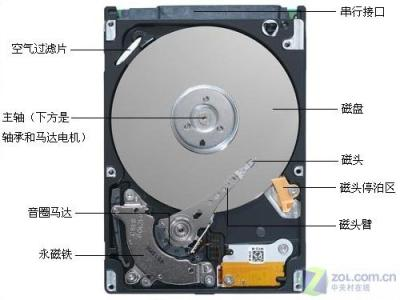
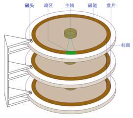
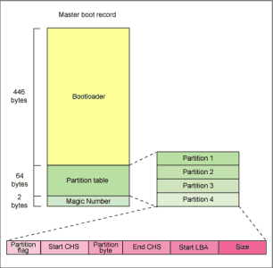

# 8.1 磁盘使用与文件系统管理介绍
磁盘是计算的五大基本组件之一，主要提供持久化存储功能。本节主讲磁盘，将包含以下内容:
1. 磁盘的类型
2. 机械式磁盘的基本组件和原理
3. 磁盘设备文件的功用和命名方式
4. MBR 磁盘分区格式
5. GPT 磁盘分区格式
6. 使用 fdisk 命令对磁盘进行分区

## 1. 磁盘的类型
所为磁盘的类型指代的是不同的生产工艺，能够提供不同级别的读写速率。按照出现的时间从早到晚，大体可以分为如下几种类型:
1. IDE(ata)：并口，133MB/s
2. SCSI：并口，Ultrascsi320, 320MB/S, UltraSCSI640, 640MB/S
3. SATA：串口，6gbps
4. SAS：串口，6gbps
5. USB：串口，480MB/s

所谓并口即同一线缆可以接多块设备；串口即同一线缆只可以接一个设备。从磁盘内部组成，又可以将硬盘分为机械硬盘，固态硬盘两种类型。


## 2. 机械式硬盘的基本组件和原理
#### 磁盘的物理结构


#### 磁盘的分区结构


Centos5 中分区是以柱面为单位进行划分，Centos6-7 中则以扇区为基本单位

## 3. 磁盘设备文件的功用和命名方式
```
> ll /dev/nvme0n1p2
brw-rw----. 1 root disk 259, 2 7月  16 08:55 /dev/nvme0n1p2
```
Linux 设备文件位于 `/dev` 目录下，用于关联至设备的驱动程序，是设备的访问入口，上述的 259， 2 为设备文件的设备号

#### 设备号
- major：主设备号，区分设备类型；用于标明设备所需要的驱动程序；
- minor：次设备号，区分同种类型下的不同的设备；是特定设备的访问入口；

#### 命名方式
设备文件有统一的命名规则，由ICANN 规定
1. centos5
  - IDE: `/dev/hd#`
  - SCSI,SATA,SAS,USB: `/dev/sd[a-z]#`
    - `[a-z]`: 表示不同设备,为不同设备被检测到的次序
    - `#`: 表示不同设备上的不同分区
2. centos>=6: 统一使用 `/dev/sd[a-z]#`

由于设备被检测到的顺序是可能发生变化的，因此设备的设备文件可能发生变化，除了设备文件名，Linux 还提供了其他引用设备的方式，包括
1. 设备文件名
2. 卷标
3. UUID

#### mknod命令
`mknod  [OPTION]...  NAME  TYPE  [MAJOR  MINOR]`
- 作用: 可用于手动创建字符或块设备文件
- 选项: `-m MODE`：创建后的设备文件的访问权限


## 4. MBR 磁盘分区格式

MBR 是 Master Boot Record 的简称，是磁盘的的第一个扇区，包括如下三个部分
1. 446bytes：bootloader, 程序，引导启动操作系统的程序；
2. 64bytes：分区表，每16bytes标识一个分区，一共只能有4个分区，其中又一个可作为扩展分区，用于创建其他逻辑分区；
	- 主分区和扩展分区的标识：1-4
	- 逻辑分区：5+
3. 2bytes：MBR区域的有效性标识；55AA为有效；

## 5. GPT 磁盘分区格式
关于 GPT 磁盘分区格式，大家可以参考此片博文 https://blog.csdn.net/diaoxuesong/article/details/9406015

## 6. 使用 fdisk 命令对磁盘进行分区
fdisk提供了一个交互式接口来管理分区，它有许多子命令，分别用于不同的管理功能；所有的操作均在内存中完成，没有直接同步到磁盘；直到使用w命令保存至磁盘上。fdisk 命令的使用方式如下

#### 查看磁盘的分区信息：
`fdisk -l [-u] [device...]`
- 作用: 列出指定磁盘设备上的分区情况，默认列出所有磁盘设备的分区情况
- 参数:
  - `-u`: 通过 UUID 指定磁盘设备
  - `device`: 通过 设备文件名指定磁盘设备

`cat  /proc/partitions`
- 作用: 查看分区信息

#### 管理分区
`fdisk  device`
- 作用: 管理分区，进入 fdisk 交互式管理界面

```bash
# fdisk 使用示例
> fdisk /dev/nvme0n1
WARNING: fdisk GPT support is currently new, and therefore in an experimental phase. Use at your own discretion.
欢迎使用 fdisk (util-linux 2.23.2)。

更改将停留在内存中，直到您决定将更改写入磁盘。
使用写入命令前请三思。


命令(输入 m 获取帮助)：m
命令操作
   d   删除已有分区
   g   create a new empty GPT partition table
   G   create an IRIX (SGI) partition table
   l   列出所有的分区类型
   m   查看帮助信息
   n   创建新分区
   o   create a new empty DOS partition table
   p   显示现有分区信息
   q   不保存并退出
   s   create a new empty Sun disklabel
   t   修改分区类型
   v   verify the partition table
   w   保存并退出
   x   extra functionality (experts only)
```

需要注意的是在已经分区并且已经挂载其中某个分区的磁盘设备上创建的新分区，内核可能在创建完成后无法直接识别；需要通知内核强制重读磁盘分区表，可使用如下命令
1. CentOS 5：`partprobe [device]`
2. CentOS 6,7：`partx, kpartx`
    - `partx -a [device]`
    - `kpartx -af [device]`

#### 分区创建的其他工具
`parted`

`sfdisk`  
