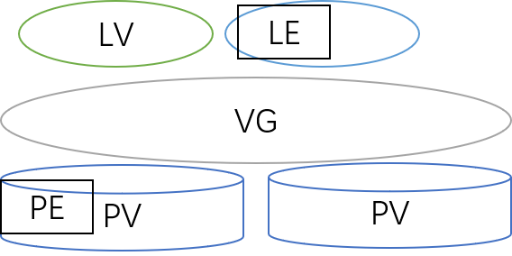

# 9.2 Linux中实现LVM逻辑卷与快照
LVM(Logical Volumn Manager) 逻辑卷，是将一个或多个底层块设备组织一个逻辑的工具。逻辑卷可以在使用过程中动态扩大和收缩，而不影响已经存在的文件。Centos7 默认安装下，会自动将磁盘组织成逻辑卷。本节我们就来介绍如何使用逻辑卷，将包含如下内容
1. LVM 简介
2. LVM 的创建和管理

## 1. LVM 的简介
我们知道普通分区一旦确定之后便不能更改大小，想扩大或缩减分区，只能删除分区然后重新创建，但这势必会影响到分区上已经存在的文件。LVM 则是在物理设备(分区)的基础上添加了一层逻辑层，以达到可以动态更改容量的目的。对于那些实现无法确定磁盘使用量的情况，LVM 提供了很大的便利。但是额外的逻辑层使得 LVM 在数据恢复上变的更加困难。因此觉得LVM好的和感觉差的差不多对半开。

#### LVM 物理结构
LVM 的物理结构如下图所示
1. 每个物理设备首先被组织成 PV(Physical Volume)
2. 多个 PV 合并组成 VG(Volume Group) 逻辑卷组，统一进行管理，VG 可以动态增加和删除 PV 以扩大或收缩容量
3. PE(Physical Extent) 是 VG 容量分配的基本单元
4. LV(Logical Volume) 包含特定数量的 PE，构成逻辑上的分区，可动态调整包含的PE 数，以达到动态调整分区容量的目录；包含在 LV 中的PE 称为 LE



#### LVM 创建过程
因此逻辑卷的创建，首先需要将物理设备创建为 PV，将多个 PV 创建为 VG，然后在 VG 的基础上创建 LV，LV 即是可以用来创建文件系统并挂载使用的逻辑分区。整个过程即 `pv --> vg --> lv`。LVM 由内核模块 dm, device mapper(设备映射组件)提供。下面是 pv,vg,lv 一众命令的概览。
|作用|PV|VG|LV|
|:---|:---|:---|:---|
|创建|pvcreate|vgcreate|lvcreate|
|显示|pvdisplay|vgdisplay|lvdisplay|
|简要显示|pvs|vgs|lvs|
|删除|pvremove|vgremove|lvremove|
|降低容量||vgreduce|lvreduce|
|添加容量||vgextend|lvextend|
|搜索|pvscan|vgscan|lvscan|


### LV 的设备文件
一个逻辑卷 LV 的设备有三个，其中两个是便于访问的软连接
1. `/dev/dm-#`: LV 实际上的设备文件
2. `/dev/VG_NAME/LV_NAME`: 指向 `dm-#` 的软连接
3. `/dev/mapper/VG_NAME-LV_NAME`: 指向 `dm-#` 的软连接

## 2. LVM 管理
下面我们开始学习pv，vg，lv 一众命令
### 2.1 PV 管理
`pvs|pvdisplays [pv_device]`
- 作用: 显示系统上所有 pv 的基本信息
- `pv_device`: pv 所在设备的设备文件名，显示特定 PV 信息；可选，默认显示所有 PV

`pvcreate /dev/DEVICE`
- 作用: 创建 PV

`pvremove pv_device`
- 作用: 删除 PV
- pv_device: pv 所在设备的设备文件名

### 2.2 VG 管理
`vgs|vgdisplays [vg_name]`
- 作用: 显示系统上所有 vg 的基本信息
- vg_name: 卷组名，可选，默认显示所有卷组

`vgcreate  [-s #] vg_name  pv_device....`
- 作用: 创建卷组
- `-s`: 指定PE 大小，默认4M，可用单位 kKmMgGtTpPeE
- `vg_name`: 卷组名
- `pv_device`: pv 所在设备，可多个

`vgextend  vg_name  pv_device....`
- 作用: 向 vg 添加 pv

`vgreduce  vg_name  pv_device....`
- 作用: 从 vg 删除 pv

`vgremove  vg_name`
- 作用: 删除整个卷组


### 2.3 LV 管理
lv 的扩大或缩减不仅要调整 lv 自身大小，还需要调整 lv 上的文件系统大小。
#### lv 创建和删除
`lvs|lvdisplays [lv_device]`
- 作用: 显示系统上所有 lv 的基本信息
- lv_device: 逻辑卷lv 的设备文件；可选，默认显示所有 lv

`lvcreate -L #[mMgGtT] -n lv_name vg_name`:
- 作用: 在特定卷组内创建 lv
- `-L`: 指定 lv 的大小
- `-n`: 指定 lv 的名称

`lvremove /dev/VG_NAME/LV_NAME`
- 作用: 删除 lv
- 附注: 删除前需先卸载文件系统

#### 扩展逻辑卷：
扩展逻辑卷，首先需要调整逻辑卷大小，然后需要调整文件系统大小，相关命令如下

`lvextend -L [+]#[mMgGtT]  /dev/VG_NAME/LV_NAME`
- 作用: 扩展逻辑卷容量
- `-L`: 指定逻辑卷大小，`+` 表示增加多少，没有`+`直接指定变更后的总大小
- eg:
    - `lvextend -L 4G /dev/myvg/mylv`
    - `lvextend -L +2G /dev/myvg/mylv`

`resize2fs  /dev/myvg/mylv [size]`
- 作用: 调整文件系统大小
- `size`: 指定调整后大小，默认使用所有分区空间，单位有mMgGtT

#### 缩减逻辑卷
缩减逻辑卷很危险，必需离线操作，大体上需要经过如下步骤:
1. 先确定缩减后的目标大小；并确保对应的目标逻辑卷大小中有足够的空间可容纳原有所有数据；
2. 卸载文件系统: `umount /dev/VG_NAME/LV_NAME`
3. 文件系统强制检测: `e2fsck -f`
4. 缩减文件系统大小: `resize2fs DEVICE #`
5. 缩减逻辑卷大小: `lvreduce -L [-]#[mMgGtT]  /dev/VG_NAME/LV_NAME`
6. 重新挂载文件系统: `mount`

`lvreduce -L [-]#[mMgGtT]  /dev/VG_NAME/LV_NAME`
- 作用: 缩减逻辑卷容量
- `-L`: 指定逻辑卷大小，`-` 表示减少多少，没有`-`直接指定变更后的总大小

#### 创建快照卷：
`lvcreate -L #[mMgGtT] -p r -s -n 快照卷  原卷`
- 作用: 创建 lv 的快照卷
- `-L #[mMgGtT]`: 指定快照卷大小
- `-n`: 指定快照卷名称
- `-s`: 指明创建快照卷
- `-p r`: 设置只读
- 注意：快照卷是对某逻辑卷进行的，因此必须跟目标逻辑卷在同一个卷组中；无须指明卷组；

## 练习
```
练习1：创建一个至少有两个PV组成的大小为20G的名为testvg的VG；要求PE大小为16MB, 而后在卷组中创建大小为5G的逻辑卷testlv；挂载至/users目录；

练习2： 新建用户archlinux，要求其家目录为/users/archlinux，而后su切换至archlinux用户，复制/etc/pam.d目录至自己的家目录；

练习3：扩展testlv至7G，要求archlinux用户的文件不能丢失；

练习4：收缩testlv至3G，要求archlinux用户的文件不能丢失；

练习5：对testlv创建快照，并尝试基于快照备份数据，验正快照的功能；
```
