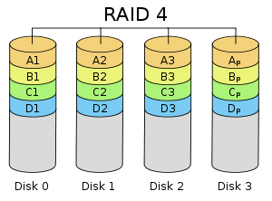

# 9.1 Linux RAID
RAID 全称叫廉价冗余磁盘阵列（Redundant Array of Inexpensive Disks)，后因磁盘不再廉价， RAID 咨询委员会将其改名为独立磁盘冗余阵列(Redundant Array of Independent Disks)。其设计初衷是为了将多个容量较小、相对廉价的磁盘进行有机组合，从而以较低的成本获得与昂贵大容量磁盘相当的容量、性能、可靠性。RAID 主要利用**数据条带、镜像和数据校验技术**来获取高性能、可靠性、容错能力和扩展性。根据运用或组合运用这三种技术的策略和架构，可以把 RAID 分为不同的等级，以满足不同数据应用的需求。本节我们学习的核心就是来了解 RAID 各个等级，包括如下内容
1. RAID 概述
2. RAID 各等级的组织结构和特性
3. 软件RAID的实现

## 1. RAID 概述
从实现角度看， RAID 主要分为软 RAID、硬 RAID 以及软硬混合 RAID 三种。软 RAID 所有功能均有操作系统和 CPU 来完成。，没有独立的 RAID 控制 / 处理芯片和 I/O 处理芯片，效率自然最低。硬 RAID 配备了专门的 RAID 控制 / 处理芯片和 I/O 处理芯片以及阵列缓冲，不占用 CPU 资源，但成本很高。生长环境中则主要以硬 RAID为主。

RAID 中主要有三个关键概念和技术：镜像（ Mirroring ）、数据条带（ Data Stripping ）和数据校验（ Data parity ）。

镜像，将数据复制到多个磁盘，一方面可以提高可靠性，另一方面可并发从两个或多个副本读取数据来提高读性能。显而易见，镜像的写性能要稍低， 确保数据正确地写到多个磁盘需要更多的时间消耗。

数据条带，将数据分片保存在多个不同的磁盘，多个数据分片共同组成一个完整数据副本，这与镜像的多个副本是不同的，它通常用于性能考虑。数据条带具有更高的并发粒度，当访问数据时，可以同时对位于不同磁盘上数据进行读写操作， 从而获得非常可观的 I/O 性能提升 。

数据校验，利用冗余数据进行数据错误检测和修复，冗余数据通常采用海明码、异或操作等算法来计算获得。利用校验功能，可以很大程度上提高磁盘阵列的可靠性、鲁棒性和容错能力。不过，数据校验需要从多处读取数据并进行计算和对比，会影响系统性能。

不同等级的 RAID 采用一个或多个以上的三种技术，来获得不同的数据可靠性、可用性和 I/O 性能。至于设计何种 RAID （甚至新的等级或类型）或采用何种模式的 RAID ，需要在深入理解系统需求的前提下进行合理选择，综合评估可靠性、性能和成本来进行折中的选择。

## 2. RAID 等级
在实际应用领域中使用最多的 RAID 等级是 RAID0 、 RAID1 、 RAID4 、 RAID5 、RAID10 、JBOD。接下来将逐一介绍这几个 RAID 等级

### 2.1 RAID0
RAID0 又称条带，将数据分片保存在多个不同的磁盘，以获取读写性能的提升。其组织结构如下图所示，我们以竖向排列的磁盘表示条带。


### 2.2 RAID1
RAID0 又称镜像，多个磁盘保存了数据的相同副本，通过冗余提供高的容错能力。其组织结构如下图所示，我们以横向排列的磁盘表示镜像，以与条带显示区分，介绍 RAID10 时更容易理解。


### 2.3 RAID10
RAID10 指的是，先将磁盘两两分组组成 RAID1,然后将 RAID1 组织成RAID0。其组织结构如下图所示，数据先分片，在冗余保存。


### 2.4 RAID4
RAID4 指的是有一块专门作为校验的磁盘，剩余磁盘组织成 RAID0，由校验盘提供冗余容错能力。其组织结构如下图所示，Ap,Bp等 表示校验数据块。



### 2.5 RAID5
RAID4 有个明显的问题是，专门的校验盘负载过重。所以RAID5 将校验功能分散到了所有磁盘上。其组织结构如下图所示，校验数据块 Ap,Bp等分散在各个磁盘中。


### 2.6 RAID6
RAID6 与 RAID5 类似，只不过有两个校验盘，能允许两块盘出现故障

### 2.7 JBOD
 JBOD 是将多个物理磁盘串联起来，提供一个巨大的逻辑磁盘，一个存满了就存下一个。它只是简单提供一种扩展存储空间的机制，不提升存储性能，也没有提供冗余容错能力。其组织结构如下图所示。


### 2.8 各个 RAID 等级性能比较
|级别|读性能|写性能|容错性|最少磁盘数|可用空间
|:---|:---|:---|:---|:---|
|RAID-0|提升|提升|降低|>=2|N*min(S1,S2,..)|
|RAID-1|提升|略有下降|有|>=2|1*min(S1,S2..)|
|RAID-4/5|提升|提升|允许坏1块磁盘|>=3|(N-1)*min(S1,S2,...)|
|RAID-6|提升|提升|允许坏2块磁盘|>=4|(N-2)*min(S1,S2,...)|
|RAID-10|提升|提升|>=4|每组镜像最多只能坏一块|N*min(S1,S2,...)/2|
|JBOD|不变|不变|降低|>=2|sum(S1,S2,...)|

## 3. 软件RAID的实现
CentOS 上软RAID的实现由 md(multi devices)模块，及其提供 mdadm 命令组成
- md 模块: multidisks, 一个内核模块，用于支持将任何块设备组织成RAID
- mdadm 命令: 操作 md 模块的模式化工具

#### mdadm
`mdadm  [mode] raiddevice [options] component-devices`
- mode: 管理模式
    - -A: 装配模式，重新识别此前实现的RAID
    - -C：创建模式，创建RAID
    - -F：监控模式
    - 管理模式：-f, -r, -a
- raiddevice: RAID设备的设备文件,通常为`/dev/md#`，`#`表示一个数字
- component-devices:成员设备
- 支持的RAID级别: JBOD, RAID0, RAID1, RAID4, RAID5, RAID10

options:
1. C: 创建模式中专用选项
    - `-n #`: 用于创建RAID设备的磁盘个数；
    - `-l #`: 级别
    - `-a {yes|no}`: 自动为创建的RAID生成设备文件;
    - `-c Chunk_Size`: 指明块大小
    - `-x #`: 指明空闲盘的个数
2. 管理模式
    - `mdadm /dev/md# -f /dev/some_device`：将`/dev/md#`中的`/dev/some_device`手动设置为损坏
    - `mdadm /dev/md# -r /dev/some_device`：将`/dev/md#`中的损坏状态的`/dev/some_device`移除
    - `mdadm /dev/md# -a /dev/new_device`: 新增设备
3. 装配模式
    - 停止软件RAID：`mdadm -S /dev/md#`
    - 重新启用RAID：
        - `mdadm -A /dev/md# /dev/DEVICE...`
        - mdadm的配置文件/etc/mdadm.conf
4. RAID 设备查看
    - `cat /proc/mdstat`: 当前系统上所有已启用的软件RAID设备及其相关信息
    - `mdadm -D /dev/md#`：显示指定的软RAID的详细信息


```
# 创建一个10G空间的RAID0
> mdadm -C /dev/md0 -a yes -n 2 -l 0 /dev/sdb{1,2}

# 创建大小为10G空间的RAID5 -- 3*5G，6*2G  (n-1)*2G
> mdadm -C /dev/md1 -a yes -n 3 -l 5 /dev/sda{3,5} /dev/sdb3
```

## 练习
```
# centos7 GPT 分区格式
练习1：创建一个可用空间为10G的RAID1设备，要求其chunk大小为128k，文件系统为ext4，有一个空闲盘，开机可自动挂载至/backup目录；
> fdisk /dev/nvme0n1 # 创建3个大小为 50M 的类型为 13 磁盘分区
> mdadm -C /dev/md0 -n 2 -l 1 -c 128K -x 1 /dev/nvme0n1p{12,13,14}
> mdadm -D /dev/md0
> mke2fs -t ext4 /dev/md0
> blkid /dev/md0
/dev/md0: UUID="8d46d667-d3e2-4f5e-b918-4e6d9a576445" TYPE="ext4"
> vim /etc/fstab
UUID="8d46d667-d3e2-4f5e-b918-4e6d9a576445" /backup ext4 defaults,acl 0 0
> mount -a

# 拆除 RAID
> umount /dev/md0
> mdadm -S /dev/md0


练习2：创建一个可用空间为10G的RAID10设备，要求其chunk大小为256k，文件系统为ext4，开机可自动挂载至/mydata目录；
> fdisk /dev/nvme0n1 # 创建4个大小为 50M 的类型为 13 磁盘分区
> mdadm -C /dev/md0 -n 4 -l 10 -c 256K /dev/nvme0n1p{12,13,14,15}
> mkfs -t ext4 /dev/md0
> blkid /dev/md0
/dev/md0: UUID="779bf9e4-846c-443d-970e-6a9b12a235c8" TYPE="ext4"
> vim /etc/fstab
UUID="779bf9e4-846c-443d-970e-6a9b12a235c8" /mydata ext4 defaults 0 0
> mount -a
```
