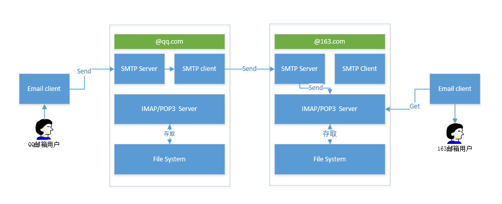

# 10.2 Linux任务计划和周期性任务
Linux 中定时执行的任务有任务计划和周期性任务两种，所谓任务计划即只在未来的某时间点执行一次某任务，周期性任务则是按照特定的时间规律定期执行某任务。本节我们就来讲解Linux 中这两种任务的实现方式。因为计划任务和周期任务的执行结果会通过邮件发送给用户，因此我们首先来简单说一下邮件服务。本节内容如下所示:
1. 本地邮件服务和使用 mailx 收发邮件
1. 任务计划：at 和 batch
2. 周期性任务计划：cron

## 1. 本地邮件服务


上图是一个QQ邮箱用户编写一封邮件，发送给一个163邮箱用户，后者接收邮件并阅读的过程。其中
- smtp协议: 属于TCP/IP 上的应用层协议，完成跨网络传输邮件，是邮件服务器之间的传输协议
- pop3/imap4:
  - 是客户端与邮件服务器之间的传输协议，定义了用户向服务商查询、分组、移动、编辑等方面的操作规范
  - POP3是比较老的协议，而IMAP稍微新一点

#### mailx
`mailx  [-s 'SUBJECT']  username[@hostname]`
- 作用: Mail User Agent, 用户收发邮件的工具程序；
- 收邮件: 不带参数使用 mailx 会进入命令行交互客户端，可用于接收邮件
- 发邮件:
	 - `-s 'SUBJECT'`: 指定邮件的主题
   - `username[@hostname]`: 指定收件人，本地传送无需域名
   - 附注: 默认进入交互式输入环境，填写邮件正文，也可通过输入重定向或管道指定

```
> mail                     # 不带参数可进入 mail 的交互模式，可查收邮件
Heirloom Mail version 12.5 7/5/10.  Type ? for help.
"/var/spool/mail/tao": 3 messages 3 new
>N  1 root                  Tue Jul 24 09:59  17/583   
 N  2 root                  Tue Jul 24 10:00  18/553   "hellp"
 N  3 root                  Tue Jul 24 10:00  18/556   "hellp"
& 1                         # & 后输入邮件编号，即可查看邮件内容

> mail -s "welcome" tao
this is jerry , welcome                  # 交互式输入邮件内容

.                  # 空行后接 . 或使用 ctrl+d 表示结束输入

> ls /var/log | mail -s "subject" tao    # 通过管道输入邮件正文
> mail -s "subject"  tao   <  /etc/fstab # 通过输入重定向输入邮件内容
```

## 2. 任务计划
### 2.1 at命令
`at  [OPTION]... TIME`
- 作用: 在 time 指定的时间运行特定命令，默认会进入交互式命令行，用于输入要执行的命令
- 选项:
    - `-l`: 查看作业队列，相当于atq
    - `-f /PATH/FROM/SOMEFILE`: 从指定文件中读取作业任务，而不用再交互式输入；
    - `-d at_id`: 删除指定的作业，相当于atrm，后跟任务的 id 号，通过 atq 即可查看；
    - `-c`: 查看指定作业的具体内容；
    - `-q QUEUE`: 指明队列, at的作业有队列，用单个字母表示，默认都使用a队列；
- TIME:
    - `HH:MM [YYYY-mm-dd]`: 指定具体的时间
    - `noon, midnight, teatime, tomorrow`: 使用特定的时间标识
    - `now+num[minutes, hours, days, OR weeks]`: 使用相对时间

```
> at now+2min
at> echo "abc"
at> <EOT>           # 按 ctrl+d 表示结束输入
job 3 at Tue Jul 24 19:06:00 2018

> atq
2	Tue Jul 24 19:06:00 2018 a tao
3	Tue Jul 24 19:06:00 2018 a tao
```


### 2.2 batch命令：
batch 会让系统自行选择在系统资源较空闲的时间去执行指定的任务


## 3. 周期性任务计划：cron
### 3.1 cron 简介
```bash
$ rpm -ql cronie
/etc/cron.d
/etc/cron.d/0hourly
/etc/cron.deny
/etc/pam.d/crond      # 守护进程
/etc/sysconfig/crond
/usr/bin/crontab       # 辅助工具
/usr/lib/systemd/system/crond.service
/usr/sbin/crond
```

周期性任务计划由 cronie 程序包提供，包括了 crond 守护进程及相关辅助工具。在定义周期性任务之前，首先需要确保crond守护进程(daemon)处于运行状态。centos7 和 centos6 检查服务运行状态的命令如下:
```
# centos7 使用 systemctl 查看服务运行状态
> systemctl status crond.service
● crond.service - Command Scheduler
   Loaded: loaded (/usr/lib/systemd/system/crond.service; enabled; vendor preset: enabled)
   Active: active (running) since 三 2018-07-25 08:59:13 CST; 47min ago
 Main PID: 1897 (crond)
   CGroup: /system.slice/crond.service
           └─1897 /usr/sbin/crond -n

# centos6
> service  crond  status
crond is running.
```


向crond提交作业的方式不同于at，它需要使用专用的配置文件，此文件有固定格式，不建议使用文本编辑器直接编辑此文件；要使用crontab命令。cron任务分为两类：
1. 系统cron任务，主要用于实现系统自身的维护；需要手动编辑 `/etc/crontab` 文件进行任务配置
2. 用户cron任务，可通过 crontab 命令，进行配置

### 3.2 系统cron的配置
系统 cron 的配置文件位于 `/etc/crontab`，其内容如下。
```bash
SHELL=/bin/bash                     # 定义执行命令的 默认 shell
PATH=/sbin:/bin:/usr/sbin:/usr/bin  # 不同于用户登录后获得的环境，因此，建议命令使用绝对路径，或者自定义PATH环境变量；
MAILTO=root                         # 执行结果邮件发送给MAILTO指定的用户

# For details see man 4 crontabs

# Example of job definition:
# .---------------- minute (0 - 59)
# |  .------------- hour (0 - 23)
# |  |  .---------- day of month (1 - 31)
# |  |  |  .------- month (1 - 12) OR jan,feb,mar,apr ...
# |  |  |  |  .---- day of week (0 - 6) (Sunday=0 or 7) OR sun,mon,tue,wed,thu,fri,sat
# |  |  |  |  |
# *  *  *  *  * user-name  command to be executed
```

周期性任务定义: 每一行定义一个周期性任务，共7个字段；

`*  *  *  *  * user-name  command to be executed`
- `*  *  *  *  *` : 定义周期性时间
- `user-name` : 运行任务的用户身份
- `command to be executed`：要执行的任务

需要特别注意的，cron 周期性任务的执行环境跟用户登陆后的系统环境并不一样，cron 执行时默认的 PATH 为 `/sbin:/bin:/usr/sbin:/usr/bin`，因此，建议命令使用绝对路径，或者在脚本中自定义PATH环境变量；


### 3.3 用户cron的配置
用户的 cron 配置文件位于 `/var/spool/cron/USERNAME` 与用户名同名的文件，其配置文件与系统 cron 配置文件类似，唯一的区别是在定义周期性任务时无需指明 user-name，默认是用户自己。建议使用 crontab 命令进行周期性任务的定义，因为其能自动检查语法错误，防止出错。

#### 3.4 cron 中的时间表示法
`*  *  *  *  *` 周期性时间有如下定义方式:
1. 特定值: 给定时间点有效取值范围内的值，day of week和day of month一般不同时使用；
2. `*`: 给定时间点上有效取值范围内的所有值；表“每..”
3. `#,#,#`:逗号分隔的离散值
4. `#-#`: 短线连接开头和结束的连续取值：
5. `*/#`:在指定时间点上，定义步长,表示每隔多少的意思
6. 注意：
    - 指定的时间点不能被步长整除时，其意义将不复存在；
    - 最小时间单位为“分钟”，想完成“秒”级任务，得需要额外借助于其它机制；

```bash
# cron 时间定义示例
3 * * * *      # 每小时执行一次；每小时的第3分钟；
3 4 * * 5      # 每周执行一次；每周5的4点3分；
5 6 7 * *      # 每月执行一次；每月的7号的6点5分；
7 8 9 10 *     # 每年执行一次；每年的10月9号8点7分；
9 8 * * 3,7    # 每周三和周日；
0 8,20 * * 3,7
0 9-18 * * 1-5
*/5 * * * *    # 每5分钟执行一次某任务；
```

### 3.5 crontab命令
`crontab [-u user] [-l | -r | -e] [-i]`
- 作用: 编辑用户 cron 配置文件
- 选项
    - `-e`：编辑任务；
    - `-l`：列出所有任务；
    - `-r`：移除所有任务；即删除`/var/spool/cron/USERNAME`文件；
    - `-i`：在使用-r选项移除所有任务时提示用户确认；
    - `-u user`：root用户可为指定用户管理cron任务；                   
- 通知：命令运行结果将以以邮件通知给当前用户；想拒收邮件可通过如下方式实现
    - `COMMAND > /dev/null`: 命令正常运行不通知用户，运行出错则通知用户
    - `COMMAND &> /dev/null`: 无论命令是否正常运行均不通知用户
- 转义：定义COMMAND时，如果命令需要用到%，需要对其转义；但放置于单引号中的%不用转义亦可；
- 注意:
    - 某任务在指定的时间因关机未能执行，下次开机不会自动执行
    - 如果期望某时间因故未能按时执行，下次开机后无论是否到了相应时间点都要执行一次，可使用anacron实现

## 练习
```
1、每12小时备份一次/etc目录至/backups目录中，保存文件 名称格式为“etc-yyyy-mm-dd-hh.tar.xz”
2、每周2、4、7备份/var/log/secure文件至/logs目录中，文件名格式为“secure-yyyymmdd”；
3、每两小时取出当前系统/proc/meminfo文件中以S或M开头的行信息追加至/tmp/meminfo.txt文件中；
```
