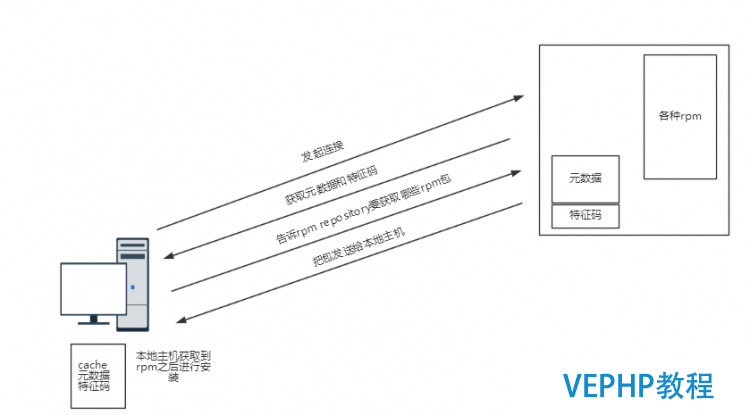

# 11.3 yum命令使用
yum 是 rpm 的前端工具，在 rpm 基础上能自动解决程序包的依赖问题，管理程序更加的方便。本节我们就来介绍 yum 的使用，包括以下内容:
1. yum 的架构示意图
2. yum 仓库指向定义
3. yum 命令的使用
4. yum 仓库管理

## 1. yum 概述


上图是 yum 架构的示意图，yum 是 C/S 架构的服务。yum 的 Serve 端就是一个文件服务器，称为 yum 仓库或 yum 源。yum 仓库包含了众多 rpm 包以及包相关的元数据文件。元数据放置在 repodata 目录，其中包含了包之间的依赖关系。

客户端在请求安装某 rpm 包时，首先会下载元数据到本地并缓存，然后分析包之间的依赖关系，分析完成后向 yum 仓库请求下载该 rpm 包及其缺失的依赖包并安装。

通常 rpm 包安装之后就会被删除，但元数据可以重复使用，因此 yum 客户端会在本地缓存yum 仓库的元数据。但缓存有可能失效，因此为及时发现 yum 仓库的变化，yum 仓库会生成元数据的特征码(单向加密算法提取的指纹信息)。yum 客户端在每次请求时首先下载特征码与本地缓存的特征码进行比对，如果不相同说明 yum 仓库发生变动，则重新下载元数据。

yum 的服务器端和客户端具有如下特征

#### yum Server
1. yum 服务器端就是一个文件服务器，支持 `ftp://，http://，nfs://，file://` 四种协议， `file://` 表示本地文件系统
2. yum 仓库存储了众多rpm包，以及包的相关的元数据文件，元数据放置于 repodata 中

#### yum 客户端
1. yum 客户端即我们通常使用的 yum 命令
2. yum 的配置文件 `/etc/yum.conf` `/etc/yum.repo.d/*.conf` 用于配置 yum 源的指向
3. yum 仓库中包含 repodata 目录的路径，就是 yum 源应该指向的路径

接下来，我们就来逐一讲解 yum 的配置文件，yum 命令的使用以及如何创建 yum 仓库

### 1.1 yum 的配置文件
yum 的核心配置文件包括两个部分:
1. `/etc/yum.conf`：为所有仓库提供公共配置
2. `/etc/yum.repos.d/*.repo`：为仓库的指向提供配置

可以使用 `whatis/man yum.conf` 获取配置文件的帮助信息，yum 仓库配置的常用选项如下所示

```
[repositoryID]                         # yum 源的唯一标识 ID
name=Some name for this repository     # yum 源的名称
baseurl=url://path/to/repository/      # yum 源的地址，可多个 url
enabled={1|0}                          # 是否启用，默认为 1 启用
gpgcheck={1|0}                         # 包来对源合法性进行检验
gpgkey=URL                             # 秘钥文件位置
enablegroups={1|0}                     # 是否在此仓库上支持组
failovermethod={roundrobin|priority}   # baseurl 指向多个时，失败后如何选择下一个连接
                                           # 默认为：roundrobin，意为随机挑选；priority 表示从上至下顺序选取
cost=1000                              # yum 源的开销，指定仓库优先级，开销越大，优先级越低
```

### 1.2 配置文件中的可用变量
yum 源的配置文件中有一些可用变量，可以方便根据当前平台特性，选择特定的 yum 源。常用变量包括

|变量名称|作用|
|:---|:---|
|$releasever|当前OS的发行版的主版本号，即 centos-release 这个 rpm 包的 Version值<br> 通过 `rpm -qi centos-release` 可查看 |
|$arch|平台，比如 i386，x86, x86_64，通过 `arch` 命令可查看当前值|
|$basearch|基础平台，平台分类中的大类，比如 i386，i568，x86都属于 i386|
|$YUM0-$YUM9|用户可自定义使用的变量|

```
# 阿里云 yum 配置示例
[base]
name=CentOS-$releasever - Base - mirrors.aliyun.com
failovermethod=priority
baseurl=http://mirrors.aliyun.com/centos/$releasever/os/$basearch/
        http://mirrors.aliyuncs.com/centos/$releasever/os/$basearch/
#mirrorlist=http://mirrorlist.centos.org/?release=$releasever&arch=$basearch&repo=os
gpgcheck=1
gpgkey=http://mirrors.aliyun.com/centos/RPM-GPG-KEY-CentOS-7

# 附注: 我的Linux 上 baseurl=http://mirrors.aliyun.com/centos/7/os/x86_64/
```

## 2. yum 命令
yum 命令有众多子命令，大体上可以分为两个部分
1. 用于安装，卸载，查看，搜索程序包和程序包组
2. yum 缓存，事务，历史等管理子命令

`yum [options] [command] [package ...]`
- 通用选项:
    - `--nogpgcheck`：禁止进行gpg check；
    - `-y`: 自动回答为“yes”；
    - `-q`：静默模式；
    - `--disablerepo=repoidglob`：临时禁用此处指定的repo；
    - `--enablerepo=repoidglob`：临时启用此处指定的repo；
    - `--noplugins`：禁用所有插件
- 子命令：
    - 程序包管理子命令
        - `install`
        - `reinstall`
        - `update`
        - `update-to`
        - `downgrade`
        - `check-update`
        - `upgrade`
        - `upgrade-to`
        - `remove|erase`
        - `deplist`
        - `list`
        - `info`
        - `search`
        - `provides | whatprovides`
    - 程序包组管理子命令
        - `groupinstall`
        - `groupupdate`
        - `grouplist`
        - `groupremove`
        - `groupinfo`
    - yum 管理子命令
        - `clean`
        - `makecache`
        - `repolist`
        - `version`
        - `history`
        - `help`

### 2.1 程序包管理子命令
#### 安装
1. `yum install package1 [...]`: 安装程序包
2. `yum reinstall package1 [...]`: 重新安装程序包

#### 升级
1. `yum update [package1] [...]`: 升级程序包
2. `yum downgrade package1 [...]`: 降级安装程序包
3. `yum check-update`: 检查可用升级

#### 卸载
`yum remove | erase package1 [package2] [...]`
- 作用: 卸载程序包
- 附注: 依赖被卸载的包的包也会被卸载

#### 查询
1. `yum search string1 [...]`: 查找程序包，会以指定的关键字搜索程序包名及summary信息；
2. `yum info [package1]`: 查看特定程序包相关信息
4. `yum deplist package1 [...]`: 查看指定包所依赖的特性(capabilities)

`yum provides | whatprovides feature1 [...]`
- 作用: 查看指定的特性(可以是某文件)是由哪个程序包所提供

`yum list [all | glob_exp1] [glob_exp2] [...]`  
`yum list {available|installed|updates} [glob_exp1] [...]`  
- 作用: 查找程序包，支持通配符，只会匹配程序包名称
- 选项:
    - `all`: 列出所有包
    - `available`: 列出所有可用的包
    - `installed`: 列出所有已经安装的包
    - `updates`: 列出所有可更新的包
- eg: `yum list  php*` 搜索所有以 php 开头的包


### 2.2 程序包组管理的相关命令
- `yum groupinstall group1 [group2] [...]`: 安装
- `yum groupupdate group1 [group2] [...]`: 升级
- `yum groupremove group1 [group2] [...]`: 卸载
- `yum grouplist [hidden] [groupwildcard] [...]`: 查看所有可用包组
- `yum groupinfo group1 [...]`: 查看特定包组相关信息


### 2.3 yum 管理命令
#### 缓存
`yum clean [packages | metadata | expire-cache | rpmdb | plugins | all]`
- 作用: 清理本地缓存
- 选项: 通过参数，可只清除特定内容

`yum makecache`
- 作用: 构建缓存


#### 事务历史
`yum history [PARAM]`
- 作用: 查看yum事务历史
- 参数: `[info|list|packages-list|packages-info|summary|redo|undo|rollback|new|sync|stats]`


#### 显示仓库列表
`yum repolist [all|enabled|disabled]`
- 作用: 显示仓库列表
- 参数:
    - `all`: 显示所有仓库
    - `enabled`: 显示启用的仓库
    - `disabled`: 显示禁用的仓库


## 3. yum 仓库管理
### 3.1 使用光盘当作本地yum仓库
使用光盘当作本地yum仓库的操作步骤如下:
1. 挂载光盘至某目录，例如/media/cdrom
    - `mount -r -t iso9660 /dev/cdrom /media/cdrom`
2. 创建配置文件

```
[CentOS7]
name=
baseurl=file:////media/cdrom
gpgcheck=
enabled=
```

### 3.2 创建 yum 仓库
`createrepo [options] <directory>`
- 作用: 创建 yum 仓库所需的 repodata 目录
- 选项:
    - `-u  --baseurl <url>`：指定Base URL的地址
    - `-o --outputdir <url>`: 指定元数据的输出位置
    - `-x --excludes <packages>`: 指定在形成元数据时需要排除的包
    - `-q --quiet`: 安静模式执行操作，不输出任何信息。
    - `-g --groupfile <groupfile>`
        - 作用: 指定本地软件仓库的组划分，范例如下：
        - 注意：组文件需要和rpm包放置于同一路径下
        - eg: `createrepo -g comps.xml /path/to/rpms`
    - `-v --verbose`: 输出详细信息
    - `-c --cachedir <path>`
        - 作用: 指定一个目录，用作存放软件仓库中软件包的校验和信息。
        - 附注: 当createrepo在未发生明显改变的相同仓库文件上持续多次运行时，指定cachedir会明显提高其性能。
    - `-d --database`: 该选项指定使用SQLite来存储生成的元数据，默认项。

### 3.3 yum 的使用奇巧
1. 当我们安装一个不在 yum 仓库的本地 rpm 包时，可使用  `yum install local_rpm.rpm` 安装，如果次包依赖到 yum 仓库中的其他 rpm 包将自动解决依赖关系。
2. 当我们安装一堆不再 yum 仓库的 rpm 包，且这些 rpm 包本身也存在依赖关系时，可将这些 rpm 包制作成一个本地yum 仓库，这样就可以使用 yum 自动解决所有的依赖关系。
