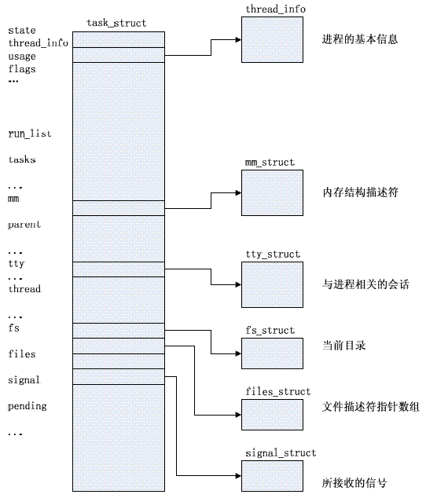
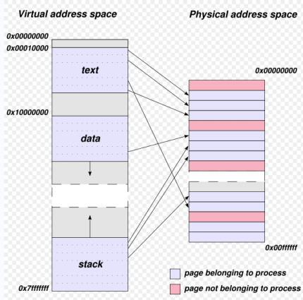
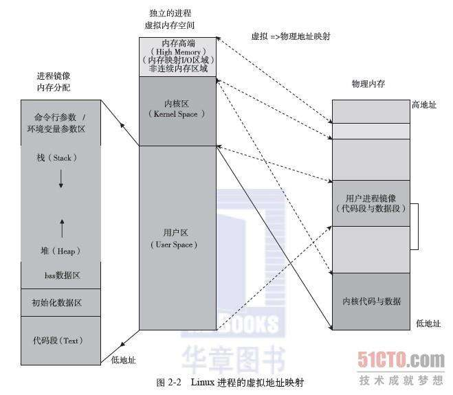
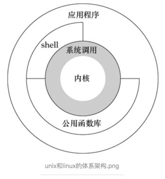

# 13.1 Linux进程原理
当然没那么容易说清楚进程是什么。无论是什么程序员，操作系统，编译原理永远都是谜一样的话题，但是人总是要慢慢进步的，随着我们不断成长，对其的认识也会慢慢深入。好吧，我们开始吧。

现代操作系统都是多任务系统，目前常用的服务器也就 64 个核心，通常要运行的任务一定比操作系统的核心多，那么就存在几个问题。一是我们应该如何给不同任务分配运行时间？二是多个任务如何共享使用我们的存储设备，特别是内存？这就涉及到进程和虚拟内存的概念了。

## 1. 进程和内存的抽象
#### 进程

进程是操作系统对一个独立的运行程序的抽象，是操作系统调度的基本单元(操作系统调度的基本单元应该是线程，但是通常一个进程只有一个线程，可以先这么理解)。每个进程都有一个叫作 task structure 的结构，其包含了该进程能正常运行的所有上下文。什么是程序运行的上下文呢？那我们要从计算机的存储系统说起。

我们都知道我们的计算机有硬盘，内存，缓存。为什么回有这么多存储设备呢？主要是因为不同的存储介质工作频率不相同，工作频率高的造价高。如果我存储介质跟不上 CPU 的频率就会造成 CPU 性能的浪费。因此基于最近被访问的数据很有可能在接下来再次被访问这样一个原理，计算机的存储系统被构建成了如下的层次结构

典型的 CPU 里面有寄存器，它的工作频率几乎和CPU 一致，但是容量很小，仅仅保存了当前指令的操作数和下一次要执行的指令。当发生进程切换时，寄存器就会被新进程的数据所覆盖。所以这些寄存器中的数据都应该被保存起来，以便下此进程再次执行时就好像从没有中断过一样能继续执行。包括 CPU 中寄存器的值，程序打开的文件描述符等等在内的维持程序能正常执行的所有数据就是进程的上下文。

#### 虚拟内存

操作系统的任务是变化的，但是运行中的内存是不变。那么应该如何分配每个进程占用的空间，占用的内存位置，以避免它们相互影响呢？

操作系统将内存抽象为虚拟内存，所有进程启动时，所见的内存空间均为虚拟内存，进程可以假设为当前系统上只有内核和自己。虚拟内存对于所用程序都是统一的，因此程序无需考虑实际内存的分配问题，直接向虚拟内存空间申请和释放内存即可。虚拟内存和物理内存被划分为一个个页框，当进程需要内存时，其向虚拟内存空间申请内存，然后由操作系统将空闲的物理页框与进程申请到的虚拟页框建立关联关系。进程访问数据时必需将虚拟地址转换实际的内存地址才能访问到数据。计算机上有一个专门的单元 MMU 用于完成虚拟地址的转换。上图 task_structure 中的 mm_struct 保存就是虚拟页框与物理页框的映射关系。

## 2. 运行中进程

进程的内存空间结构如上图左边所示，包括代码段，数据段，堆栈等。创建进程时，父进程调用 fork() 系统调用创建子进程，此时子进程共享父进程的所有环境，然后子进程调用 exec() 系统调用将自己的代码装载入代码段；最后父子进程各自运行。Linux 使用写时复制，当子进程需要修改父进程的内存空间时，它首先将当前内存中的内容复制到新的空闲空间中，然后在修改。因此父子进程不会相互影响。

进程都是有父进程创建和销毁。Centos 中的第一个进程叫 init ，它是所有进程父进程。Centos567 的 init 程序并不相同。我们会在后面的系统开机启动中详细讲解。

运行中的进程存在优先级的概念，优先级用于控制进程的执行次序
Linux 中进程优先级别为0-139：
- 1-99：实时优先级；
- 100-139：静态优先级； 数字越小，优先级越高，Nice值(-20,19) 用于调整静态优先级。
需要注意的是，优先级越靠近 99，优先级越高。可以通过调整 Nice 值调整程序优先级。普通用户只能调高优先级(即降低程序优先级)，不能调高优先级。root 可以调高或调低。

进程之间可能需要通信，进程间通信叫作 IPC，IPC 有如下方式。

IPC: Inter Process Communication
1. 同一主机上：
    - signal: 信号
    - shm: shared memory: 共享内存
    - semerphor: 信号量
2. 不同主机上：
    - rpc: remote procecure call 远程系统调用
    - socket: 套接子

进程最终必需由父进程收回，如果父进程意外终止而没有收回进程，进程就会成为孤儿进程，在进程执行完成后将称为僵尸进程。

## 3. 用户空间与内核空间

为了避免用户空间的程序破坏内核，Linux 将操作系统的指令分成了4个不同级别，这些级别的指令被分别放在操作系统抽象的环上。最内存的内核和系统调用属于特权指令，被称为内核空间，外层的指令属于普通指令，被称为用户空间。

当进程需要调用特权指令时，进程需要发出软中断，陷入内核，由内核执行所需的特权执行，并将执行结果交给用户进程。进程获取到结果后继续运行。进程等待系统调用结果而不能执行时，我们称进程处于不可中断睡眠状态。运行中的内存有如下几种状态
- 运行态：running，正在被CPU 执行
- 就绪态：ready，程序准备完成，等待内核调度执行
- 睡眠态：
    - 可中断：interruptable，进程的执行时间耗尽而被换出CPU
    - 不可中断：uninterruptable
- 停止态：暂停于内存中，但不会被调度，除非手动启动之；stopped
- 僵死态：zombie

最后Linux 中进程可以分为两类
- 守护进程: 在系统引导过程中启动的进程，跟终端无关的进程；
- 前台进程：跟终端相关，通过终端启动的进程，也可把在前台启动的进程送往后台，以守护模式运行；
