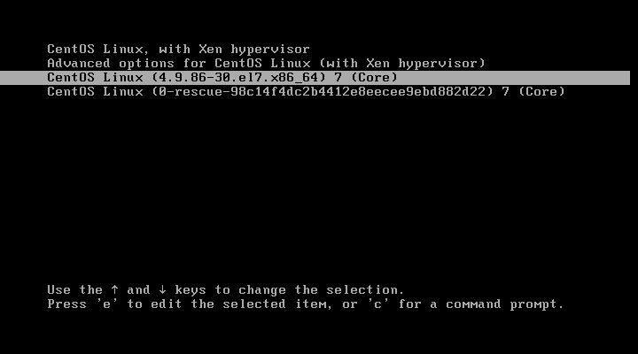
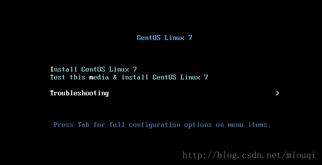

# 14.5 grub2 系统配置与使用
上一节我们介绍了 grub 第一版的配置和使用，接下来我们学习 grub2。内容介绍同上一节相同，如下:
1. grub2 概述
  - 认识 grub2 的菜单  
  - grub2 的启动流程
2. grub2 命令行的使用
3. grub2 的配置文件
4. 安装 grub2
5. 开机过程中常见问题解决

## 1. grub2 概述
grub2 支持 efi，比 grub 更加复杂，本人对此并不是很懂。关于 grub2 的详细描述可以参考这篇博文[Grub 2：拯救你的 bootloader](https://linux.cn/article-6892-1.html)

### 1.1 认识 grub2 菜单

正常开机启动后，我们就会看到一个类似上图的grub2 开机启动菜单界面。
1. 使用上下键，可以选择开机启动项
2. 按下 `e` 键就可以编辑光标所在项的启动选项
3. 按下 `c` 键就可以进入 grub 的命令行

默认情况下，如果不做任何选择，五秒之后系统在默认的开机启动项上开机启动，如果进行了上述任何一个操作则必须按下确认键才能启动操作系统。


### 1.2 设备表示
grub2 设备的表示方式与 grub 并不相同
1. grub2 中设备从 0 开始编号，而分区则是从 1 开始编号
2. MBR 和 GPT 两种分区格式表示并不相同
	- `(hd0,1)`： 一般的默认语法，由 grub2 自动判断分区格式
	- `(hd0,msdos1)`： 磁盘分区为传统的 MBR 模式
	- `(hd0,gpt1)`：磁盘分区为 GPT 模式


## 2. grub2 命令行的使用
下面是在 grub2 命令行中直接启动操作系统的示例，可以看到 grub2 更加接近我们 bash。

```
grub> ls      # 查看当前的磁盘分区设备
(hd0), (hd0, msdos1), (hd0, msdos2)

grub> set root=(hd0, msdos1)    # 设置根设备
grub> ls /                      # 查看当前设备内的文件
grub> linux /vmlinux-VERSION-releaser ro root=/dev/mapper/centos-root # 设置内核和跟目录
grub> initrd /initramfs-VErSION-releaser         # 设置 initramdisk
grub> insmod gizo                                # 装载必要的驱动模块
grub> insmod xfs
grub> insmod part_msdos
grub> boot                                      # 启动开机流程
```


## 3. grub2 的配置文件
grub2 的配置分成了核心配置和辅助配置两个部分
1. 核心配置文件`/boot/grub2/grub.cfg`，是 grub2 在开机启动过程中读取的配置文件
2. 辅助配置文件是 `grub2-mkconfig` 会读取的配置文件，此命令用于生成核心配置文件。辅助配置文件包括 `/etc/default/grub`文件 与 `/etc/grub.d/`目录两个部分。

因此 grub2 参数可分成两个步骤:
1. 修改 `/etc/default/grub` 与 `/etc/grub.d/` 内的相关辅助配置文件
2. 使用 `grub2-mkconfig -o /boot/grub2/grub.cfg` 生成新的 grub.cfg 核心配置文件

通过 grub.cfg 的结构与注释，可以直接看出 辅助配置文件的作用结果。首先我们来看 grub.cfg 的文件结构。

### 3.1 grub2 配置文件
grub.cfg 主要包括两个部分
1. 第一部分是环境配置段，大多是环境设置与默认值设置，对应于 `/etc/default/grub`
2. 第二部分是菜单选项，`/etc/grub.d/`内每个配置文件生成的菜单选项，都包含在对应文件的注释中。

```
# 1. 最开始的部份，大多是环境设置与默认值设置
set timeout=5
set default="2"

### BEGIN /etc/grub.d/10_linux ###
# 2. /etc/grub.d/10_linux 生成的菜单项
menuentry 'CentOS Linux (4.9.86-30.el7.x86_64) 7 (Core)' --class centos --class gnu-linux --class gnu --class os --unrestricted $menuentry_id_option 'gnulinux-4.9.86-30.el7.x86_64-advanced-0afffff8-52f1-4af0-90e5-958f57489518' {
        load_video
        set gfxpayload=keep
        insmod gzio
        insmod part_gpt
        insmod xfs
        if [ x$feature_platform_search_hint = xy ]; then
          search --no-floppy --fs-uuid --set=root  748911a9-cbdb-4f17-acb8-8f44661ec67d
        else
          search --no-floppy --fs-uuid --set=root 748911a9-cbdb-4f17-acb8-8f44661ec67d
        fi
        linuxefi /vmlinuz-4.9.86-30.el7.x86_64 root=/dev/mapper/cl-root ro crashkernel=auto rd.lvm.lv=cl/root rd.lvm.lv=cl/swap rd.lvm.lv=cl/usr rhgb quiet
        initrdefi /initramfs-4.9.86-30.el7.x86_64.img
}
### END /etc/grub.d/10_linux ###

### BEGIN /etc/grub.d/30_os-prober ###

### END /etc/grub.d/30_os-prober ###
```

### 3.2 grub2 辅助配置文件
下面我们来看各个辅助配置文件的组成
#### `/etc/default/grub`
主要环境配置文件，常见的配置选项如下

```
GRUB_TIMEOUT=5
# 作用: 指定默认倒数读秒的秒数，0 表示直接开机，-1 表示必需用户选择

GRUB_TIMEOUT_STYLE
# 作用：是否隐藏菜单项目
# 选项：menu      -- 默认，显示菜单
#      countdown -- 显示剩余秒数，不显示菜单
#      hidden    -- 什么都不显示

GRUB_DISTRIBUTOR="$(sed 's, release .*$,,g' /etc/system-release)"
#

GRUB_DEFAULT=2
# 作用： 指定要用哪一个菜单 （menuentry） 来作为默认开机项目
# 可选值：包括“ saved, 数字, title 名,ID 名”等等
#        ID 名值的是 menuentry 后使用 --id 为选项指定的 ID
# 默认值：就是以第一个开机菜单来作为默认项目

GRUB_DISABLE_SUBMENU=true
# 作用：是否要隐藏次菜单，通常是藏起来的好！

GRUB_TERMINAL_OUTPUT="console"
# 作用：指定输出的画面应该使用哪一个终端机来显示
# 可选值：console, serial, gfxterm, vga_text
# 默认值：console 文字终端机

GRUB_CMDLINE_LINUX="crashkernel=auto rd.lvm.lv=cl/root rd.lvm.lv=cl/swap rd.lvm.lv=cl/usr rhgb quiet"
# 作用：为 menuentry 内 linux16 指定的内核追加额外的参数

GRUB_DISABLE_RECOVERY="true"
# 作用：取消救援菜单的制作
```
#### `/etc/grub.d/`
分段配置，每个文件实现一个特殊功能，grub2-mkconfig 会分析并执行 `/etc/grub.d/*` 内的文件，来创建 grub.cfg
- `00_header`: 创建初始的显示项目，包括需要载入的模块分析、屏幕终端机的格式、倒数秒数、菜单是否需要隐藏等等，大部分在 /etc/default/grub 里面所设置的变量，大概都会在这个脚本当中被利用来重建 grub.cfg
- `10_linux`: 根据分析 /boot 下面的文件，尝试找到正确的 linux 核心与读取这个核心需要的文件系统模块与参数,将所有在 /boot 下面的核心文件创建为一个独立的菜单选项
- `30_os-prober`: 查看系统其他分区是否存在操作系统，如果存在制作成一个独立的菜单选项，可通过 `/etc/default/grub` 内的选项 `GRUB_DISABLE_OS_PROBER=true` 来取消此文件的执行
- `40_custom`: 如果还有其他想要自己手动加上去的菜单项目，或者是其他的需求，那么建议在这里补充


### 3.3 grub2 中的帐号机制
grub2 内将用户分为了两类，超级管理帐号(superusers) 和普通用户(users)

|特性|superusers|user|
|:---|:---|:---|
|作用|设置系统管理员与相关参数还有密码等|设置一般帐号的相关参数与密码，可设置多个用户|
|权限|将可在 grub2 内具有所有修改的权限|使用这个密码的用户可以选择要进入某些菜单项目|
|附注|一旦设置了这个 superusers 的参数，则所有的指令修改将会被变成受限制的|菜单项目也要搭配相对的帐号才行|
|附注|只有系统管理员能够修改参数|一般用户只能选择可用的开机菜单，不能修改菜单|

#### 设置 grub 帐号的步骤
以设置一个超级管理员帐号 vbird,和一个普通帐号 dmtsai 为例，相关操作如下
```
# 1. 先取得 vbird 与 dmtsai 的密码。
> grub2-mkpasswd-pbkdf2
Enter password:     # 输入 vibird 密码
Reenter password:   # 再一次输入密码
PBKDF2 hash of your password is XXXXXXXXXXXXXXXXXXXXX

# 2. 将密码与帐号写入到 01_users 文件内
# 附注：在 /etc/grub.d/* 下面的文件是“执行脚本”,只能通过 cat 或 echo 来将帐密数据显示出来
> vim /etc/grub.d/01_users
cat << eof
set superusers="vbird"
password_pbkdf2 vbird    XXXXXXXXXXXXXXXXXXXXX
password_pbkdf2 dmtsai   XXXXXXXXXXXXXXXXXXXXX
eof

# 3. 给 01_users 给予执行权限
> chmod a+x /etc/grub.d/01_users

# 4. 修改 menuentry，配置用户
# --unrestricted：默认不受限制
# --users "帐号名称"：限定特定账户使用
# 无 --users 无 --unrestricted：一定要系统管理员”才能够进入与修改

> vim /etc/grup.d/40_custom
menuentry MyLinux  --users dmtsai {
   load_video
   insmod gzio
   linux16  ......
   .........
}
```


## 4. 安装 grub2
`grub2-install --root-directory=ROOT /dev/DISK`
- ROOT 为 boot 目录所在的父目录

```
> mkdir /mnt/boot
> mount /dev/sdb1 /mnt/boot   # /dev/sdb1 为 /boot 目录所在的分区
> grub2-install --root-directory=/mnt /dev/sdb
    # /boot 的父目录是 /mnt
    # grub stage1 此时会安装到 sdb 的 MBR 中

> grub-install --root-directory=/mnt /dev/sdb1
    # grub stage1 此时会安装到 sdb 第一个分区的 boot sector 中
```

## 5. 开机过程中常见问题解决
### 5.1 忘记开机密码
新版的 systemd 的管理机制中，需要 root 的密码才能以救援模式登陆 Linux，所以无法通过救援模式重新设置 root 密码。我们需要借助 rd.break 核心参数

1. 进入开机画面，按下 e 来进入编辑模式，在 linux16 参数上添加 rd.break 参数

2. 改完之后按下 [crtl]+x 开始开机
3. 开机完成后屏幕会出现如下的类似画面,此时处于 RAM Disk 的环境，正真的根应该被挂载在 /sysroot


```
> mount                           # 检查一下挂载点！一定会发现 /sysroot 才是对的
/dev/mapper/centos-root on /sysroot
> mount -o remount,rw /sysroot    # 挂载成可读写
> chroot /sysroot                 # 实际切换了根目录的所在！取回你的环境了
>  echo "your_root_new_pw" | passwd --stdin root  # 修改root密码
> touch /.autorelabel             # 如果SELinux=Enforcing，必需，详细说明见下
> exit
> reboot

# touch /.autorelabel 等同操作
# 1. 在 rd.break 模式下，修改完 root 密码后，将SELinux 该为 Permissive
> vim /etc/selinux/config
SELINUX=permissive

# 2. 重新开机后，重至 /etc SELinux 安全文本
> restorecon -Rv /etc
> vim /etc/selinux/config
SELINUX=Enforcing
> setenforce 1
```
SELinux 的说明:
- 在 rd.break 的 RAM Disk 环境下，系统是没有 SELinux 的,更改密码会修改 `/etc/shadow`， 所以的 shadow 的SELinux 安全本文的特性将会被取消，SELinux 为 Enforcing 的模式下，如果你没有让系统于开机时自动的回复 SELinux 的安全本文，你的系统将产生“无法登陆”的问题。加上 `/.autorelabel` 就是要让系统在开机的时候自动的使用默认的 SELinux type 重新写入 SELinux 安全本文到每个文件去


### 5.2 因文件系统错误而无法开机
文件系统错误常见原因有两个:
1. 通常就是 /etc/fstab的设置问题，尤其是使用者在实作 Quota/LVM/RAID 时，最容易写错参数， 又没有经过 mount -a 来测试挂载，就立刻直接重新开机
2. 曾经不正常关机后，也可能导致文件系统不一致情况， 也有可能会出现相同的问题

开机启动时，在检查文件系统时会有提示信息，类似下图所示。通常只要输入 root 密码进入救援模式，然后重新挂载根目录即可。


上图属于第二种错误状况。图中的第二行处，fsck 告知其实是 `/dev/md0` 出错。系统会自动利用 fsck.ext3 去检测 /dev/md0，等到系统发现错误，并且出现“clear [Y/N]”时，输入“ y ”即可。但是需要注意的是 partition 上面的 filesystem 有过多的数据损毁时，即使 fsck/xfs_repair 完成后，可能因为伤到系统盘，导致某些关键系统文件数据的损毁，那么依旧是无法进入 Linux 此时，最好就是将系统当中的重要数据复制出来，然后重新安装，并且检验一下，是否实体硬盘有损伤的现象才好

### 5.3 进入紧急模式
`systemd.unit=emergency.target`


### 5.4 通过光盘进入救援模式
如果 grub 已经损坏，并已重启，将无法进入 grub，也就无法正常开机，此时需要借助光盘进入救援模式
1. 进入 BIOS 调整开机启动次序
2. 插入光盘或装机U盘，开机启动，进入如下画面 
3. 选择"Troubleshooting", 然后选择 "Rescue a CentOS Linux system"
4. 救援模式会将找到的根挂载至 `/mnt/sysimage/`，然后执行以下命令

```
> chroot /mnt/sysimage/
> grub-install /dev/sda
```
