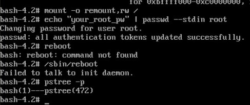

# 14.4 grub系统配置与使用
本节我们我们将学习主流的 BootLoader 程序 grub。这部分内容与开机启动项设置，忘记 root 密码，操作系统修复相关。grub 有两个版本，本节介绍第一个版本，下一节介绍第二个版本。因为两个版本的使用方式几乎完全不一样。我们将按照如下的内容顺序介绍grub 的使用:
1. grub 概述
  - 认识 grub 的菜单
  - grub 的启动流程
2. grub 命令行的使用
3. grub 的配置文件
4. 安装 grub
5. 开机过程中常见问题解决

## 1. grub 概述
grub: 是 GRand Unified Bootloader 的简称，目前包括如下两个版本。
- grub 0.x: grub legacy，简称 grub
- grub 1.x: grub2

### 1.1 认识 grub 菜单
开机进入 grub 菜单后按下 c 键即可进入到 grub 命令


### 1.2 启动步骤
grub 的配置文件在 `/boot/grub/grub.conf`, `/etc/grub.conf`，后者是前者的一个软件连接，grub 启动包括三个步骤
1. stage1: BIOS 读取并加载 mbr 中的 BootLoader
2. stage1_5: 位于 mbr 之后的扇区，让stage1中的bootloader能识别stage2所在的分区上的文件系统；
3. stage2：位于磁盘分区(/boot/grub/)
    - stage2及内核等通常放置于一个基本磁盘分区；
    - 功用包括：
        - 提供菜单、并提供交互式接口
            - `e`: 编辑模式，用于编辑菜单；
            - `c`: 命令模式，交互式接口；
        - 加载用户选择的内核或操作系统
            - 允许传递参数给内核
            - 可隐藏此菜单
        - 为菜单提供了保护机制
            - 为编辑菜单进行认证
            - 为启用内核或操作系统进行认证
    - 如何识别设备：
        - (hd\#,\#)
            - hd\#: 磁盘编号，用数字表示；从0开始编号
            - \#: 分区编号，用数字表示; 从0开始编号
            - eg: (hd0,0)

## 2. grub的命令行接口
```
# 手动在grub命令行接口启动系统
grub> root (hd#,#)
grub> kernel /vmlinuz-VERSION-RELEASE ro root=/dev/DEVICE
grub> initrd /initramfs-VERSION-RELEASE.img
grub> boot
```

- help: 获取帮助列表
- help KEYWORD: 详细帮助信息
- root (hd\#,\#): 设置根设备
- find (hd\#,\#)/PATH/TO/SOMEFILE：查找特定磁盘分区上的文件，如果使用了 root 指定了根设备可以省略 (hd\#,\#)，下同
- kernel /PATH/TO/KERNEL_FILE: 设定本次启动时用到的内核文件；额外还可以添加许多内核支持使用的cmdline参数；
    - 例如：init=/path/to/init, selinux=0
- initrd /PATH/TO/INITRAMFS_FILE: 设定为选定的内核提供额外文件的ramdisk；
- boot: 引导启动选定的内核；
- 附注: 上述路径取决于 /boot 是否单独分区

## 3. 配置文件：
/boot/grub/grub.conf
- default=#: 设定默认启动的菜单项；落单项(title)编号从0开始；
- timeout=#：指定菜单项等待选项选择的时长；
- splashimage=(hd#,#)/PATH/TO/XPM_PIC_FILE：指明菜单背景图片文件路径；
- hiddenmenu：隐藏菜单；
- password [--md5] STRING: 菜单编辑认证；
- title TITLE：定义菜单项“标题”, 可出现多次；
    - root (hd#,#)：grub查找stage2及kernel文件所在设备分区；为grub的“根”;
    - kernel /PATH/TO/VMLINUZ_FILE [PARAMETERS]：启动的内核
    - initrd /PATH/TO/INITRAMFS_FILE: 内核匹配的ramfs文件；
    - password [--md5] STRING: 启动选定的内核或操作系统时进行认证；
        - grub-md5-crypt命令: 生成密码的 md5

## 4. 安装grub：
#### 方法一 命令行
```
grub-install
grub-install --root-directory=ROOT /dev/DISK
# ROOT 为 boot 目录所在的父目录
```

#### 方法二 grub 命令行
```
# 前提: 设备上必须存在 grup 目录，里面的文件必须齐全
grub> root (hd#,#)
grub> setup (hd#)
```

## 5. 常见开机问题的解决
### 5.1 进入单用户模式：
1. 编辑grub菜单(选定要编辑的title，而后使用e命令);
2. 在选定的 kernel 后附加 1, s, S或single都可以；
3. 在kernel所在行，键入“b”命令；
