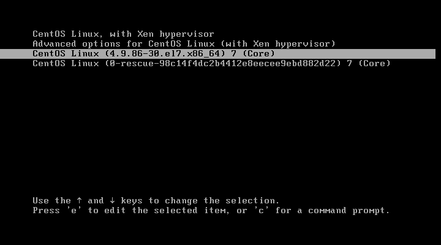
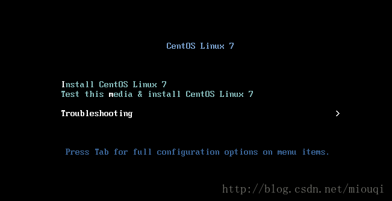

# 14.4 grub配置与使用
本节我们我们将学习主流的 BootLoader 程序 grub。这部分内容与开机启动项设置，忘记 root 密码，操作系统修复相关。grub 有两个版本，使用方式几乎完全不一样，本节首先介绍第一个版本，下一节介绍第二个版本。本节内容如下:
1. grub 概述
  - 认识 grub 的菜单
  - grub 的启动流程
2. grub 命令行的使用
3. grub 的配置文件
4. 安装 grub
5. 开机过程中常见问题解决

## 1. grub 概述
grub: 是 GRand Unified Bootloader 的简称，目前包括如下两个版本。
- grub 0.x: grub legacy，简称 grub
- grub 1.x: grub2

### 1.1 认识 grub 菜单

正常开机启动后，我们就会看到一个类似上图的grub 开机启动菜单界面。
1. 使用上下键，可以选择开机启动项
2. 按下 `e` 键就可以编辑光标所在项的启动选项
3. 按下 `c` 键就可以进入 grub 的命令行

默认情况下，如果不做任何选择，五秒之后系统在默认的开机启动项上开机启动，如果进行了上述任何一个操作则必须按下确认键才能启动操作系统。上图是我虚拟机上 grub2 的界面。grub 界面类似，操作完全相同。

### 1.2 启动步骤
grub 启动包括三个步骤:
1. stage1: BIOS 读取并加载 mbr 中的 BootLoader
2. stage1_5: 位于 mbr 之后的扇区，作用是让 stage1 中的 bootloader 能识别 stage2 所在的分区上的文件系统
3. stage2：位于`/boot/grub/`，stage2及内核等通常放置于一个基本磁盘分区，因为 stage1_5 能识别的文件系统有限，其实现的功用如下：
    - 提供菜单、并提供交互式接口
    - 加载用户选择的内核或操作系统
        - 允许传递参数给内核
        - 可隐藏此菜单
    - 为菜单提供了保护机制
        - 为编辑菜单进行认证
        - 为启用内核或操作系统进行认证

在学习 grub 使用时，我们首先需要了解 grub 是如何识别设备的。grub 中使用 `(hd#,#)` 表示磁盘设备及分区
`(hd#,#)`
- `hd#`: 表示磁盘编号，用数字表示，从0开始编号
- `#`: 表示分区编号，用数字表示; 从0开始编号
- 例如 `(hd0,0)` 表示第一块磁盘的第一个分区。

我们知道 grub 的作用就是在没有根文件系统的前提下直接加载内核，因此 grub 的根设备与操作根设备文件系统不是同一个概念。grub 的根设备指的是包含stage2 以及内核文件所在的设备，内核文件的位置也是相对于 grub 根设备的文件系统而言的。
1. 如果 /boot 独立分区，那么 grub 的根设备就是 /boot 所在分区，内核文件直接位于根之下，所以其路径为 /vmlinuz-VERSION
2. 如果 /boot 是 / 下的目录，那么 grub 的根设备就是 / 所在分区，内核文件的路径为 /vmlinuz-VERSION
所以 grub 的根对内核文件的路径有着直接影响。

## 2. grub的命令行接口
下面是在 grub 命令行中直接启动操作系统的示例，grub 命令行有很多可用命令，列示如下:
```
# 手动在grub命令行接口启动系统
grub> root (hd#,#)
grub> kernel /vmlinuz-VERSION-RELEASE ro root=/dev/DEVICE selinux=0 init=/bin/bash
grub> initrd /initramfs-VERSION-RELEASE.img
grub> boot
```

- `help`: 获取帮助列表
- `help COMMAND`: command 详细帮助信息
- `root (hd#,#)`: 设置根设备
- `find (hd#,#)/PATH/TO/SOMEFILE`：查找特定磁盘分区上的文件，如果使用了 root 指定了根设备可以省略 `(hd#,#)`，下同
- `kernel /PATH/TO/KERNEL_FILE`: 设定本次启动时用到的内核文件；额外还可以添加许多内核支持使用的cmdline参数
- `initrd /PATH/TO/INITRAMFS_FILE`: 设定为选定的内核提供额外文件的ramdisk
- `boot`: 引导启动选定的内核

## 3. 配置文件：
grub 的配置文件在 `/boot/grub/grub.conf`, `/etc/grub.conf` 是其软连接。一个最简单的配置文件如下，注释中描述了每一项的含义。grub 中实现了菜单编译和选中特定菜单的两级认证功能。可以使用明文密码，但是建议使用 md5 加密后字串。grub 为我们提供了一个快捷命令 `grub-md5-crypt` 用于生成密码的 md5

```
# grub 示例配置文件
default=0                   # 设定默认启动的菜单项，编号从0开始
timeout=5                   # 指定菜单项等待选项选择的时长
splashimage=(hd0,0)/PATH/TO/XPM_PIC_FILE： # 指明菜单背景图片文件路径
hiddenmenu                  # 隐藏菜单，不想隐藏，无须此项即可
password --md5 MD5_STRING   # 设置菜单编辑密码，--md5 后跟 md5 加密后的密码字符串
title My Linux              # 定义菜单项“标题”, 可出现多次；
    root (hd#,#)            # grub查找stage2及kernel文件所在设备分区，为grub的“根”;
    kernel /PATH/TO/VMLINUZ_FILE [PARAMETERS]    # 启动的内核
    initrd /PATH/TO/INITRAMFS_FILE               # 内核匹配的ramfs文件；
    password --md5 MD5_STRING   #启动选定的内核或操作系统时进行认证；
```

```
# 使用 grub-md5-crypt 生成 md5 密码串
> grub-md5-crypt
Password:           # 输入两次密码
Password:
MD5_STRING
```

## 4. 安装 grub
grub 正常情况下，不"瞎搞"，不会损坏，毕竟不会有谁没事去覆盖掉磁盘的 MBR，但是不怕一万就怕万一。安装双系统时，如果后安装的 Window，window 的 BootLoader 是没法引导 Linux，但是 grub 能引导 Window，此时我们就需要重新安装 Linux。

安装 grub 有两种方法，如下

#### 方法一 命令行
`grub-install --root-directory=ROOT /dev/DISK`
- ROOT 为 boot 目录所在的父目录

```
> mkdir /mnt/boot
> mount /dev/sdb1 /mnt/boot   # /dev/sdb1 为 /boot 目录所在的分区
> grub-install --root-directory=/mnt /dev/sdb
    # /boot 的父目录是 /mnt
    # grub stage1 此时会安装到 sdb 的 MBR 中

> grub-install --root-directory=/mnt /dev/sdb1
    # grub stage1 此时会安装到 sdb 第一个分区的 boot sector 中
```

#### 方法二 grub 命令行
```
# 前提: 设备上必须存在 grup 目录，里面的文件必须齐全
grub> root (hd#,#)
grub> setup (hd#)
```

## 5. 常见开机问题的解决
### 5.1 进入单用户模式：
1. 编辑grub菜单(选定要编辑的title，而后使用e命令);
2. 在选定的 kernel 后附加 1, s, S或single都可以；
3. 在kernel所在行，键入“b”命令；


### 5.2 grub 已经损坏，并已重启
这种情况下已经无法进入 grub，因此需要使用光盘或装机 U 盘进入救援模式
1. 进入 BIOS 调整开机启动次序
2. 开机启动，进入如下画面 
3. 选择"Troubleshooting", 然后选择 "Rescue a CentOS Linux system"
4. 救援模式会将找到的根挂载至 `/mnt/sysimage/`，然后执行以下命令

```
> chroot /mnt/sysimage/
> grub-install /dev/sda
```
