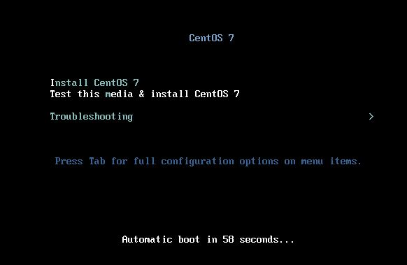

# 15.2 Centos安装过程
本节我们来讲解 Centos 系统的安装过程。

## 1. Centos 系统安装
### 1.1 安装程序：anaconda
前面我们说过操作系统的层次，如下图所示，因为直接面向硬件编程是一件非常困难的是，所以才有了操作系统。如果有安装过 Centos 系统就会知道，安装过程有一个操作界面供我们进行选择安装，显然这是一个应用程序，那么这个应用程序是直接在硬件之上编写的么？我们说过在硬件之上编写应用程序是极其困难的，且不易移植，所以我们的安装程序也是构建在内核之上，只不过这个内核不是来自我们的计算机，而是我们的安装光盘或U盘上。Centos 的安装程序就是 annaconda。
```
--------------
|  库调用接口   |
---------------
|   系统调用接口 |
-------------------------------
|    操   作  系   统           |
-------------------------------
|    底   层  硬   件           |
-------------------------------
```

### 1.2 安装光盘的结构
```
mount -r /dev/cdrom /media/cdrom
cd /media/cdrom
tree -L 1
.
├── CentOS_BuildTag
├── EFI
├── EULA
├── GPL
├── images
├── isolinux           # 内核所在目录
├── LiveOS
├── Packages
├── repodata
├── RPM-GPG-KEY-CentOS-7
├── RPM-GPG-KEY-CentOS-Testing-7
└── TRANS.TBL
```
我们安装光盘的目录结构如上所示，isolinux 就是光盘上操作系统内核所在的目录，其余部分是程序包仓库。

操作系统安装时
1. 首先加载操作系统内核；
  - 光盘安装就是加载位于 isolinux 中的内核
  - 除了光盘，内核还可以来自 U 盘，网络等其他引导设备
  - 通过 PXE 可以实现通过网络自动安装操作系统，这个我们会在后面详述配置过程。
2. 启动 anaconda，进而根据用户选择，安装操作系统
  - anacona及其安装用到的程序包等来自于程序包仓库，此仓库的位置可以为
    - 本地光盘，光盘中 isolinx 之外的就是目录就是程序包仓库
    - 本地硬盘
    - ftp server
    - http server
    - nfs server

anaconda 提供的安装界面分为:
- tui：基于cureses的文本配置窗口
- gui：图形界面


### 1.2 CentOS的安装过程启动流程
当前我们就以光盘安装来讲解 Centos 的安装过程
```
cd /media/cdrom/isolinux
tree -L 1
.
├── boot.cat      # MBR 中的 bootLoader
├── boot.msg
├── grub.conf
├── initrd.img
├── isolinux.bin  # 提供安装界面
├── isolinux.cfg  # 配置文件，包含开机菜单
├── memtest
├── splash.png
├── TRANS.TBL
├── vesamenu.c32
└── vmlinuz
```
1. 加载并启动 BootLoader
  - Stage1: 执行 `isolinux/boot.cat`，光盘的 MBR 包含的就是此文件
  - Stage2: 执行 `isolinux/isolinux.bin` 提供提供安装界面和开机启动菜单
3. BootLoader 引导和加载内核，并装载根文件系统
3. 启动anaconda
    - 默认界面是图形界面：512MB+内存空间；
    - 若需要显式指定启动TUI接口： 向启动内核传递一个参数"text"即可；
    - 如果想手动指定安装仓库，也可以通过向内核传递参数更改

#### isolinux.bin
isolinux.bin 其配置文件位于 `isolinux/isolinux.cfg`，配置文件中包含了开机启动菜单

```
vim /media/cdrom/isolinux/isolinux.cfg
....
label linux                       # 菜单标识
  menu label ^Install CentOS 7    # 彩带名称
  kernel vmlinuz                  # 指定内核
                                  # 内核参数，通过 boot 命令行添加的参数会添加在此行后
  append initrd=initrd.img inst.stage2=hd:LABEL=CentOS\x207\x20x86_64 quiet 

label rescue
  menu indent count 5
  menu label ^Rescue a CentOS system
  text help
  If the system will not boot, this lets you access files
  and edit config files to try to get it booting again.
  endtext
  kernel vmlinuz
  append initrd=initrd.img inst.stage2=hd:LABEL=CentOS\x207\x20x86_64 rescue quiet
```

#### 向内核传递参数
安装启动时，我们可以通过向内核传递参数，来更改 anacoda 的启动方式，那么如何向内核参数传递参数呢？

首先进入安装界面，这个安装界面就是 `isolinux/isolinux.bin` 提供的，上面的选项就是  `isolinux/isolinux.cfg` 配置文件的内容



然后按 `ESC` 即进入 boot 命令行界面，输入`菜单标识 参数`即可以向内核传递参数。传递的参数将附加在, isolinux.cfg 对应菜单的 append 行 后面。boot 中添加如下参数(此处 linux 表示  isolinux.cfg 中的一个菜单标识)
- `linux text`: 指定 anaconda 以tui 方式启动
- `linux method`: 手动指定程序包源

