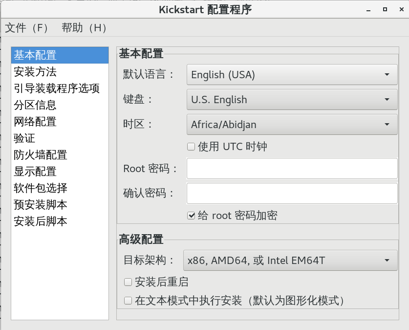

# 15.3 Centos 安装程序 anaconda 配置
上一节我们讲解了 Centos 的安装启动过程，下面我们来说一下，anaconda 启动后会进行哪些操作，以及如何配置 anaconda。

## 1. anaconda的工作过程
anaconda 在进行操作系统安装时会经由如下几个步骤:
1. 安装前配置阶段，包括设置如下参数
    - 安装过程使用的语言；
    - 键盘类型
    - 安装目标存储设备
        - Basic Storage：本地磁盘
        - Special Storage： iSCSI
    - 设定主机名
    - 配置网络接口
    - 时区
    - 管理员密码
    - 设定分区方式及MBR的安装位置；
    - 创建一个普通用户；
    - 选定要安装的程序包；
2. 安装阶段
    - 在目标磁盘创建分区并执行格式化；
    - 将选定的程序包安装至目标位置；
    - 安装bootloader；
3. 首次启动
    - iptables
    - selinux
    - core dump

## 2. anaconda的配置方式
安装前配置阶段，有两种配置方式
1. 交互式配置方式；利用 anaconda 提供的安装界面，逐项进行选择配置
2. 通过读取配置文件中，事先定义好的配置项，自动完成配置；此文件即为kickstart文件；交互式配置安装完成后，在 root 目录下会生成此次安装的 kickstart 文件 `/root/anaconda-ks.cfg`

kickstart 文件有特定的语法格式
1. 可以直接手动编辑，或依据模板修改
2. 也可以使用创建工具 `system-config-kickstart`，此命令会提供给我们一个交互界面，类似模拟 anaconda 的安装界面。我们可以打开 root 目录下生成的  kickstart 文件作为模板来生成我们的kickstart 文件。`system-config-kickstart` 安装与使用界面如所示

```
yum install  system-config-kickstart
system-config-kickstart

# ksvalidator 命令可用于检查 ks 文件是否有语法错误
ksvalidator  /root/kickstart.cfg
```



## 3. kickstart 文件格式
大体上，kickstart 文件由三个部分组成
```
# 1. 命令段
#version=DEVEL
# System authorization information
auth --enableshadow --passalgo=sha512
# Use CDROM installation media
cdrom
# Use graphical install
graphical
......

# 2. 程序包段
%packages    # 开始标记
@group_name  # 要安装的包组
package      # 要安装的单个包
-package     # 不要安装的单个程序包
%end         # 结束标记

# 3. 脚本段

```
1. 命令段：指定各种安装前配置选项，如键盘类型等；有一些是必备命令，有一些则是可选命令
2. 程序包段：指明要安装程序包，以及包组，也包括不安装的程序包；
3. 脚本段：
    - `%pre`：安装前脚本，运行环境：运行安装介质上的微型Linux系统环境；
    - `%post`：安装后脚本，运行环境：安装完成的系统；

### 3.1 命令段
kickstart 可用命令很多，想深入了解，可以参考官方文档：《Installation Guide》。下面是我安装 Centos7 之后生成的 ks 文件。我们只会介绍最常用的命令的。

```bash
#version=DEVEL
# System authorization information
auth --enableshadow --passalgo=sha512
# Use CDROM installation media
cdrom
# Use graphical install
graphical
# Run the Setup Agent on first boot
firstboot --enable
ignoredisk --only-use=sda
# Keyboard layouts
keyboard --vckeymap=cn --xlayouts='cn'
# System language
lang zh_CN.UTF-8

# Network information
network  --bootproto=dhcp --device=ens33 --onboot=off --ipv6=auto --no-activate
network  --hostname=localhost.localdomain

# Root password
rootpw --iscrypted $6$ji4or39qLiMVBwAi$E9N78iOYlZw9zzD3g3CGgVvb7MSUgLbsjq9WiwIu6qSGV.y8Sbmx8WtvrWyAPnKkHhdxJKhUAZqXl2zrzjp3t0
# System services
services --enabled="chronyd"
# System timezone
timezone Asia/Shanghai --isUtc
user --groups=wheel --name=tao --password=$6$u/SLeiTrWJUgp.8E$fGCp/IAm01lyGVBkcYMTrutmAFDjdEblCorhX5Kv.cgCZvVpn8PB4LoQ/6.Qn1Tlvq0YqwhzivNqqCSeGpgc5/ --iscrypted --gecos="tao"
# X Window System configuration information
xconfig  --startxonboot
# System bootloader configuration
bootloader --append=" crashkernel=auto" --location=mbr --boot-drive=sda
autopart --type=lvm
# Partition clearing information
clearpart --none --initlabel
```

#### 必备命令
- `authconfig  --enableshadow  --passalgo=sha512`:认证方式配置
- `bootloader  --location=mbr  --driveorder=sda  --append="crashkernel=auto rhgb quiet"`
    - 作用: 定义bootloader的安装位置及相关配置
    - `--append`: 添加到内核的参数
- `keyboard us`: 设置键盘类型
- `lang  zh_CN.UTF-8`: 语言类型
- `part`: 创建磁盘分区
    - `clearpart  --none  --drives=sda`：清空磁盘分区
    - `part /boot  --fstype=ext4  --size=500`: 定义基本磁盘分区
    - `part  pv.008002  --size=51200`: 创建逻辑卷的物理卷，008002 为物理卷的标识
    - `volgroup  myvg  --pesize=4096  pv.008002`: 创建逻辑卷组
    - `logvol  /home  --fstype=ext4  --name=lv_home  --vgname=myvg  --size=5120`: 创建逻辑卷
- `rootpw  --iscrypted  passwd`: 管理员密码
- `timezone  Asia/Shanghai`: 时区

```
# 生成加密密码的方式(root 密码)
openssl  passwd  -1  -salt `openssl rand -hex 4`
```

#### 可选命令
- `install|upgrade`：安装或升级；
- `text|graphical`：安装界面类型，text为tui，默认为GUI
- `network  --onboot yes  --device eth0  --bootproto dhcp  --noipv6`
    - 作用: 配置网络接口
    - `--onboot yes`: ifcfg 中的 ON_BOOT 参数，其他参数类似
- `firewall`: 防火墙设置
    - `firewall  --disabled`: 关闭防火墙
    - `firewall --service ssh`: 启动防火墙，放行 ssh 服务
- `selinux --disabled`: 关闭 selinux
- `halt|poweroff|reboot`：安装完成之后的行为；
- `repo  --name="CentOS"  --baseurl=cdrom:sr0  --cost=100`
    - 作用: 指明安装时使用的repository；
- `url --url=http://172.16.0.1/cobbler/ks_mirror/CentOS-6.7-x86_64/`
    - 作用: 指明安装时使用的repository，但为url格式；
    - `url --url=https://mirrors.aliyun.com/centos/7/os/x86_64/`
