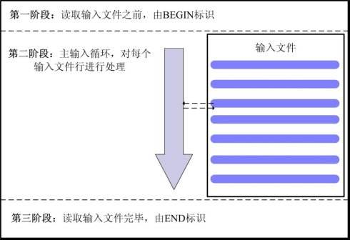

# 17.2 awk使用与实战
Linxu 上有文本处理三剑客`grep`,`sed`,`awk`。本节我们来学习最后一个命令  awk 的使用。 grep 的使用见 [7.4 grep命令与正则表达式](07-vim/grep命令与正则表达式.md)，sed 的使用见 [17.1 sed命令应用与实战](17-sed及awk/sed命令应用与实战.md)

awk 算得上是一门编程语言，这个编程语言内有包括变量，条件判断，循环，命令等诸多语言特性。我们将按照类似 bash 脚本的方式，从变量开始逐一讲解 awk 的使用。内容概述如下:
1. awk 命令简介
2. awk 变量与数组的使用
4. awk 程序执行逻辑，包括顺序执行，条件判断和循环
5. awk 内置函数

有关 awk 的使用推荐大家阅读
- 《sed和awk》
- 《Linux Shell与脚本编程指南》

## 1. awk 简介
Centos 中的 awk 是 GNU awk即 gawk。awk 是指向 gawk 命令的软连接

```bash
tao@hp:~$ which awk
/usr/bin/awk

tao@hp:~$ ll /usr/bin/awk
lrwxrwxrwx. 1 root root 4 5月   8 09:34 /usr/bin/awk -$ gawk
```

### 1.1 awk 处理逻辑


如上图，awk 将文件处理分成三个阶段。第一阶段由 BEGIN 标识，第三阶段由 END标志，分别位于文件处理前和文件处理之后。

文本处理位于第二阶段，awk 每次读取文件中的一行，按照内部 FS 变量标识的分割符，将行分割成多个字段。字段按照位置分别保存在 `$1`,`$2`,`$3`.... 等变量中，供 awk 编程使用，`$0` 表示整行。awk 中的字段变量如下所示

```
-----------------------------------
|             $0                   |   # 整行
------------------------------------
|   $1 |    $2   |   $3   | .......|   # $n 表示分隔后的第 n 个字段
------------------------------------
```

作为一个编程语言，awk 有一些基本的语法特性，如果你有其他编程语言的使用经验，记住这些语法特性基本上很快就能写出  awk 程序。我们以如下例子来说明这些基本特性

`awk -F: '/^r/{if ($3$10) {i=1;printf "|%-15s |%-15s|\n",$1,$7} }' /etc/passwd`
1. 使用 `{}` 分割代码块
1. 控制语句的条件判断放置在 `()`内
1. 代码块内的多条语句使用`;`分割，按顺序从左往右执行
2. 使用 `""` 表示字符串
2. 使用`/pattern/` 表示使用正则表达式

如果你不懂上面说的什么意思，没有关系，我们接下来会详细介绍 awk 的语法。


### 1.2 awk 命令使用
`gawk [options] 'program' FILE ...`
- 作用: 文件格式化工具
- 选项:
    - `-F`：指明输入时用到的字段分隔符；
    - `-v var=value`: 自定义变量；
- 参数:
    - `FILE`: 待处理的文本文件，可多个
    - `program`: awk 编程脚本，必须使用单引号括起
        - 格式: `'PATTERN{ACTION STATEMENTS}'`
        - `PATTERN`：过滤出要处理的行
        - `{ACTION STATEMENTS}`: 编程语句表达式

```
tao@hp:~$ awk -F: '{print $1}' /etc/passwd
root
bin
daemon
adm
```

### 1.3  PATTERN
PATTERN 用于过滤出要处理的行，有如下几种过滤方式
1. `empty`：
    - 作用: 空模式，匹配每一行
2. `/regular expression/`
    - 作用: 仅处理能够被此处的模式匹配到的行；
3. `relational expression`:
    - 作用: 关系表达式；结果为“真”才会被处理;非0值，非空均为真；
4. `/pat1/,/pat2/`：
    - 作用: 从 pat1 匹配首行到 pat2 匹配的首行之间的行
    - 注意: 不支持类似 sed 直接给出数字的格式 `startline,endline`,只能通过关系表达式实现
5. `BEGIN/END`模式
    - `BEGIN{}`: 仅在开始处理文件中的文本之前执行一次；
    - `END{}`：仅在文本处理完成之后执行一次；

#### pattern 使用示例
下面是一些使用 PATTERN 的示例，可以先跳过。

```bash
# 1. empty
# 显示eth0网卡配置文件的配置信息，只显示=号后的内容；
$ gawk -F= '{print $2}' /etc/sysconfig/network-scripts/ifcfg-eth0


# 2. /regular expression/
# 显示默认shell为nologin的用户；
$ gawk -F: '$7~/nologin$/{print $1}' /etc/passwd

# 显示/etc/sysctl.conf文件定义的内核参数的参数名；
$ awk -F= '/^[^#]/{print $1}' /etc/sysctl.conf

# 显示eth0网卡的ip地址；
$ ifconfig eth0 | awk -F: '/inet addr/{print $2}' | awk '{print $1}'

# 3.  relational expression
# 显示gid小于500的组；
$ gawk -F: '$3<500{print $1}' /etc/group


# 4. line ranges
$ awk -F: '(NR$=2&&NR<=10){print $1}' /etc/passwd
$ awk -F: '/^r/,/^h/{print $1}' /etc/passwd

# 5. BEGIN/END
awk -F: 'BEGIN{printf "%-15s|%-15s\n","user","bash"}{printf "%-15s|%-15s\n",$1,$7}END{print "---------------------------\n"}' /etc/passwd

# 6. 指定复杂分隔符
$ ifconfig eth0 | awk 'BEGIN{FS="[ :]+"}/inet addr/{print $4}'
```

## 2. awk 编程语法
### 2.1 变量
#### 变量特性
awk 中变量具有如下特性:
1. 区分大小的
2. 变量直接引用，无需使用 `$`, `$1` 整体表示一个变量，存储了第一个字段的值
3. 自定义变量可以通过 `-v var=value` 选项指定，也可以在program中直接定义

```bash
awk  -v FS=: '{print $1}' /etc/passwd  # 等同于

awk  -F: '{print $1}' /etc/passwd
# -F 就是指定  FS 变量的值
```

#### 内置变量
awk 有众多内置变量，常见的如下所示:
- `FS`：input field seperator，默认为空白字符；
- `OFS`：output field seperator，默认为空白字符；
- `RS`：input record seperator，输入时的换行符；
- `ORS`：output record seperator，输出时的换行符；-
- `NF`：number of field，字段数量
    - `{print NF}`: 打印当前行列数
    - `{print $NF}`: 打印当前行最后一个字段的值
- `NR`：number of record, 行数；如果 awk 后跟多个文件，这个 `NR` 将是所有行的累计值
- `FNR`：各文件分别计数；行数；
- `FILENAME`：当前文件名；
- `ARGC`：命令行参数的个数；
- `ARGV`：数组，保存的是命令行所给定的各参数；


#### 2.2 输出
awk 的输出有 `print`,`printf` 两个命令
#### print
`print item1, item2, ...`
- 作用: 输出后跟的内容
- 特性:
    - 逗号分隔符；
    - 输出的各item可以字符串，也可以是数值；当前记录的字段、变量或awk的表达式；
    - 如省略item，相当于`print $0`;

#### printf
`printf FORMAT, item1, item2, ...`
- 作用: 格式化输出,与 C 语言的 printf 函数的使用方式完全相同，bash中也有同名命令
- 说明: printf 不会自动换行，需要显式给出换行控制符，`\n`
- 参数:
    - FORMAT: 格式化字符串，表示以特定格式显示数据；包括格式符和修饰符两个部分
    - item1..: 被格式化的数据，FORMAT中需要分别为后面的每个item指定一个格式化符号；
- 格式符：
    - `%c`: 显示字符的ASCII码；
    - `%d, %i`: 显示十进制整数；
    - `%e, %E`: 科学计数法数值显示；
    - `%f`: 显示为浮点数；
    - `%g, %G`：以科学计数法或浮点形式显示数值；
    - `%s`：显示字符串；
    - `%u`：无符号整数；
    - `%%`: 显示%自身；
- 修饰符：
    - `#[.#]`：第一个数字控制显示的宽度；第二个数字表示小数点后的精度
    - `-`: 左对齐
    - `+`：显示数值的符号

```bash
$ printf "%-5.2f\n" 3.2
3.20

$ awk 'BEGIN{printf "%-5.3f\n", 32.44456}'
32.445

$ printf "%+20.2f\n" 3.2
               +3.20
```

### 2.3 操作符
awk 支持几乎所有的常规操作符
1. 算术操作符：
    - `x+y, x-y, x*y, x/y, x^y, x%y`
    - `-x`
    - `+x`: 转换为数值；
2. 字符串操作符：没有符号的操作符，字符串连
3. 赋值操作符：
    - `=, +=, -=, \*=, /=, %=, ^=`
    - `++, --`
4. 比较操作符: `$, $=, <, <=, !=, ==`
5. 模式匹配符：后接正则表达
    - `~`：是否匹配
    - `!~`：是否不匹配
6. 逻辑操作符：
    - `&&`
    - `||`
    - `!`
7. 条件表达式：`selector?if-true-expression:if-false-expression`

```bash
# 1. 算术运算
$ awk 'BEGIN{i=1;i++;print i^3}'
8

# 5. 模式匹配符
awk -F: '{if($1 ~ /^r/){print $1}}' /etc/passwd

# 7. 条件表达式
awk -F: '{$3$=1000?usertype="Common User":usertype="Sysadmin or SysUser";printf "%15s:%-s\n",$1,usertype}' /etc/passwd
```

#### 2.4 控制语句
过程式编程语言的代码执行顺序有顺序执行，条件判断和循环。awk 中常见的控制语句语法如下所示:
- `if(condition) {statments}`
- `if(condition) {statments} else {statements}`
- `while(conditon) {statments}`
- `do {statements} while(condition)`
- `for(expr1;expr2;expr3) {statements}`
- `break`
- `continue`
- `next`

代码块使用 `{}`，控制语句中的条件放置在 `()`内，而 代码块内顺序执行的代码使用 `;` 分隔。

#### if-else
`if(condition) statement [else statement]`

```bash
$ awk -F: '{if($3$=1000) {printf "Common user: %s\n",$1} else {printf "root or Sysuser: %s\n",$1}}' /etc/passwd

$ awk -F: '{if($NF=="/bin/bash") print $1}' /etc/passwd

$ awk '{if(NF$5) print $0}' /etc/fstab

$ df -h | awk -F[%] '/^\/dev/{print $1}' | awk '{if($NF$=20) print $1}'
```

#### while循环
`while(condition) statement`
- 使用场景：对一行内的多个字段逐一类似处理时使用；对数组中的各元素逐一处理时使用；

```bash
$ awk '/^[[:space:]]*linux16/{i=1;while(i<=NF) {print $i,length($i); i++}}' /etc/grub2.cfg

$ awk '/^[[:space:]]*linux16/{i=1;while(i<=NF) {if(length($i)$=7) {print $i,length($i)}; i++}}' /etc/grub2.cfg

```

#### do-while循环
`do statement while(condition)`
- 意义：至少执行一次循环体

#### for循环
1. `for(expr1;expr2;expr3) statement`: 普通 for 循环  
2. `for(var in array) {for-body`：遍历数组的特殊语法格式

```
$ awk '/^[[:space:]]+linuxefi/{for(i=1;i<NF;i++){if(length($i)$5){print $i,length($i)}}}' /boot/grub2/grub.cfg
```

#### switch语句
`switch(expression) {case VALUE1 or /REGEXP/: statement; case VALUE2 or /REGEXP2/: statement; ...; default: statement}`


#### next
awk 内自动按行进行遍历，awk 内的循环主要用来遍历每行内的所有字段，next 是 awk 特有的，用来提前结束 awk 内对本行的处理而直接进入下一行；

```bash
$ awk -F: '{if($3%2!=0) next; print $1,$3}' /etc/passwd
```

### 2.5 关联数组
`array[index-expression]`
- `index-expression`:
    - 可使用任意字符串；字符串要使用双引号；
    - 如果某数组元素事先不存在，在引用时，awk会自动创建此元素，并将其值初始化为“空串”，如果用于数值运算，默认为 0；
- 若要判断数组中是否存在某元素，要使用 `index in array` 格式进行；
- 若要遍历数组中的每个元素，要使用for循环，注意 for 循环迭代的是下标不是值；
    - `for(var in array) {for-body}`

```bash
$ awk 'BEGIN{weekdays["mon"]="Monday";weekdays["tue"]="Tuesday";for(i in weekdays) {print weekdays[i]}}'

$ ss -tan|awk '{stat[$1]+=1;}END{for(i in stat){print i,stat[i]}}'

$ awk '{ip[$1]++}END{for(i in ip) {print i,ip[i]}}' /var/log/httpd/access_log

# 练习1：统计/etc/fstab文件中每个文件系统类型出现的次数；
$ awk '/^UUID/{fs[$3]++}END{for(i in fs) {print i,fs[i]}}' /etc/fstab

# 练习2：统计指定文件中每个单词出现的次数；
$ awk '{for(i=1;i<=NF;i++){count[$i]++}}END{for(i in count) {print i,count[i]}}' /etc/fstab
```

### 2.6 函数
函数调用使用 `function_name(argu1, argu2, ...)`

#### 内置函数
- 数值处理：
    - `rand()`：返回0和1之间一个随机数；
- 字符串处理：
    - `length([s])`：返回指定字符串的长度；
    - `sub(r,s,[t])`：以r表示的模式来查找t所表示的字符中的匹配的内容，并将其第一次出现替换为s所表示的内容；
    - `gsub(r,s,[t])`：以r表示的模式来查找t所表示的字符中的匹配的内容，并将其所有出现均替换为s所表示的内容；
    - `split(s,a[,r])`：以r为分隔符切割字符s，并将切割后的结果保存至a所表示的数组中；

```
$ netstat -tan | awk '/^tcp\>/{split($5,ip,":");count[ip[1]]++}END{for (i in count) {print i,count[i]}}'
```
