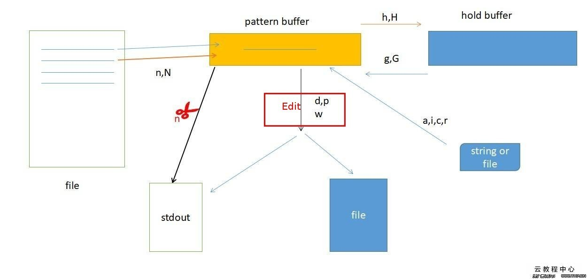

# 17.1 sed命令应用与实战
Linux 中有文本处理三剑客
- grep, egrep, fgrep：文本过滤器
- sed：Stream EDitor，流编辑器，行
- awk：文本格式化工具，报告生成器

前面我们已经介绍了 [grep 命令](../07-vim/grep命令与正则表达式.md) 的使用，本节我们来讲解 sed 。sed 是基于行的文本处理工具，其处理文件使用的命令与 vim 命令行很相似由，地址定界+编辑命令组成，地址定界用于铆定要处理的行，编辑命令指定编辑操作。相比于 vim，sed 无需将整个文本加载至内存，因此 sed 更适用于文件太大而不便使用 vim 打开的情景。本节我们会详细介绍 sed 命令的使用，内容如下:
1. sed 工作原理
2. sed 命令的使用

## 1. sed 工作原理


如图是 sed 命令工作流程的示意图。sed 有两个专用的内存空间，一个叫模式空间(Pattern Space)，用于暂存地址定界匹配到的行，这些行会被接下来的 Edit 编辑命令编辑；另一个是保持空间(Hold Space)，我的理解是这就是一个临时的交换空间，可以辅助模式空间完成多行处理。我们会在后面详细介绍如何使用保持空间完成一些高级操作。

整个处理过程是。文件按行被读取，如果不能被地址定界所匹配，默认直接输出到标准输出(1)，被匹配的行进入模式空间，被 Edit 编辑命令处理，然后输出到标准所输出(2)。如果指定了原处修改源文件的 -i 选项，原本输出到标准输出的数据流将被重定向到原文件。编辑命令中有个 p 命令，其作用是将匹配到的行复制一遍再一次输出到标准输出(3)

上述过程中，我们描述了(1)(2)(3) 三种输出到标准输出的情况，sed 的 -n 选项可以禁止(1)(2)输出到标准输出。


## 2 sed 使用
**sed [OPTION]...  'script'  [input-file] ...**
- 说明: sed 命令由选项和处理文件的 script 脚本组成
- options：
    - `-n`：不输出模式空间中的内容至屏幕，具体控制见原理部分
    - `-f  /PATH`： 指定包含 script 的文件，逐行执行内部的编辑命令
    - `-r, --regexp-extended`：支持使用扩展正则表达式；
    - `-i, --in-place`：直接编辑原文件 ；
    - `-e script`：多点编辑,可使用多次，指定多个编辑脚本，文件将按行被每个命令处理；
- script：
    - 格式: 地址定界+命令，多个命令使用 ";" 隔开

#### 地址定界
|位置表示|作用|
|:---|:---|
|空地址|对全文进行处理|
|#|数字，指定行|
|#,#|指定行范围，从哪一行开始，哪一行结束|
|#,+#|从哪一行开始，往下几行；例如：3,+7|
|$|最后一行，要使用 '' 引用 script，否则 $ 会解释为引用变量值|
|1,$|第一行到最后一行|
|/pattern/|被此模式所匹配到的每一行|
|/pat1/,/pat2/|第一次由pat1匹配到的行，至第一次由pat2匹配到的行之间的所有行|
|#，/pat1/|# 指定的行到/pat1/匹配到的第一行之间的行|
|a～b|步进,从 a 行开始，每隔 b 取一行|
|1~2|所有奇数行|
|2~2|所有偶数行|

#### 编辑命令：
- `d`：删除模式空间中的内容
- `p`：额外显示模式空间中的内容；
- `a  \text`：在匹配行后面追加文本“text”，支持使用\n实现多行追加；
- `i  \text`：在匹配行前面插入文本“text”，支持使用\n实现多行插入；
- `c  \text`：把匹配到的行替换为此处指定的文本“text”；
- `w /PATH`：保存模式空间匹配到的行至指定的文件中；
- `r  /PATH`：读取指定文件的内容至当前文件被模式匹配到的行后面；文件合并；
    - eg: `sed '6r /home/tao/log.csv' /etc/fstab`
- `=`：为模式匹配到的行打印行号；
- `!`：条件取反；位于编辑命令之前，表示地址定界之前的行
    - 格式: 地址定界!编辑命令；
    - eg: `sed '/^UUID/!d'  /etc/fstab`
- `s///`：查找替换，其分隔符可自行指定，常用的有s@@@, s###等；
    - 替换标记：
        - g：全局替换；
        - w /PATH/TO/SOMEFILE：将替换成功的结果保存至指定文件中；
        - p：显示替换成功的行；
    - eg:
        - `sed '/^UUID/s/UUID/uuid/g' /etc/fstab`
        - `sed 's@r..t@&er@'    /etc/passwd`  -- & 后项引用前面匹配到的内容
        - `sed 's@r..t@&er@p' /etc/passwd`  -- 仅仅打印被替换的行

#### 结合保持空间的高级编辑命令
|命令|作用|
|:---|:---|
|h|把模式空间中的内容覆盖至保持空间中|
|H|把模式空间中的内容追加至保持空间中|
|g|把保持空间中的内容覆盖至模式空间中|
|G|把保持空间中的内容追加至模式空间中|
|x|把模式空间中的内容与保持空间中的内容互换|
|n|覆盖读取匹配到的行的下一行至模式空间中|
|N|追加读取匹配到的行的下一行至模式空间中|
|d|删除模式空间中的行|
|D|删除多行模式空间中的所有行|


#### sed 多点编辑的执行逻辑
```
# 输出第二行内容
> sed -n -r '6p' fstab
> # Accessible filesystems, by reference, are maintained under '/dev/disk'

# 对第六行执行替换，但是 -n 禁止了输出
> sed -r -n  -e '6s/Access/aaaa/' fstab
>

# 第六行被第一个 script 执行了替换，替换后的内容被第二个 script 输出
> sed -r -n  -e '6s/Access/aaaa/' -e '6p' fstab
> # aaaaible filesystems, by reference, are maintained under '/dev/disk'
```

## 3. 示例：
#### 普通用法示例
```
# 删除/boot/grub/grub2.cfg文件中所有以空白字符开头的行的行首的所有空白字符；
> sed  's@^[[:space:]]\+@@' /etc/grub2.cfg

# 删除/etc/fstab文件中所有以#开头的行的行首的#号及#后面的所有空白字符；
> sed  's@^#[[:space:]]*@@'  /etc/fstab

# 输出一个绝对路径给sed命令，取出其目录，其行为类似于dirname；
> echo "/var/log/messages/" | sed 's@[^/]\+/\?$@@'
> echo "/var/log/messages" | sed -r 's@[^/]+/?$@@'
```
#### 使用保持空间的高级示例
```
sed  -n  'n;p'  FILE：显示偶数行；
sed  '1!G;h;$!d'  FILE：逆序显示文件的内容；
sed  ’$!d'  FILE：取出最后一行；
sed  '$!N;$!D' FILE：取出文件后两行；
sed '/^$/d;G' FILE：删除原有的所有空白行，而后为所有的非空白行后添加一个空白行；
sed  'n;d'  FILE：显示奇数行；
sed 'G' FILE：在原有的每行后方添加一个空白行；
sed -n '1!G;h;$p': 逆序显示文件的内容；
```
