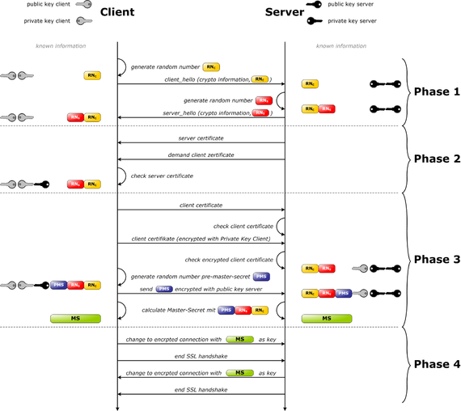

# 18.2 公钥基础设置与ssl会话
上一节我们学习了通信加密的基础知识，常见的加密解密算法，ssl/tls 协议。 还概括性的介绍了在已知公钥和基于公钥基础设施实现安全通信的过程。ssl/tls 正是用来规范如何通过公钥基础设施来进行安全通信的协议，本节我们就来详细讲解公钥基础设施，数字证书以及 ssl 会话建立的过程。

### 1. 公钥基础设施
公钥基础设置，PKI(Public Key Infrastructure)，由以下部分:
- 签证机构：CA，实际签发数字证书的机构
- 注册机构：RA，接收证书申请的机构
- 证书吊销列表：CRL
- 证书存取库

证书申请方向注册机构发起证书申请请求，注册机构统一提交给签证机构，由签证机构对申请者进行尽责调查，在确认无误后向申请方签发证书。如果申请者私钥丢失等其他原因，可向签证机构申请吊销证书。

### 2. 数字证书
X.509v3 定义了证书的结构以及认证协议标准，数字证书包含了以下内容:
- 版本号
- 序列号
- 签名算法ID: 提取数字证书特征码的单向加密算法
- 发行者名称
- 有效期限
- 主体名称
- 主体公钥
- 发行者的惟一标识
- 主体的惟一标识
- 扩展
- 发行者的签名: CA 私钥对数字证书的特征码加密后的结果

## 2. SSL会话
ssl 会话创建需要三个步骤:
1. 客户端向服务器端索要并验正证书；
2. 双方协商生成“会话密钥”；
3. 双方采用“会话密钥”进行加密通信；

SSL Handshake Protocol(ssl 握手协议) 就是用来规范客户端与服务器端如何协商生成会话密钥。如下图所示，其分成了四个阶段

#### 第一阶段：ClientHello
客户端将向服务器端发送以下信息:
- 支持的协议版本，比如tls 1.2；
- 客户端生成一个随机数，稍后用户生成“会话密钥”
- 支持的加密算法，比如AES、3DES、RSA；
- 支持的压缩算法；

#### 第二阶段：ServerHello
服务器端将向客户端发送以下信息
- 确认使用的加密通信协议版本，比如tls 1.2；
- 服务器端生成一个随机数，稍后用于生成“会话密钥”
- 确认使用的加密方法；
- 服务器证书；

#### 第三阶段-Client：
客户端接收到服务器的证书后，验正服务器证书，在确认无误后取出其公钥；（发证机构、证书完整性、证书持有者、证书有效期、吊销列表）。发送以下信息给服务器端：
- 一个随机数；
- 编码变更通知，表示随后的信息都将用双方商定的加密方法和密钥发送；
- 客户端握手结束通知；

#### 第四阶段-Server
服务器端收到客户端发来的第三个随机数pre-master-key后，计算生成本次会话所有到的“会话密钥”；向客户端发送如下信息：
- 编码变更通知，表示随后的信息都将用双方商定的加密方法和密钥发送；
- 服务端握手结束通知；