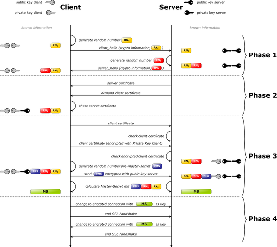

# 18.1 通信加密和解密技术入门
很多互联网的基础协议诞生于互联网产生的初期，那时候能使用互联网的人很少，能实现主机之间的通信就已经很不容易，也就没有安全通信的需求，所以大多数的基础网络通信协议都是明文传输的。随着互联网的普及，安全通信的需求越来越迫切，ssl 协议孕育而生，它位于应用层和传输层之间，为所有的应用层协议提供可选的安全通信服务。安全通信需要各种加密技术，同时也出现了通信安全的基础设施 CA，本节就会介绍这部分的基础知识，内容包括
1. 网络安全概述，包括安全的目标，面临的威胁，以及可能的防范手段
2. ssl 协议的作用和实现
3. 加密算法和协议
4. 公钥基础设施及安全通信的过程

## 1. 网络安全概述
2. 安全的目标：
	- 保密性：confidentiality
	- 完整性：integrity
	- 可用性：availability
3. 攻击类型：
	- 威胁保密性的攻击：窃听、通信量分析；
	- 威胁完整性的攻击：更改、伪装、重放、否认
	- 威胁可用性的攻击：拒绝服务（DoS）
4. 解决方案：
	- 技术（加密和解密）、服务（用于抵御攻击的服务，也即是为了上述安全目标而特地设计的安全服务）
	- 加密和解密：
		- 传统加密方法：替代加密方法、置换加密方法
		- 现代加密方法：现代块加密方法
	- 服务：
		- 认证机制
		- 访问控制机制


### 2. ssl 协议


通信协议栈分为 5 层，最上面是应用层，又称为资源子网，关注的是只关心数据是如何组织起来的，传输层及以下又称为通信子网关注的是如何传输数据。

ssl(Secure Sockets Layer) 协议相当于位于应用层与传输层之间的半层，它是可选的，可为所有的应用协议提供可选的安全通信服务。ssl 有众多实现，最著名的开源实现是 OpenSSL，任何想使用安全通信的服务，只要在进行网络传输时调用 OpenSSL 提供的服务即可。以 https 服务为例 `http --> ssl --> https`。

通过 OpenSSL 实现安全通信的过程其实是非常复杂的，http 与 https 其实是两个独立的服务，http的服务的默认端口是 80，https 则是 443。

### 2.1 ssl 版本
#### SSL协议的诞生
Netscape（网景通信公司）在1994年创建了SSL协议的原始规范，但是第一个SSL协议版本因为使用弱加密算法受到密码学界的质疑，所以从来没有公开发布过。Netscape在1995年2月修订了规范，并发布了一个大大改进的版本SSL 2.0协议，虽然SSL 2.0版本被认为是一个相当强大和健壮的协议，但仍存在一些易受攻击的漏洞。
#### SSL协议更名TLS协议
在1996年，由Netscape和Paul Kocher共同设计的版本SSL 3.0协议发布。**SSL(Secure sockets Layer)** 3.0协议获得互联网广泛认可和支持，因特网工程任务组（IETF）接手负责该协议，并将其重命名为传输层安全 **TLS(Transport Layer Security)** 协议。TLS协议的第一个版本（RFC 2246）于1999年1月发布，实质上就是SSL 3.0协议的适度改进版。虽然TLS协议和SSL协议是同一个协议的迭代升级，但是其重命名后在名称上造成的混淆一直延续到今天，业内通常将二者统称为SSL/TLS协议。

当前正在使用的时 TLS 的 V1.0, V1.1, V1.2, V1.3

### 2.2 ssl 开源实现
Linux系统上 ssl 有两个开源实现:OpenSSL(ssl) 和 GPG(pgp)。GPG 是商业软件 pgp 的开源实现。更常用的是 OpenSSL，因此我们主要讲解 OpenSSL 的使用。OpenSSL由三部分组成：
1. libencrypto库:加密算法库
2. libssl库:加密模块应用库，实现了ssl及tls
3. openssl多用途命令行工具


## 3.  加密算法和协议
加密算法分为以下几类，它们具有不同的特性，在安全通信中用于不同的安全目标。
- 对称加密: 数据加密
- 公钥加密: 数字签名和密钥交换
- 单向加密: 数据完整性认证

### 3.1 对称加密
- 定义: 加密和解密使用同一个密钥；
- 特性：
	- 加密、解密使用同一个密钥；
	- 将原始数据分割成为固定大小的块，逐个进行加密；
- 缺陷：
	- 密钥过多；
	- 密钥分发困难
- 算法
	- DES：Data Encryption Standard;
	- 3DES：Triple DES;
	- AES：Advanced Encryption Standard;  (128bits, 192bits, 256bits, 384bits)
	- Blowfish
	- Twofish
	- IDEA
	- RC6
	- CAST5

### 3.2 公钥加密：
- 定义: 密钥分为公钥与私钥
	- 公钥：从私钥中提取产生；可公开给所有人；pubkey
	- 私钥：通过工具创建，使用者自己留存，必须保证其私密性；secret key；
- 特点：用公钥加密的数据，只能使用与之配对儿的私钥解密；反之亦然；
- 缺陷：加密时间长
- 用途：
	- 数字签名：主要在于让接收方确认发送方的身份；
	- 密钥交换：发送方用对方公钥加密一个对称密钥，并发送给对方；
	- 数据加密
- 算法：
	- RSA， DSA， ELGamal
	- DSS: Digital Signature Standard
	- DSA：Digital Signature Algorithm

#### 3.3 单向加密
- 定义: 用于提出数据指纹；只能加密，不能解密；
- 特性：定长输出、雪崩效应；
- 功能：数据完整性校验；
- 算法：
	- md5：Message Digest 5, 128bits
	- sha1：Secure Hash Algorithm 1, 160bits
	- sha224, sha256, sha384, sha512

### 3.4  密钥交换协议
密钥交换协议 IKE（Internet Key Exchange）主要作用是如何在不安全的网络环境中实现密钥交换。其密钥交换过程如下所示

```
公钥加密
DH（Deffie-Hellman）
A：p, g
B：p, g

A: x
	--> p^x%g ==> B

	A: (p^y%g)^x=p^yx%g

B: y
	--> p^y%g ==> A

	B: (p^x%g)^y=p^xy%g
```

## 4. 公钥基础设施与安全通信过程
公钥基础设施主要作用是确保安全的获取通信双方的公钥，要完整了解公钥基础设施与安全通信过程我们得分成两步:
1. 在已知通信双方公钥的情况下，我们如何安全通信
2. 公钥基础设施如何确保我们安全拿到对方的公钥

### 4.1 已知公钥下安全通信过程
A  ---> B
```
A             ----->        B          ---->  作用
-----------------------------------------------------
B公钥加密的                B 私钥解密           密钥交换
对称加密密钥               获取对称密钥
------------------------------------------------------
对称加密的     ------>    使用对称密钥    ----->  数据保密性
传输内容                  解密传输内容
---------------------------------------------------------
A私钥加密的   -------->   使用 A 公钥解密指纹 ---> A 身份验证
传输内容的指纹             重算传输内容指纹
                         对比指纹          --->  数据完整性
```
A:
1. A 使用单向加密提取传输内容特征码，并使用自己的私钥加密特征码
2. A 使用对称密钥加密传输内容
3. A 使用 B 的公钥加密使用到的对称加密的密钥

B:
1. B 使用自己的私钥解密获取对称加密的密钥
2. 使用对称加密密钥解密整个文件内容
3. 使用 A 的公钥解密获取邮件内容特征码
4. 使用同样的加密算法提取接收内容的特征码，与解密的特征码对比验证数据完整性


### 4.2 基于CA获取公钥


A ---> B 数字证书交换及验证
1. 通信双方分别发送 hello 信息给对方，开启 ssl 会化，然后协商后续通信过程使用的加密算法等信息
1. 双方分别获取对方的数字证书
2. 通过发行者名称获取本地已经保存的CA的证书，获取CA公钥
3. 验证CA: 使用 CA 公钥解密发行者签名，认证 CA，并获取数字证书特征码
4. 验证数字证书完整性: 使用数字证书中签名算法ID表明的单向加密算法重新计算特征码，并与 3 中解密出来的特征码进行比对
5. 对于主机数字证书，主体名称必须与访问的主机名称(域名) 必须一致，否则也可能不会通过认证

证书验证包括:
1. 证书内容完整有效
1. 证书名称与访问服务器是否一致
2. 证书是否是信任的CA颁发的
3. 证书是否在有效期内
4. 证书是否在CA的吊销列表中

通信双方通过 CA 以安全方式获取私钥之后，就可以安全性的进行网络通信了。


### 4.2 公钥基础设施
PKI：Public Key Infrastructure，公钥基础设施包括了以下部分:
- 签证机构：CA
- 注册机构：RA
- 证书吊销列表：CRL
- 证书存取库

### 4.3 数字证书
X.509v3：定义了证书的结构以及认证协议标准，数字证书包含了以下内容:
- 版本号
- 序列号
- 签名算法ID: 提取数字证书特征码的单向加密算法
- 发行者名称
- 有效期限
- 主体名称
- 主体公钥
- 发行者的惟一标识
- 主体的惟一标识
- 扩展
- 发行者的签名: CA 私钥对数字证书的特征码加密后的结果
