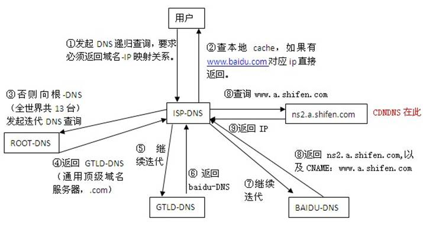

# 19.1 DNS域名服务原理
DNS 虽然是互联网的基础服务，但是实际上很少人会买域名，配置 DNS 服务器的人很少，所以很多人对 DNS 服务并不熟悉。本节我们就来讲解 DNS 服务的基本原理。

## 1. DNS 概述：
### 1.1 DNS 相关概念
DNS 全称为 Domain Name Service 属于应用层协议，工作于 udp/tcp 的 53 号端口。DNS 服务工作于 udp 53 号端口，tcp 的 53 端口用于实现主从 DNS 同步。

为了分散 DNS 查询的负载，同时方便域名的管理，DNS 被组织成一个倒置的树结构。如下图所示

根域为 `.`，其下是顶级域和国家域，每个顶级域由不同的机构进行域名管理。顶级域下是二级域，我们购买的域名不是单个域名而是整个二级域，购买后可根据需要配置子域。比如，我在`.com.`顶级域下购买了域 `tao.com.`，可根据需求配置一个域名 `web.tao.com.`,也可以配置 `image.web.tao.com.`，对于域名大范围在右边，小范围在左边。

### 1.2 DNS 服务
上面展示的倒置树是 DNS 的结构示意图，在每个域上，都是有一个个 DNS 服务器。DNS 服务由 bind 程序提供。按照提供的服务类型，可将 DNS 服务器分为
- 负责解析至少一个域的**主名称服务器**和**辅助名称服务器**；
- 不负责哉解析的**缓存名称服务器**；

### 1.3 DNS 查询请求流程

12 章中我们讲解了如何配置 Linux 的网络属性，`/etc/resolv.conf` 配置文件内配置了我们的 DNS 服务器指向。当我们在浏览器内输入 `www.baidu.com` 时，将按照如下的顺序查询 百度的 ip 地址:
1. 首先会访问本地的 hosts文件，如果有记录则直接返回结果
2. 查询本地的DNS缓存DNS，有则直接返回
3. 向 `/etc/resolv.conf` 配置的 DNS 服务器发起查询请求
	- 如果域名是自己负责解析的域，DNS 服务器将直接查询数据库并返回结果；
	- 如果不是自己负责解析域，并且服务器内未缓存，DNS 服务器将向发起迭代查询
4. 如上图所式，配置文件指向的 DNS 服务器，将帮助我们按照 DNS 的层级结构从顶至下发起迭代查询，直至查询到结果返回给我们。

因此 DNS 的查询可分为:
- 递归查询：本机向配置的 DNS 服务器发起的即是递归查询，DNS 服务器返回给我们的是结果
- 迭代查询：DNS 服务向上层 DNS 服务器发起的则是迭代查询，需要根据返回结果继续迭代查询。

DNS 服务器返回给我们的结果有如下几种情况:
- 肯定答案：域名的解析结果
- 否定答案：不存在查询的键，因此，不存在与其查询键对应的值；
- 权威答案：由直接负责的DNS服务器返回的答案；
- 非权威答案：由非直接负责的DNS服务器的缓存返回，有可能缓存失效

### 1.4 DNS 反向解析
DNS 除了将域名解析为 ip 外，还能将 ip 解析为主机名
- 名称 --> IP：正向解析
- IP --> 名称：反向解析

但是需要注意的是，正向反向解析的的名称空间，不是同一个空间，即正向反向解析不是同一棵树，使用的是不同的解析库文件

### 1.5 DNS 中的区域与域
域(domain)，FQDN（Full Qualified Domain Name）是一种逻辑概念，包括物理上的
1. 由 `FQDN --> IP` 的正向解析区域(zone)
- 由 `IP --> FQDN` 的反向解析区域(zone)

## 2. 主从 DNS 服务器
为了放置 DNS 单节点故障导致整个服务不可用，也为了平衡负载，DNS 服务器通常为主从模式
- 主DNS服务器：为维护所负责解析的域数据库的那台服务器；读写操作均可进行；
- 从DNS服务器：从主DNS服务器那里或其它的从DNS服务器那里“复制”一份解析库；但只能进行读操作；

### 2.1 主从同步方式
DNS 服务器的主从复制有如下特性:
1. 数据库有序列号(serial),即数据库的版本号；主服务器数据库内容发生变化时，其版本号递增
2. 从服务器会按照设置的时间间隔从主服务器同步数据
		- `refresh`: 刷新时间间隔,从服务器每多久到主服务器检查序列号更新状况
		- `retry`: 重试时间间隔, 从服务器从主服务器请求同步解析库失败时，再次发起尝试请求的时间间隔；
		- `expire`: 过期时长，从服务器始终联系不到主服务器时，多久之后放弃从主服务器同步数据；停止提供服务；
3. 处理从服务器定时同步外，主服务器会在每次数据发生变更时，通知从服务器随时更新数据
4. 数据传送(区域传送)分为如下两种，通常只会进行增量传送
	- 全量传送：axfr, 传送整个数据库；
	- 增量传送：ixfr, 仅传送变量的数据
