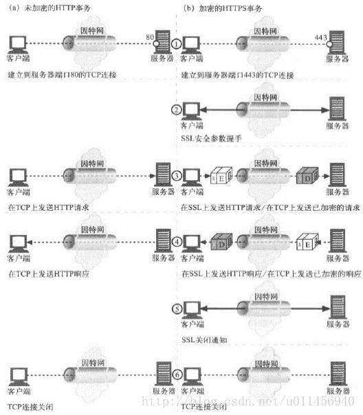

# 20.7 httpd 配置进阶
我们来继续学习 httpd 的配置，本节属于高级配置篇，核心是配置httpd支持https。

## 1. 指定 httpd 服务的运行身份
```
User apache
Group apache
```
`User` 和 `Group` 指令用于指定以哪个用户的身份运行httpd服务进程。该帐户决定了 httpd 进程在本机的权限。千万不能以 root 用户运行我们的 httpd 进程，以免 httpd 被劫持导致整个机器被控制。

需要注意的是如果指定的帐户没有权限访问文件系统上的内容，即便 `<Directory>` 开放了访问接口也一样无法访问。因此 httpd 提供了 `SUexec`，用于在特定的目录内进行用户切换以便能够方便的访问到受限的文件，而不用更改文件的权限。`SUexec`有安全风险，一般也很少使用。

## 2. 页面压缩
`mod_deflate` 模块提供了压缩功能。压缩可以节约带宽，但是会额外消耗CPU；同时，可能有些较老浏览器不支持。是否启用压缩取决于网络带宽与 CPU 哪个更加稀缺。

有些资源是可压缩的，例如文件文件，而有些资源本身已经是压缩的，比如图片，这些则无需压缩。httpd 的压缩功能配置如下:

```
# 1. 首先确认是否加载了 deflate 模块
$ httpd -M|grep -i deflate  
deflate_module (shared)

# 2. 没有加载，则在配置文件中加载 deflate_module
LoadModule deflate_module modules/mod_deflate.so

# 3. 配置压缩功能
$ vim /etc/httpd/conf.d/compress.conf  # 在单独配置文件中配置，方便取消

SetOutputFilter DEFLATE               # 添加一个过滤器   

# mod_deflate configuration           # 向过滤器添加压缩哪些内容
# Restrict compression to these MIME types
AddOutputFilterByType DEFLATE text/plain
AddOutputFilterByType DEFLATE text/html
AddOutputFilterByType DEFLATE application/xhtml+xml
AddOutputFilterByType DEFLATE text/xml
AddOutputFilterByType DEFLATE application/xml
AddOutputFilterByType DEFLATE application/x-javascript
AddOutputFilterByType DEFLATE text/javascript
AddOutputFilterByType DEFLATE text/css

# Level of compression (Highest 9 - Lowest 1)
DeflateCompressionLevel 9           # 默认压缩级别

# Netscape 4.x has some problems.   # 特殊浏览器的特殊处理
BrowserMatch ^Mozilla/4  gzip-only-text/html

# Netscape 4.06-4.08 have some more problems
BrowserMatch  ^Mozilla/4\.0[678]  no-gzip

# MSIE masquerades as Netscape, but it is fine
BrowserMatch \bMSI[E]  !no-gzip !gzip-only-text/html
```

## 3. 配置httpd支持https
SSL会话是基于IP地址创建；所以单IP的主机上，仅可以使用一个https虚拟主机
### 3.1 SSL会话的简化过程


1. 客户端发送可供选择的加密方式，并向服务器请求证书；
2. 服务器端发送证书以及选定的加密方式给客户端；
3. 客户端取得证书并进行证书验正：
    - 验正证书来源的合法性；用CA的公钥解密证书上数字签名；
    - 验正证书的内容的合法性：完整性验正
    - 检查证书的有效期限；
    - 检查证书是否被吊销；
    - 证书中拥有者的名字，与访问的目标主机要一致；
4. 客户端生成临时会话密钥（对称密钥），并使用服务器端的公钥加密此数据发送给服务器，完成密钥交换；
5. 服务用此密钥加密用户请求的资源，响应给客户端；

### 3.2 配置httpd支持https
配置 https 需要如下几个步骤:
1. 为服务器申请数字证书。本地测试时，可以私建CA发证书
2. 配置httpd支持使用ssl，及使用的证书；
3. 测试基于https访问相应的主机；

#### 私建 CA 发证
参见[18.4 私建CA.md](18-通信加密和解密技术/私建CA.md)

#### 配置 ssl
```
# 1. 安装 httpd 的 ssl 功能模块
yum -y install mod_ssl

# 2. 编辑配置文件
$ vim /etc/httpd/conf.d/ssl.conf  
DocumentRoot "/var/www/html"
ServerName   "www.magedu.com:443"
SSLCertificateFile  "/etc/httpd/ssl/http_crt.pem"
SSLCertificateKeyFile "/etc/httpd/ssl/http_key.pem"
```

#### 测试 https 服务
我们可以在浏览器导入我们私建的 CA 直接在浏览器中进行测试，也可以通过 `openssl` 的 `s_client` 子命令进行测试

`openssl  s_client  OPTIONS`
- 作用: https 连接的客户端工具
- 选项:
  - `[-connect host:port]`: 连接的主机和端口
  - `[-CAfile filename]`: CA 证书的位置
