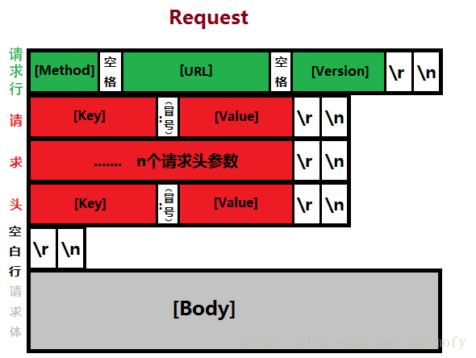
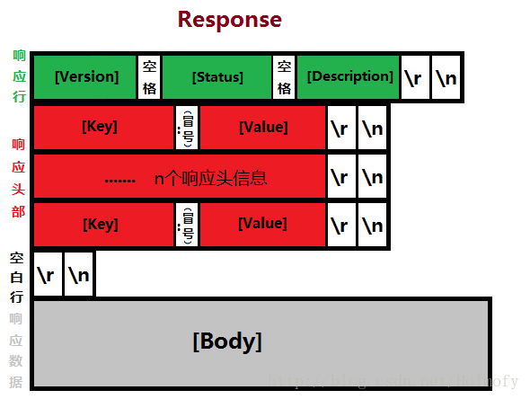

# 20.2 http协议基础
前面我们了解了 web 的基础概念，本节来对 http 协议做一个更加详细的描述。

## 1. http 协议
http协议全称为超文本传输协议(**hyper text transfer protocol**),用来协议传输 html，有如下几个版本
1. http/0.9：原型版本，功能简陋
2. http/1.0: 增加了 cache, MIME, method,              
    - MIME：Multipurpose Internet Mail Extesion 多功能互联网邮件扩展
    - method：支持多种 http 方法，包括 GET， POST， HEAD，PUT， DELETE，TRACE， OPTIONS
3. http/1.1：增强了缓存功能；spdy
4. http/2.0：rfc

## 1.2 http 报文格式
http 报文有请求报文，响应报文组成，一次http事务包括完整的`请求<-->响应` 过程。报文格式如下所示。我们会在之后的章节中详细讲解 http 报文中各个字段的含义及作用，目前做了解即可。

#### 请求报文


```
<method> <request-URL> <version>
<headers>

<entity-body>
```

示例如下:
```
Host: ss1.bdstatic.com
User-Agent: Mozilla/5.0 (X11; Linux x86_64; rv:52.0) Gecko/20100101 Firefox/52.0
Accept: text/css,*/*;q=0.1
Accept-Language: zh-CN,zh;q=0.8,en-US;q=0.5,en;q=0.3
Accept-Encoding: gzip, deflate, br
Referer: https://www.baidu.com/
Connection: keep-alive
```

#### 响应报文


```
<version> <status> <reason-phrase>
<headers>

<entity-body>
```

示例如下:
```
HTTP/1.1 200 OK
Content-Encoding: gzip
Content-Type: text/html;charset=utf-8

<!DOCTYPE html>
<html lang="en">
<head>
    <meta charset="UTF-8" />
    <title>Document</title>
</head>
<body>
    <p>this is http response</p>
</body>
</html>
```


### 1.1 MIME
`MIME`: Multipurpose Internet Mail Extesion
- 作用: 多功能互联网邮件扩展，通过文本协议(http)发送非文本数据
- MIME 类型: 媒体类型，由 http header 的 `Content-Type` 字段标识，决定了资源由哪一个浏览器外部插件打开
- 格式: `major/minor`
    - text/html
    - text/plain
    - image/jpeg

```
BDPAGETYPE: 1
BDQID: 0xbbfea62700012a90
Cache-Control: private
Connection: Keep-Alive
Content-Encoding: gzip
Content-Type: text/html   # MIME 类型
.....
```

### 1.3 http 长短链接
http请求处理中的有两种连接模式：
- 非保持连接（短连接）：完成当前 http 事务后即断开 tcp 链接，下次请求需要重新建立链接
- 保持连接（又称长连接）：keep-alive，http 会复用当前的 tcp 链接。

tcp 链接的建立与拆除需要耗费时间，因此复用 tcp 链接能降低请求响应的时间，但是 tcp 链接会占用 web server 的 socket 文件，当链接过多时，其他客户将无法建立链接。所以是否启用保持链接取决于 tcp 链接的使用状态。通常情况下，http 1.1 中默认就会启动保持链接功能，服务器会在 tcp 链接达到一定时间，或者处理足够多的请求时自动断开链接，以免资源浪费。


### 1.4  http请求过程
一次完整的 http 请求包括了如下过程:
- 建立或处理连接：接收请求或拒绝请求；
- 接收请求：接收来自于网络上的主机请求报文中对某特定资源的一次请求的过程；
- 处理请求：对请求报文进行解析，获取客户端请求的资源及请求方法等相关信息；
- 访问资源：获取请求报文中请求的资源；
- 构建响应报文：
- 发送响应报文：
- 记录日志：

### 2. 并发访问响应模型
web server 面对的时互联网上的所有潜在用户，因此同一时刻可能有多个用户访问我们的主机。面对多用户请求，web server 有如下几种访问响应模型:
1. 单进程I/O模型：启动一个进程处理用户请求；这意味着，一次只能处理一个请求，多个请求被串行响应；
2. 多进程I/O结构：并行启动多个进程，每个进程响应一个请求；
3. 复用的I/O结构：一个进程响应n个请求；
    - 多线程模式：一个进程生成n个线程，一个线程处理一个请求；
    - 事件驱动(event-driven)：一个进程直接n个请求；
4. 复用的多进程I/O结构：启动多个（m）个进程，每个进程生成（n）个线程；
    - 响应的请求的数量：m*n
