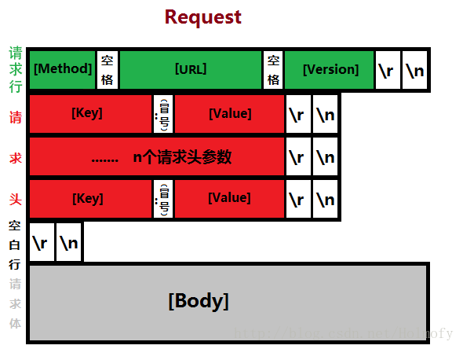

# 20.3 http协议进阶
在[20.2 http协议基础](20-web-apache/http协议基础.md)我们对 http 协议做了简单介绍，本节我们来学 http 协议更深入的细节,包括:
1. http 的状态追踪机制
1. http 协议的报文

市面上有很多的协议抓包分析工具，常见的有 tcpdump, tshark, wireshark，常见浏览器也提供了 http 协议的网络分析工具，大家可以学习了解了解。

## 1 http状态追踪
http 协议是无状态的(stateless),服务器无法持续追踪访问者来源。因此在 http 协议的基础上有 cookie 和 session 机制用来帮助状态追踪。

## 2. http 报文
#### 请求报文


```
<method> <request-URL> <version>
<headers>

<entity-body>
```

#### 响应报文


```
<version> <status> <reason-phrase>
<headers>

<entity-body>
```

#### http 报文内容
http 的报文格式如上图所示，各个字段的含义如下
- `method`: 请求方法，标明客户端希望服务器对资源执行的动作 -- GET、HEAD、POST
- `version`: `HTTP/<major>.<minor>`，http 协议的版本
- `status`: 三位数字，如200，301, 302, 404, 502; 标记请求处理过程中发生的情况；
- `reason-phrase`：状态码所标记的状态的简要描述；
- `headers`：每个请求或响应报文可包含任意个首部；每个首部都有首部名称，后面跟一个冒号，而后跟上一个可选空格，接着是一个值；
- `entity-body`：请求时附加的数据或响应时附加的数据；

## 2.1 method(方法)：
http 协议的请求方法:
- `GET`：从服务器获取一个资源；
- `HEAD`：只从服务器获取文档的响应首部；
- `POST`：向服务器发送要处理的数据；
- `PUT`：将请求的主体部分存储在服务器上；
- `DELETE`：请求删除服务器上指定的文档；
- `TRACE`：追踪请求到达服务器中间经过的代理服务器；
- `OPTIONS`：请求服务器返回对指定资源支持使用的请求方法；


## 3.status(状态码)
http 协议的状态码:
- `1xx`：100-101, 信息提示；
- `2xx`：200-206, 成功
- `3xx`：300-305, 重定向
- `4xx`：400-415, 错误类信息，客户端错误
- `5xx`：500-505, 错误类信息，服务器端错误

常用的状态码：
- `200`： 成功，请求的所有数据通过响应报文的entity-body部分发送；OK
- `301`： 永久重定向，请求的URL指向的资源已经被删除；但在响应报文中通过首部Location指明了资源现在所处的新位置；Moved Permanently
- `302`： 临时重定向，与301相似，但在响应报文中通过Location指明资源现在所处临时新位置; Found
- `304`： 条件式请求，客户端发出了条件式请求，但服务器上的资源未曾发生改变，则通过响应此响应状态码通知客户端；Not Modified
- `401`： 需要输入账号和密码认证方能访问资源；Unauthorized
- `403`： 请求被禁止；Forbidden
- `404`： 服务器无法找到客户端请求的资源；Not Found
- `500`： 服务器内部错误；Internal Server Error
- `502`： 代理服务器从后端服务器收到了一条伪响应；Bad Gateway

## 4. headers(首部)
http 的首部是形如 `Name: Value`的键值对，可分为:
- 通用首部
- 请求首部
- 响应首部
- 实体首部
- 扩展首部

```
Cache-Control:public, max-age=600
Connection:keep-alive
Content-Type:image/png
Date:Tue, 28 Apr 2015 01:43:54 GMT
ETag:"5af34e-ce6-504ea605b2e40"
Last-Modified:Wed, 08 Oct 2014 14:46:09 GMT


Accept:image/webp,*/*;q=0.8
Accept-Encoding:gzip, deflate, sdch
Accept-Language:zh-CN,zh;q=0.8
Cache-Control:max-age=0
Connection:keep-alive
Host:access.redhat.com
If-Modified-Since:Wed, 08 Oct 2014 14:46:09 GMT
If-None-Match:"5af34e-ce6-504ea605b2e40"
Referer:https://access.redhat.com/documentation/en-US/Red_Hat_Enterprise_Linux/6/html-single/Installation_Guide/index.html
User-Agent:Mozilla/5.0 (Windows NT 6.1; WOW64) AppleWebKit/537.36 (KHTML, like Gecko) Chrome/41.0.2272.101 Safari/537.36
```


### 4.1 通用首部：
- `Date`： 报文的创建时间
- `Connection`：连接状态，如keep-alive, close
- `Via`：显示报文经过的中间节点
- `Cache-Control`：控制缓存
- `Pragma`：

### 4.2 请求首部：
1. 基础请求首部
	- `Accept`：通知服务器自己可接受的媒体类型；
	- `Accept-Charset`：
	- `Accept-Encoding`：接受编码格式，如gzip
	- `Accept-Language`：接受的语言
	- `Client-IP`：
	- `Host`： 请求的服务器名称和端口号
	- `Referer`：包含当前正在请求的资源的上一级资源；
	- `User-Agent`：客户端代理
2. 条件式请求首部：
	- `Expect`：
	- `If-Modified-Since`：自从指定的时间之后，请求的资源是否发生过修改；
	- `If-Unmodified-Since`：
	- `If-None-Match`：本地缓存中存储的文档的ETag标签是否与服务器文档的Etag不匹配；
	- `If-Match`：
3. 安全请求首部：
	- `Authorization`：向服务器发送认证信息，如账号和密码；
	- `Cookie`： 客户端向服务器发送cookie
	- `Cookie2`：
4. 代理请求首部：
	- `Proxy-Authorization`： 向代理服务器认证

### 4.3 响应首部：
- 信息性：
    - `Age`：响应持续时长
    - `Server`：服务器程序软件名称和版本
- 协商首部：某资源有多种表示方法时使用
    - `Accept-Ranges`：服务器可接受的请求范围类型
    - `Vary`：服务器查看的其它首部列表；
- 安全响应首部：
    - `Set-Cookie`：向客户端设置cookie；
    - `Set-Cookie2`：
    - `WWW-Authenticate`：来自服务器的对客户端的质询认证表单

### 4.4 实体首部：
1. 基础实体首部
	- `Allow`： 列出对此实体可使用的请求方法
	- `Location`：告诉客户端真正的实体位于何处
	- `Content-Encoding`： 实体的编码方式 eg： gzip
	- `Content-Language`：
	- `Content-Length`： 主体的长度
	- `Content-Location`： 实体真正所处位置；
	- `Content-Type`：主体的对象类型，MIME 类型
2. 缓存相关：
	- `ETag`：实体的扩展标签；
	- `Expires`：实体的过期时间；
	- `Last-Modified`：最后一次修改的时间
