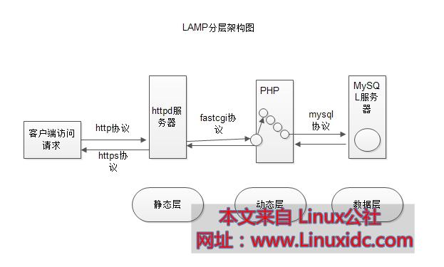

# 20.1 web服务基础概念
web 服务也就是我们常说的网站开发，是构建在 http 协议上的 C/S 架构的应用程序。web serve 监听在 80 端口，浏览器就是我们的客户端。通过浏览器我们就可以访问 web 站点的内容。本节我们就来对 web 框架和浏览器的请求流程做一个概括性的描述。


## 1. web 架构
最简单的 web 应用构建在我们通常称之为 LAMP 的架构上，如下图所示。



静态层称为 web 服务器(又叫**静态资源服务器**)，动态层称为**应用程序服务器**。之所以有动态和静态之分，是因为我们 web 资源分为两种类型
- 静态资源: 无须服务端做出额外处理,比如 .jpg, .png, .gif, .html, txt, .js, .css, .mp3, .avi                    
- 动态资源: 服务端需要通过执行程序做出处理，发送给客户端的是程序的运行结果，比如 .php, .jsp。

即我们看到的 web 页面的部分内容不是事先就存在的，而是根据每个访问的客户动态生成的，其中定制了每个人的特定信息。动态资源能根据用户的请求，到数据库中读取用户个人信息，然后执行再生成特定的页面供用户访问。

#### URL
通常一个页面中展示的资源可能有多个，每个资源都需要单独请求。每个资源由 URL(Uniform Resource Locator,统一资源定位符号)进行标识。URL 的格式为:

`<scheme>://<user>:<password>@<host>:<port>/<path>;<params>?<query>#<frag>`
- `scheme`: 协议类型，eg: http,https, ftp
- `host`: 主机 ip 地址
- `port`: 端口
- `path`: 资源在主机上的路经
- `params`: 参数 http://www.magedu.com/bbs/hello;gender=f
- `query`： http://www.magedu.com/bbs/item.php?username=tom&title=abc
- `frag`：https://access.redhat.com/documentation/en-US/Red_Hat_Enterprise_Linux/6/html-single/

#### web 服务器
常见的 web 服务器与应用程序有以下几种:
1. web 服务器(静态资源服务器)
    - httpd (apache)
    - nginx
    - lighttpd
2. 应用程序服务器：
    - 使用 `C#` 作为开发语言的 `.Net` 服务器: IIS
    - 使用 java jsp 作为开发语言的 `.jsp` 服务器: tomcat, jetty, jboss, webshpere, weblogic

抛开动态层和数据层，客户端和 web 服务器就可以构成简单的 web 站点。

#### 通信过程
web 是构建在 http 协议上的应用。http协议全称为超文本传输协议(**hyper text transfer protocol**),用来协议传输 html 这种超文本的应用层协议， 工作于tcp 的 80。

整个 web 请求和响应会有如下过程:
1. web server 监听在 tcp 80 端口
2. 用户在浏览器中输入网址，经 DNS 解析得到 ip 后，发起对 web server 的链接请求
3. 通信双方基于 tcp 的三次握手建立 tcp 链接
4. web serve 收到用户的请求报文中对某一特定资源的请求
5. web server 对请求报文进行解析，获取客户端请求的资源及请求方法等相关信息；
6. web server 获取请求的资源，构建响应报文，经 tcp 链接发送响应报文给客户端，并记录日志
7. 浏览器接收响应报文并展示给用户
8. 通信结束后，tcp 四次挥手断开 tcp 链接，通信结束。

#### web 技术栈
web 开发，分为前段和后端开发，前端指的是浏览器展示的页面，后端通常是应用程序部分。后端依所使用的开发语言而异，前端开发运用到的技术有:
2. `html`：hyper text mark language，超文本标记语言
3. `css`: Cascading Style Sheet 样式表
4. `js`：JavaScript, 客户端脚本

下面是一个简单的 html 的示例，这些技术如果了解过 web 开发很容易就会明白他们有什么作用。
```html
    <html>
        <head>
            <title>TITLE</title>
        </head>
        <body>
            <h1></h1>
                <p> blabla... <a href="http://www.magedu.com/download.html"> bla... </a> </p>
            <h2> </h2>
        </body>
    </html>
```
