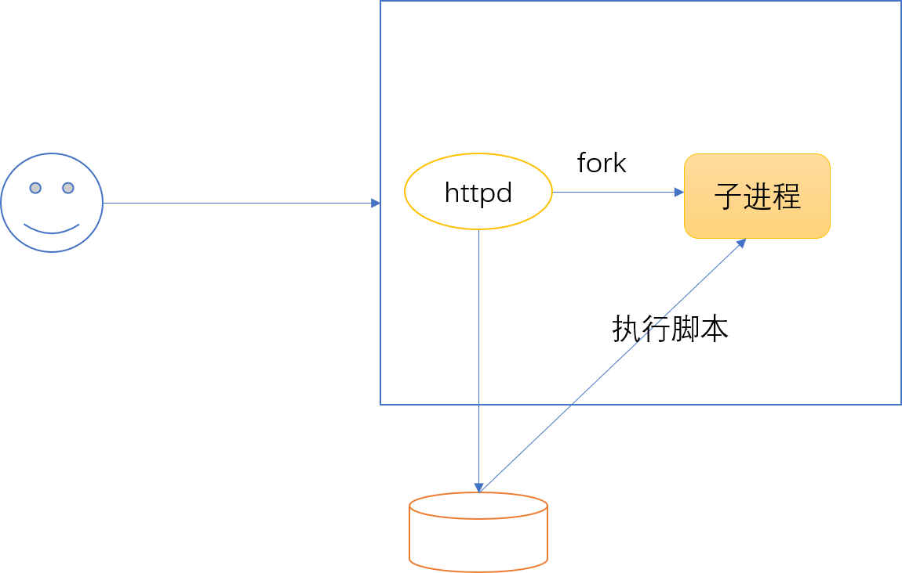
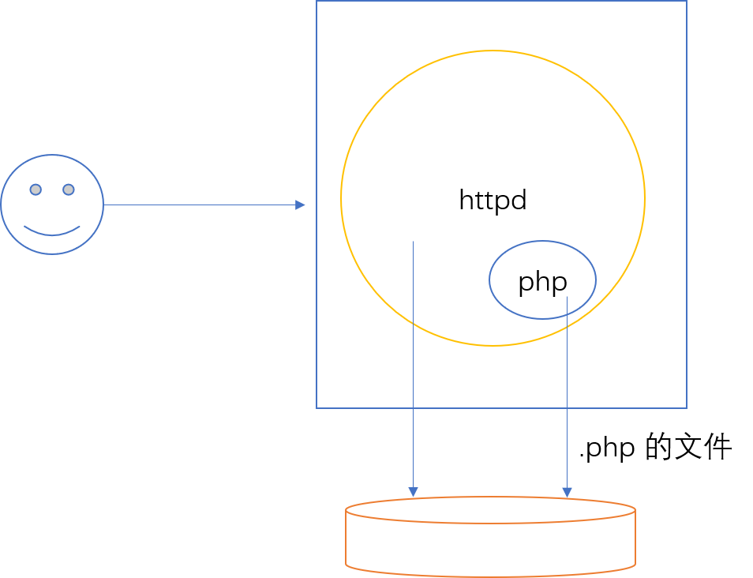

# 21.1 LAMP入门讲解
LAMP 是搭建一个动态 web 站点的基本服务框架，本节我们就来介绍他的基本原理。

## 1. LAMP
### 1.1 LAMP 简介
最早的 web 站点只能提供静态内容，我们的 web 服务只有一个 httpd 服务器，要想展示页面我们必需事先生成静态的 web 页面。但是我们很清楚，不论哪个网站大多数页面都是类似的，只有一小部分不同，大多数页面都可以套用相同的模板动态生成。而填充模板的数组则通常放置在数据库中，最为大家所熟知的也就是 mysql。因此我们的 web 资源就分成了静态资源和动态资源两种
- 静态资源：原始形式与响应内容一致；
- 动态资源：原始形式通常为程序文件，需要在服务器端执行之后，将执行结果返回给客户端

服务器端加载动态资源的方式，按照技术的出现的时间次序分为了:
1. CGI, Common Gateway Interface
2. FCGI, Fast CGI

接下来我们就来详细介绍，这两种动态资源的加载方式

### 1.1 CGI
CGI(Common Gateway Interface，通用网关接口)，是一种传输协议，它规范了客户端与服务器端如何传输动态资源以及服务器端如何加载动态资源的方式。它的模型如下图所示

这种模型下并不存在后端的应用程序服务器，由前端 web 服务器完成所有工作。动态资源的请求过程如下所示：
- httpd 服务接收用户请求(动态资源)
- httpd 基于cgi 协议，在子进程中自动调用 php 的解释器执行对应的 php 脚本，并获取脚本返回结果作为响应传递给客户端
- 后端应用程序，无须是一个服务，无须理解 http 协议，全部由 apache 服务器完成
- 即由 web 服务器理解和解析 url，并由 web 服务自行调用动态资源的解释器，运行该动态资源，并获取结果响应给客户端

CGI 在每响应一个动态资源时，必须创建和销毁子进程，性能很低。

### 1.2 FCGI
FCGI 是 CGI 的增强版本，其动态资源的请求过程如下所示

- 后端应用程序服务器作为独立的服务监听在特定端口，与 httpd 通过 tcp/udp 协议进行通信
- httpd 接收用户请求后，作为客户端向应用程序服务器请求相同的动态资源
- 后端应用程序服务器加载并执行 php 脚本，并将执行结果作为响应返回给 httpd，httpd 响应给客户端
- httpd 起到了反向代理的作用

后端应用程序服务器可以预先创建子进程，这样避免了每次请求都必须创建和销毁子进程带来的开销。

对于 php 而言还存在另一中 FCGI 模式。php 解释功能可作为 httpd 的一个模块存在，httpd 可直接执行 php 脚本，无需创建和销毁子进程。此时 httpd 既是一个静态 web 服务器，也充当应用程序服务器。这种模式也存在一定缺陷:
1. web 服务器和应用程序服务器无法分离开
2. 每个执行 php 的 httpd 进程都必需独自解析 php 脚本，无法利用 php 的加速技术。

此 LAMP 的结构如下所示

### 1.4 LAMP 架构

一个经典的 LAMP 架构如上图所示，包括:
- l: Linux
- a: apache httpd
- m: 数据库存储系统，可以是 mysql, mariadb，mongo
- p: 后端应用程序的开发语言，可以是 php, perl, python
