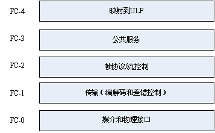

# 23. 文件存储共享服务配置与实战
计算机上的磁盘设备有 SATA，SAS；IDE，SCSI；USB 等各种接口。以 SCSI 而言，SCSI 接口可以分线，一个接口可连接多个设备，我们的操作系统想要往磁盘上写数据时，需要标识哪块磁盘哪个位置。因此 SCSI 不仅代表一种硬盘，也代表了一种操作系统如和向磁盘读写数据的协议，而且与网络协议类似，这种协议是分层的。SCSI 协议结构如下图所示

因为协议是分层，所以如果将最底下的物理层替换为光纤，并通过 TCP/IP 协议进行网络传输，我们的磁盘设备就可以被互联网上的其他访问，从而达到共享存储的目的。对于 SCSI 大家不用太关心，只需要知道数据传输的协议都是分层的，我们可以通过替换底层的传输协议达到共享存储的目的，具体怎么实现大家无需关心。

类似于磁盘这种直接附加在总线上的的设备通常被称为 DAS(Direct Attached Storage)，DAS 输出给操作系统的接口是块(block),块可以被分区格式化。按照附加到操作系统的方式，我们将存储设备分成以下几个类别:
1. DAS: Direct Attached Storage
    - 接口类型：输出给操作系统的接口是"块"
    - 设备：SATA，SAS；IDE，SCSI；USB；
2. NAS: Network Attached Storage
    - 接口类型: 输出给操作系统的接口是"文件"
    - 依据传输数据的协议可以分为
      - CIFS: samba
      - NFS: Network File System
    - 说明: 这种方式就是我们可以把别人共享出来的文件系统直接挂载使用
3. SAN：Storage Area Network 存储区域网络
    - 接口类型："block"
    - 协议：iSCSI(IP-SAN), FCSAN, FCoE, ...
    - 说明: 这种方式的实现方式就是类似与我们上述所说的，将 SCSI 协议底层的物理协议替换成 TCP/IP，让磁盘设备能够通过网络向其他主机输出块接口。而为了能够进行网络传输，原来的 SCSI 磁盘将被替换为一个主机，该主机负责向外输出存储。

ftp 不能视为为一种存储，因为其基本调用接口是不能在文件系统层级进行的，只能使用专门的客户端与其交互。ftp 是应用层协议实现的共享存储。本节我们就来依次介绍这几种服务:
1. vsftpd
2. NFS
3. samba

需要注意的是，如果不是当网管上述几个服务用到的很少，所以我们只需要达到基本应用即可。
