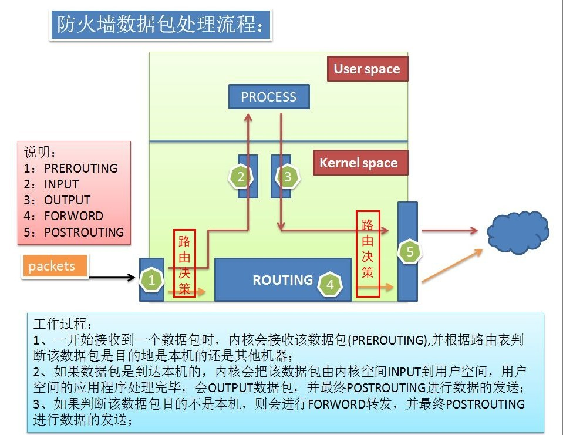

# 24.1 Linux防火墙基础理论
要想说清楚防火墙的工作机制并不容易，需要从网络通信说起，我们首先得明白网络通信都是通过 TCP/IP 协议进行得，无论是正常得请求响应还是非法得入侵首先必需与我们得主机建立通信，而我们得防火墙就是在数据包到达本机之后，在报文得必经之地设下"管卡"，利用我们设置得过滤对报文进行检查，放行我们允许得数据报文，阻挡可疑得报文以达到保护主机得目的。所以 Linux 中得防火墙又称为包过滤型的防火墙。下面我们就来详细解释防火墙得工作机制，本节内容包括:
1. Linux 防火墙工作机制
2. Linux 防火墙 Firewall 简介
3. iptables 的四表五链

## 1. 防火墙工作机制

(图一摘录自: http://bubufx.com/detail-1702595.html)

(图一摘录自: 原作者不详)

上面两幅图很好的展示了Linux 防火墙的工作机制，说清楚第一幅图也就说清楚了防火墙的工作机制。

#### 报文解析位于内核空间
前面我们说过 TCP/IP 协议可分为 4 层，应用层，传输层，网络层和物理层；应用层属于资源子网位于用户空间，用于确定数据的组织形式，其他三层属于传输子网位于内核空间，用于传输数据。网络协议报文的封装，拆封装，路由决策都位于内核空间，由内核提供。

#### 报文流向
报文到达我们的主机时，首先经由网卡进入内核，内核解析 IP 报文首部得到报文的目标主机，此时发生第一路由决策。如果目标 IP 与本机 IP 相同，则该报文是发往本机，此时需要进一步拆封装传输层首部得到报文的目标端口，将其发送至注册使用此端口的进程，报文进入用户空间。这是图一中 `1->2` 标识的过程。

如果目标 IP 与本机 IP 不同，并且本机打开了路由转发功能，则需要将报文转发至其它主机，此时将发生第次二路由决策，因为本机可能由多块网卡，需要根据路由表决定由哪块网卡发出报文。这是图一中 `1->4->5` 标识的过程。

报文也可能经由本机发出，此时也将发生第二次路由决策，内核需要更据目标 IP和路由表决定报文由哪块网卡发出，这是图一中 `3->5` 标识的过程。

#### 防火墙位于报文的必经之处
流经本机的报文只有三个方向:
1. 发往本机进入用户空间
2. 流经本机，需要转发至其他主机
3. 由本机发出

而防火墙就是在报本的必经之处设置了勾子(hook)，我们可以在勾子上添加规则，防火墙就可以根据我们设置的规则对报文进行过滤，以达到保护主机的功能。防火墙由两个部分组成:
1. `netfilter`: 提供防火墙框架，位于内核中，提供了钩子函数(hook function),勾子位于图一中1-5标识的五个位置
2. `iptables`: 防火墙规则管理工具，便于用户向钩子函数添加规则。这部分是可有可无的，因为 `netfilter` 提供了系统调用接口，可以直接调用该系统调用向勾子添加规则，iptables 只是一个辅助工具。

`netfilter` 提供的勾子(hook function)分别叫作
1. `prerouting`
2. `input`
3. `forward`
4. `output`
5. `postrouting`

`netfilter` 中的勾子在 `iptables` 中称为链，勾子跟链是一一对应的，链是勾子名称的大写而已。
- `PREROUTING`: 报文进入主机，并在第一次路由之前
- `INPUT`: 进入用户空间之前
- `FORWARD`: 转发
- `OUTPUT`: 由本机发出，并在第二次路由之前
- `POSTROUTING`: 报文离开主机，并在第二次路由之后

### 总结
因此报文的流向可以总结为:

|流向|途径的链|
|:---|:---|
|流入本机|`PREROUTING --> INPUT`|
|由本机流出|`OUTPUT --> POSTROUTING`|
|转发|`PREROUTING --> FORWARD --> POSTROUTING`|

路由发生在：
- 报文进入本机后：判断目标主机是谁
- 报文离开本机之前：判断经由哪个接口送往下一站

## 2. Firewall 简介
现在我们可以对防火墙下一个定义了。防火墙是一种隔离工具，工作于主机或网络边缘，对于进出本主机或本网络的报文根据事先定义的检查规则作匹配检测，对于能够被规则匹配到的报文作出相应处理的组件。

### 2.1 分类和版本
Firewall 在 Linux 已经迭代了三个版本，详细的信息大家可以查阅其他资料
1. ipfw (firewall framework)
2. ipchains (firewall framework)
3. iptables(netfilter)
    - netfilter：位于 kernel，是防火墙框架，提供 hook functions
    - iptables：rules until，防火墙规则管理工具

按照防火墙提供的功能可以将防火墙分为:
- 主机防火墙: 位于主机上，仅为当前主前主机提供防火墙功能
- 网络防火墙: 位于默认网关之上，为局域网内的所有主机提供防火墙功能。

其次按照防火墙实现的方式可以分成:
- 软件防火墙（软件逻辑）
- 硬件防火墙（硬件和软件逻辑)

### 2.2 功能
防火墙除了过滤功能外，还有其他功能，并且不同功能之间具有不同的优先级，优先级从高到低如下所示:
1. `filter`：过滤，防火墙；
2. `nat`：network address translation；用于修改源IP或目标IP，也可以改端口；
3. `mangle`：拆解报文，做出修改，并重新封装起来；
4. `raw`：关闭nat表上启用的连接追踪机制；

### 2.3 四表五链
防火墙提供的功能在 iptables 中被称为表，不同的功能只能工作于特定的链上，因此就有了 iptables 的四表五链

|功能|工作的链|
|:---|:---|
|filter|`INPUT，FORWARD，OUTPUT`|
|nat|`PREROUTING(DNAT)，[INPUT，OUTPUT](少见)，POSTROUTING(SNAT)`|
|mangle|`PREROUTING，INPUT，FORWARD，OUTPUT，POSTROUTING`|
|raw|`PREROUTING， OUTPUT`|

iptables 规则添加就是要确定在哪个表的何处添加规则
- 要实现哪种功能: 判断添加在哪张表上
- 报文流经的路径: 判断添加在哪条链上
