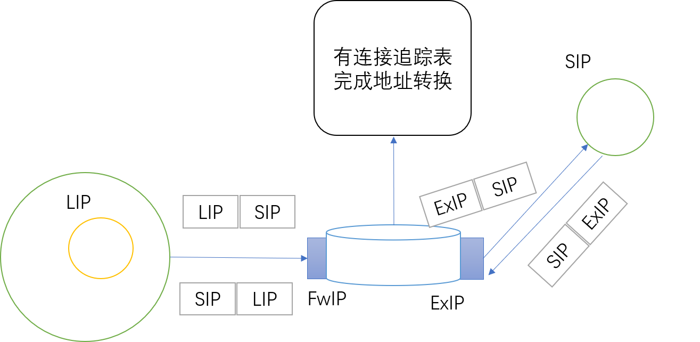
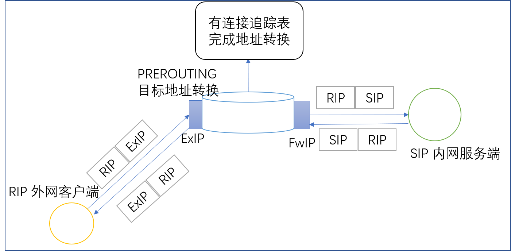

# 24.5 nat路由
nat (`network address translation`) 是 iptables 另一功能，起初设计的目的是为了隐藏内网中的主机，后来为解决 ipv4 地址的紧缺问题提供了重要帮助。本节我们就来学习如何使用 nat 来隐藏内网中 主机，内容包括
1. 源地址转换原理
2. 目标地址转换原理
3. 本地端口映射
4. iptables nat 规则配置

要想使用 nat 首先必需打开 Linux 的核心转发功能。如何修改内核参数详见 [14.6 Linux内核功能及模块应用](14-Linux系统启动流程及内核模块管理/Linux内核功能及模块应用.md)，打开核心转发功能可参考如下

```
echo 1 > /proc/sys/net/ipv4/ip_forward
systcl -w net.ipv4.ip_forward=1
```

## 1. 源地址转换


如上图所示:
1. 内部网络的报文经由网关向外部网络转发
2. 网关服务器在 `POSTROUTING` 上将请求报文源地址转换为网关的外网地址并向外部服务器转发请求
3. 外网服务收到源地址为网关服务器的请求，则向网关服务器返回响应
3. 网关在收到来自服务端的响应时，再将目标地址从本机转换为内网主机，并转发给内网主机。

源地址转换称为 snat，可工作于 `POSTROUTING` 和 `INPUT` 链上，绝大多数都是工作于 `POSTROUTING` 链上。这是因为 `POSTROUTING` 作用于第二次路由之后，是报文离开主机的最后一个环节，此时 snat 一定是作用在发出的报文，而如果在 `INPUT` 上，则有可能将由本机发往本机的报文也做了地址转换，这实际上没有必要。

外部服务器，看到的请求始终是网关服务器的外网 IP，因此达到隐藏内网客户端的目的。

## 2. 目标地址转换


如上图所示:
1. 外网客户端向我们的网关服务器发送请求
2. 网关服务器在 `PREROUTING` 上将请求报文目标地址转换为内网服务器地址并向其转发请求
3. 内网服务器返回响应，报文经网关服务器向外转发
4. 网关服务将响应报文的源地址从内网服务器转换为本机地址，并向外网客户端转发响应。因为客户端发送的请求的目标地址是网关，所以返回响应的也必需是网关而不能是内网服务器。

目标地址转换称为 dnat，可工作于 `PREROUTING` 和 `OUTPUT` 链上，绝大多数都是工作于 `PREROUTING` 链上。这是因为第一路由决策会决定报文由 INPUT 进入用户空间，还是进入 FORWARD 转发出去，因此应该在第一路由之前就将报文的目标地址为内网服务器地址，否则报文就被送往内核而不是被转发到内网服务器。

外部客户端，发送始终是向网关服务器发送请求，根本不知道网关服务器是否转发的请求报文，因此达到了隐藏内网服务器的目的。

我们可以在内网部署多台 web 服务器，让 iptables 将请求转发到不同的内网服务器上，此时就实现了负载均衡的功能。只不过 iptables 的负载均衡功能已经独立为 lvs，并提供了更加丰富的功能，而不再由 dnat 实现。

## 3. 本机端口映射
还有一种情形，比如本地的 tomcat 监听载 8080 端口上，但是http 默认是 80 端口，为了让客户端可通过 80 端口直接能请求到web 服务而不用修改默认端口，此时我们需要在本机做一个端口映射；将 80 端口的请求转发至 8080 上。本机端口映射是通过 iptables REDIRECT 扩展实现的。

## 4. iptables nat 实现
iptables 实现地址转换，只需要使用 nat 特用的 target(处理动作即可)
1. SNAT: `-j SNAT options`
    - 作用: 源地址转换
    - 选项: `--to-source [ipaddr[-ipaddr]][:port[-port]]`: 指定源端口和地址
2. DNAT: `-j DNAT options`
    - 作用: 目标地址转换
    - 选项: `--to-destination [ipaddr[-ipaddr]][:port[-port]]` 指定目标端口和地址
3. MASQUERADE: `-j MASQUERADE`
    - 作用: 源地址转换，当主机的 ip 是动态获取时，会自动指定源地址
4. REDIRECT: `-j REDIRECT options`
    - 作用: 端口重定向，做端口映射
    - 选项: `--to-ports port[-port]` 指定源端口

```
# SNAT示例：
> iptables -t nat -A POSTROUTING -s 192.168.12.0/24  -j SNAT --to-source 172.16.100.67    

# MASQUERADE示例：
# 源地址转换：当源地址为动态获取的地址时，MASQUERADE可自行判断要转换为的地址；
> iptables -t nat -A POSTROUTING -s 192.168.12.0/24  -j MASQUERADE

# DNAT示例
> iptables -t nat -A PREROUTING -d 172.16.100.67 -p tcp --dport 80 -j DNAT --to-destination 192.168.12.77
> iptables -t nat -A PREROUTING -d 172.16.100.67 -p tcp --dport 22012 -j DNAT --to-destination 192.168.12.78:22

# REDIRECT
> iptables -t nat -A PREROUTING -d 172.16.100.67 -p tcp --dport 80 -j REDIRECT --to-ports 8080
```

## 5. dnat 于 filter
在 dnat 的网关服务器上对转发报文做过滤时，由于 dnat 已经在 `PREROUTING` 上将报文的目标地址转和端口转换为了内网服务器地址和端口，因此在设置过滤条件时应该使用内网服务器地址作为过滤条件，而不是网关地址。
