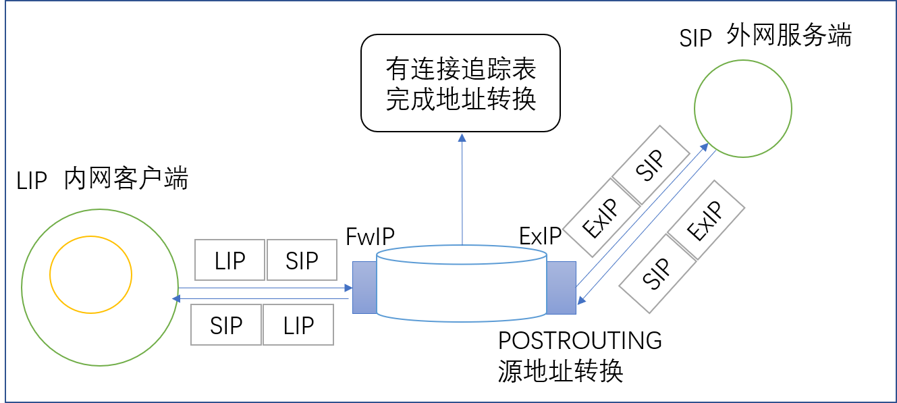
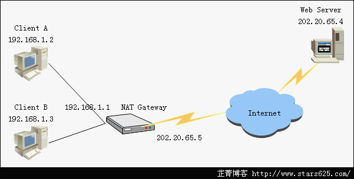

# 24.5 nat路由
之前的所有章节，我们讲解了 iptables 作为防火墙的 filter 表的功能和使用方式。本节我们来讲解 iptables 的另一张表 nat 的使用。nat 的全称是 `network address translation`，用于实现网络地址转换。本节我们就来介绍地址转换的原理，内容包括:
1. 源地址转换原理
2. 目标地址转换原理
3. Linux 核心转发功能
4. iptables nat 的实现

## 1. 源地址转换





源地址转换称为 snat，工作于 `POSTROUTING`, `OUTPUT`(很少)，用于让本地网络中的主机通过某一特定地址访问外部网络。


## 2. 目标地址转换
目标地址转换称为 dnat，工作于 `PREROUTING` 链上，用于把本地网络中的某一主机上的某服务开放给外部网络中的用户访问时。

## 3. Linux 的核心转发功能
要想使用 nat 首先必需打开 Linux 的核心转发功能。打开方式大家可以回看 [14.6 Linux内核功能及模块应用](14-Linux系统启动流程及内核模块管理/Linux内核功能及模块应用.md)

```
echo 1 > /proc/sys/net/ipv4/ip_forward
systcl -w net.ipv4.ip_forward=1
```

## 4. iptables nat 实现
iptables 实现地址转换，只需要使用 nat 特用的 target(处理动作即可)
1. SNAT
    - 作用: 源地址转换
    - 选项:
        - `--to-source [ipaddr[-ipaddr]][:port[-port]]`: 指定转换后的源端口
        - `--random`
2. DNAT
    - 作用: 目标地址转换
    - 选项:
        - `--to-destination [ipaddr[-ipaddr]][:port[-port]]`
3. MASQUERADE
    - 作用: 源地址转换，当主机的 ip 是动态获取时，会自动指定源端口
    - 选项:
        - `--to-ports port[-port]`:
        - `--random`
4. REDIRECT
    - 作用: 端口重定向，做端口映射
    - 情景: 本地的 tomcat 监听载 8080 端口上，但是http 默认是 80 端口，使用REDIRECT 将访问 80 的请求转发到 8080 上

```
# SNAT示例：
> iptables -t nat -A POSTROUTING -s 192.168.12.0/24 ! -d 192.168.12.0/24  -j SNAT --to-source 172.16.100.67    

# MASQUERADE示例：
# 源地址转换：当源地址为动态获取的地址时，MASQUERADE可自行判断要转换为的地址；
> iptables -t nat -A POSTROUTING -s 192.168.12.0/24 ! -d 192.168.12.0/24 -j MASQUERADE

# DNAT示例
> iptables -t nat -A PREROUTING -d 172.16.100.67 -p tcp --dport 80 -j DNAT --to-destination 192.168.12.77
> iptables -t nat -A PREROUTING -d 172.16.100.67 -p tcp --dport 22012 -j DNAT --to-destination 192.168.12.78:22

# REDIRECT
> iptables -t nat -A PREROUTING -d 172.16.100.67 -p tcp --dport 80 -j REDIRECT 8080
```
