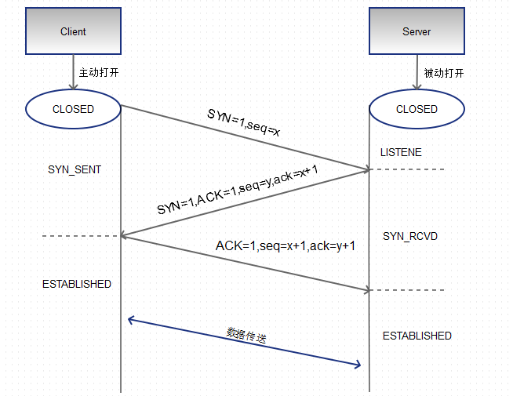

# 24.6 TCP 协议简述
tcp 连接是由两个有来有往的半个连接组成的

## 1. 连接建立与拆除
### 1.1 三此握手

### 1.2 四次挥手

### 1.3 连接重置
tcp 连接过程中可能因为网络抖动导致双方无法通信，但是连接未拆除，过了一段时间后网络又恢复正常，双方的连接状态依旧存在，此时需要发送 RST 标识位的报文实现 tcp 连接重置。

### 1.4 连接过程

