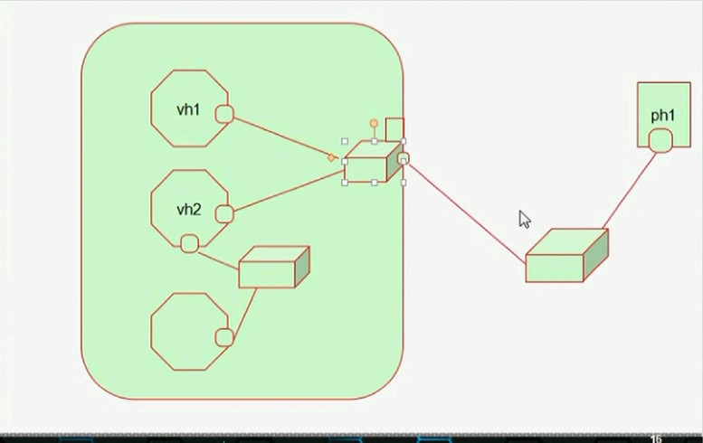
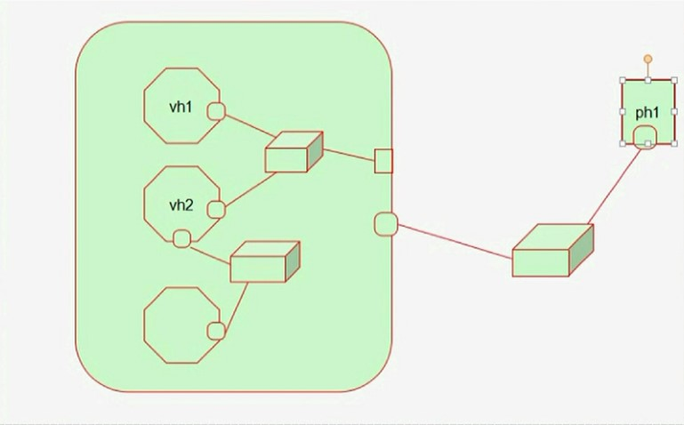

# 24.7 网络接口类型
网络虚拟化我们会在之后的高级篇详细讲解，但是为了方便大家理解，我们在此章节简单描述以下不同虚拟网卡的类型的作用范围。虚拟网卡分为四种主要类型:
1. `bridge`:桥接，将当前主机的物理网卡与VMware 内部的虚拟交换机进行关联
2. `nat`: 在当前物理主机的物理网卡上启动 nat 转发功能，转发内部虚拟主机的网络请求，以连接外部物理主机
3. `host-only`:
    - 功能: 虚拟主机能与其他虚拟主机以及当前物理主机进行通信，不能与外部物理主机通信
    - 特征: 与 nat 相比，仅仅是取消了当前物理网卡的 nat 功能
4. 私有网桥(VMnet2)
    - 功能: 仅虚拟主机之间可以通信，不能与当前物理主机通信

## 1. bridge

(图片来自于马哥Linux)

桥接的原理是当前主机的物理网卡与VMware 内部的虚拟交换机进行关联，原本的物理网卡被当作交换机使用，vmware 会再虚拟出一块网卡 VMNate8
作为当前物理主机的网卡。所有的虚拟机和当前物理主机(VMNate0网卡)都会连接到虚拟交换机上，这样所有的虚拟主机就可以共享物理主机的网络。

## 2. nat

nat 的原理是 vmware 在当前的物理主机上虚拟出一块网卡 VMNate8，并在其上启动 nat和 DHCP 功能，使用 nat 网络的虚拟主机会处于VMNate8 网卡所在的网络，因此会自动分配 IP 并将网关指向 VMNate8；然后由 VMNate8 做 SNAT 转发内网的主机请求以连接外部物理主机。

## 3. host-only
host-only 与 nat 功能类似，只不过 vmware 虚拟出的网卡不会启动 nat 功能，虚拟机无法与外部物理主机通信，只能当前的物理机通信

## 4. 私有网络
私有网络更简单，vmware 会虚拟出一块网卡，而且此虚拟网卡不会添加在当前的物理主机之上。只有连接到相同私有网络的虚拟机之间才能通信，也无法与当前主机进行通信。
