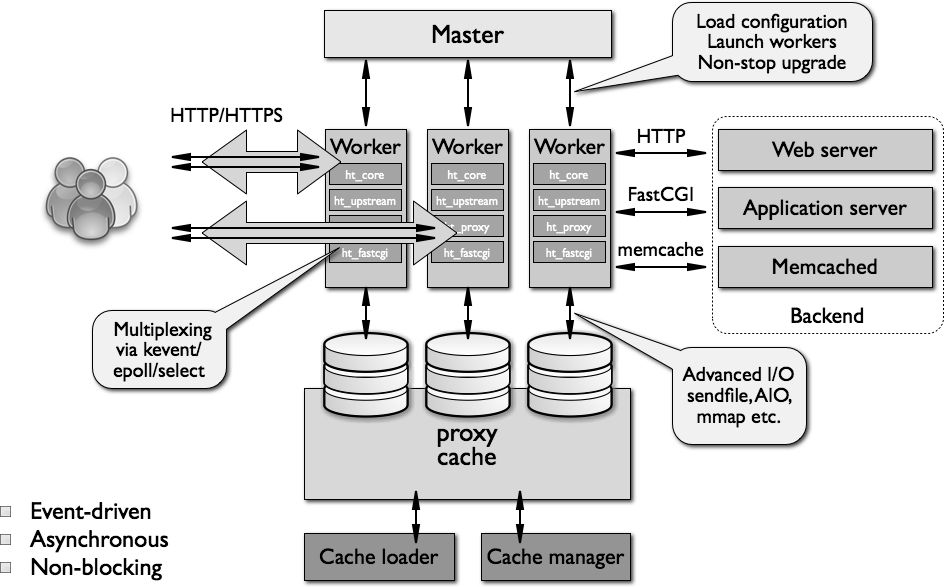

# 26.2 nginx基础入门
在学习 nginx 之前，我们首先来对 nginx 做一个入门介绍，后续我们会详细介绍 nginx web server 的配置。本节内容包括:
1. nginx 框架
2. nginx 安装
3. nginx 配置文件格式

## 1. nginx 架构与特性
### 1.1 架构


ngnix 架构如上图所示:
1. Master 进程:
  - 作用: 主控进程负责生成和管理 Worker 进程
  - 特性: 支持动态加载配置文件，非停机更新
2. Worker:
  - 作用:
    - 作为 web 服务，Worker 进程负责接收和处理用户请求
    - 作为反代服务器，可通过 httpd/FastCGI 等协议向后端服务器(Backend) 转发请求
  - 特性:
    -  支持 http 和 https
    - Workder 内是高度模块化的，新版本 nginx 支持部分模块动态装卸载
    - 支持 epoll，kqueue 等高效的事件驱动的 IO 模型，一个 Worker 进程可同时响应多个用户请求，支持更高的并发链接
3. Cache:
  - 作用: 支持本地缓存，Cache Loader 缓存加载，Cache manager 缓存管理
  - 特性: 支持 AIO，senfile，mmap 拥有高效的磁盘 IO

nginx 高度模块化，模块可分为:
- 核心模块
- 标准http模块
- 可选的http模块
- 邮件模块
- 第三方扩展模块

### 1.2 nginx 功用
nginx 可实现如下功能:
- 静态资源的web服务器，能缓存打开的文件描述符；
- http, smtp, pop3 协议的反向代理服务器
- 缓存、负载均衡；
- 支持FastCGI(fpm,  LNMP), uWSGI(python)
- 模块化，非DSO机制，过滤器gzip，SSI和图像大小调整等
- 支持SSL

作为web 服务支持:
- 基于名称和IP做虚拟主机
- 支持keepalive
- 支持平滑配置更新或程序版本升级
- 定制访问日志，支持使用日志缓存以提高性能
- 支持url rewrite
- 支持路径别名
- 支持基于IP及用户的认证；
- 支持速率限制，并发限制等；


## 2. nginx 安装
### 2.1 rpm 包安装
默认情况下 epel 仓库与 nginx 官方仓库 rpm 组织 nginx 方式有所不同。
#### epel 仓库
Linux 上 nginx 的 rpm 包由 epel 源提供，因此在安装 nginx 之前需要配置好 epel 的 yum 源
```
$ sudo vim /etc/yum.repos.d/epel.repo
[epel]
name=Extra Packages for Enterprise Linux 7 - $basearch
baseurl=http://mirrors.aliyun.com/epel/7/$basearch
        http://mirrors.aliyuncs.com/epel/7/$basearch
#mirrorlist=https://mirrors.fedoraproject.org/metalink?repo=epel-7&arch=$basearch
failovermethod=priority
enabled=1
gpgcheck=0
gpgkey=file:///etc/pki/rpm-gpg/RPM-GPG-KEY-EPEL-7

$ sudo yum install nginx
$ yum info nginx
$ rpm -ql nginx
```

#### nginx 官方仓库
使用 nginx 官方仓库，可以安装 nginx 最新的稳定版本，安装之前首先需要配置其 yum 源，可参考 [nginx yum 源](http://nginx.org/en/linux_packages.html#stable)

```
$ sudo vim /etc/yum.repos.d/nginx.repos
[nginx]
name=nginx repo
baseurl=http://nginx.org/packages/centos/$releasever/$basearch/
gpgcheck=0
enabled=1

$ sudo yum install nginx
$ yum info nginx
$ rpm -ql nginx
```

### 2.2 编译安装
```bash
# 1. 编译环境准备
yum grouplist
yum groupinstall "Development"  
yum install pcre-devel
yum install openssl openssl-devel  

# 2. 编译安装
cd /usr/local
tar xf nginx-1.14.0.tar.gz
cd nginx-1.14.0
./configure --help

groupadd -r nginx
useradd -g nginx -r nginx

./configure  --prefix=/usr/local/nginx  --conf-path=/etc/nginx/nginx.conf  --user=nginx  --group=nginx  --error-log-path=/var/log/nginx/error.log  --http-log-path=/var/log/nginx/access.log --pid-path=/var/run/nginx/nginx.pid  --lock-path=/var/lock/nginx.lock --with-http_ssl_module  --with-http_stub_status_module --with-http_gzip_static_module  --with-http_flv_module --with-http_mp4_module --http-client-body-temp-path=/var/tmp/nginx/client  --http-proxy-temp-path=/var/tmp/nginx/proxy --http-fastcgi-temp-path=/var/tmp/nginx/fastcgi  --http-uwsgi-temp-path=/var/tmp/nginx/uwsgi

make && make install
mkdir -pv /var/tmp/nginx/{client,proxy,fastcgi,uwsgi}

# 3. 启动 nginx
/usr/local/nginx/sbin/nginx

# 4. 可以仿照 rpm 安装时生成的 unit file 为编译安装创建一个服务管理脚本
```

### 2.3 nginx 主程序使用
nginx 的主程序 `nginx`, 位于 `/usr/sbin/nginx`，其使用方式如下:

`nginx options`:
- 作用: 启动和管理 nginx 服务
- 选项:
  - `?,-h `: 显示命令帮助
  - `v`: 显示 nginx 版本
  - `V`: 显示 nginx 版本和**编译参数**
  - `t`: 检查配置文件
  - `T`: 检查配置文件，并显示配置文件内容
  - `q`: nginx 启动测试
  - `s signal`: 向 nginx 发送管理信号 stop, quit, reopen, reload
  - `c filename `: 设置配置文件路经 (default: /etc/nginx/nginx.conf)
  - `g directives `: 设置 nginx 的全局配置参数，会负载配置文件中同名参数
  - `p prefix`: set prefix path (default: /usr/share/nginx/)

## 3. nginx 配置文件
```
# rpm -ql nginx
/etc/nginx/             # 配置文件目录
/etc/nginx/nginx.conf   # 主配置文件

/usr/sbin/nginx         # 主程序
/usr/bin/nginx-upgrade

/usr/lib/systemd/system/nginx.service  # systemctl 服务管理脚本
/usr/lib64/nginx/modules # nginx 模块目录

/var/log/nginx         # 默认日志存放目录
/etc/logrotate.d/nginx
```

### 3.1 配置文件结构
nginx 配置参数由下面三个部分组成
```
###### main 配置段 ######
user nginx;
# Load dynamic modules. See /usr/share/nginx/README.dynamic.
include /usr/share/nginx/modules/*.conf;

events {
    worker_connections 1024;
}


###### http 配置段 ######
http {
    include             /etc/nginx/mime.types;
    default_type        application/octet-stream;

    include /etc/nginx/conf.d/*.conf;
    server {
        listen       80 default_server;
        listen       [::]:80 default_server;
        server_name  _;
        root         /usr/share/nginx/html;
    }
```

1. main配置段: 基本核心配置，包括
    - 用于调试、定位问题
    - 正常运行的必备配置
    - 优化性能的配置
    - 事件类的配置
2. http 配置段: 配置 nginx web server
3. mail 配置段

### 3.2 配置文件语法
```
user nginx;
worker_processes auto;
error_log /var/log/nginx/error.log;
pid /run/nginx.pid;
```
nginx 由如下语法要求:
1. 语法格式: `directive value1  [value2....];` 必需以分号结尾
2. 支持使用变量
    - 内置变量: [nginx 内置变量索引](http://nginx.org/en/docs/varindex.html)
    - 自定义变量: `set var_name value`
