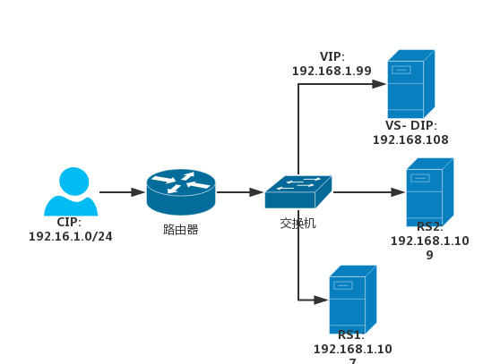

# 27.5 LVS DR模型实战

## 1. 网络拓扑结构


## 2. lvs-dr 配置示例
```bash
# 1. 配置RS
## 1. 设置 arp 内核参数
echo 2 > /proc/sys/net/ipv4/conf/all/arp_announce # 最好将所有接口都配置
echo 1 > /proc/sys/net/ipv4/conf/all/arp_ignore

## 1.2 配置 vip 地址
ifconfig lo:0  192.168.1.121/32 broadcast 192.168.1.121 up
route add -host 192.168.1.121 dev lo:0 # 必须，以保证响应源 ip 为 vip

# 2. 配置 director
# 2.1 配置 vip
ifconfig ens33:0 192.168.1.121/32 broadcast 192.168.1.121 up
route add -host 192.168.1.121 dev ens33:0 # 非必须，保持和RS统一

# 3. 添加 ipvs 规则
ipvsadm -A -t 192.168.1.121 -s rr
ipvsadm -a -t 192.168.1.121:80 -r 172.16.0.1 -g
ipvsadm -a -t 192.168.1.121:80 -r 172.16.0.2 -g
```

### 2.1 RS 配置脚本
```bash
#!/bin/bash
#
vip=10.1.0.5
mask='255.255.255.255'

case $1 in
start)
  echo 1 > /proc/sys/net/ipv4/conf/all/arp_ignore
  echo 1 > /proc/sys/net/ipv4/conf/lo/arp_ignore
  echo 2 > /proc/sys/net/ipv4/conf/all/arp_announce
  echo 2 > /proc/sys/net/ipv4/conf/lo/arp_announce

  ifconfig lo:0 $vip netmask $mask broadcast $vip up
  route add -host $vip dev lo:0
  ;;
stop)
  ifconfig lo:0 down

  echo 0 > /proc/sys/net/ipv4/conf/all/arp_ignore
  echo 0 > /proc/sys/net/ipv4/conf/lo/arp_ignore
  echo 0 > /proc/sys/net/ipv4/conf/all/arp_announce
  echo 0 > /proc/sys/net/ipv4/conf/lo/arp_announce

  ;;
*)
  echo "Usage $(basename $0) start|stop"
  exit 1
  ;;
esac
```

### 2.2 VS 配置脚本
```bash
#!/bin/bash
#
vip='10.1.0.5'
iface='eno16777736:0'
mask='255.255.255.255'
port='80'
rs1='10.1.0.7'
rs2='10.1.0.8'
scheduler='wrr'
type='-g'

case $1 in
start)
  ifconfig $iface $vip netmask $mask broadcast $vip up
  iptables -F

  ipvsadm -A -t ${vip}:${port} -s $scheduler
  ipvsadm -a -t ${vip}:${port} -r ${rs1} $type -w 1
  ipvsadm -a -t ${vip}:${port} -r ${rs2} $type -w 1
  ;;
stop)
  ipvsadm -C
  ifconfig $iface down
  ;;
*)
  echo "Usage $(basename $0) start|stop"
  exit 1
  ;;
esac
```
