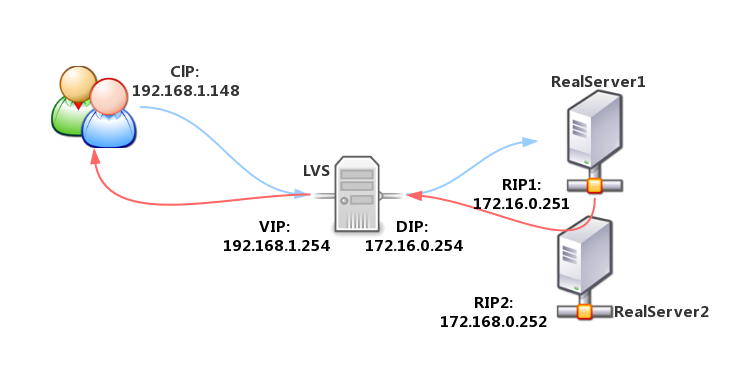

# 27.4 LVS nat模型实战
本节我们将搭建一个 LVS-NAT 的负载均衡集群。

## 1. 网络拓扑结构


## 2. lvs-nat 配置
```bash
# 1. 配置 RS
# - 配置 ip 地址
# - 配置 httpd
# - 关闭 iptables
# - 关闭 SELinux

# 2. 配置 Director ipvs
sysctl net.ipv4.ip_foward=1
ipvsadm -A -t 192.168.1.254:80 -s rr
ipvsadm -a -t 192.168.1.254:80 -r 172.16.0.251 -m -w 1
ipvsadm -a -t 192.168.1.254:80 -r 172.16.0.252 -m -w 1

ipvsadm -L -n

ipvadm -S -n    > /etc/sysconfig/ipvsadm
ipvsadm-save -n > /etc/sysconfig/ipvsadm

ipvsadm -C
ipvsadm -R < /etc/sysconfig/ipvsadm

# 修改规则
ipvsadm  -E -t 192.168.1.148:80 -s sh
ipvsadm -L -n

ipvsadm -e -t 192.168.1.148:80 -r 172.16.0.2:8080 -m # 不行
ipvsadm -d -t 192.168.1.148:80 -r 172.16.0.2
```
