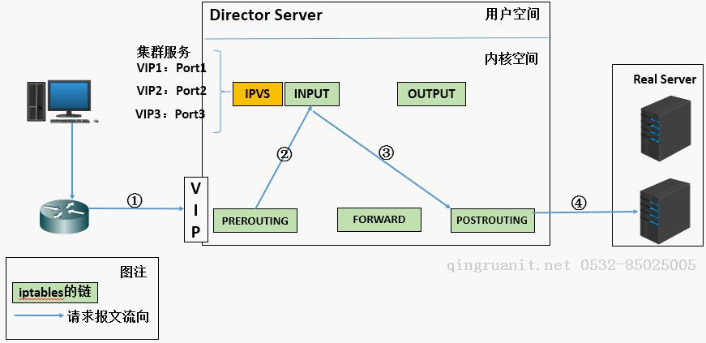
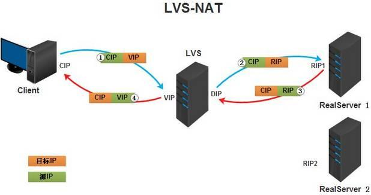
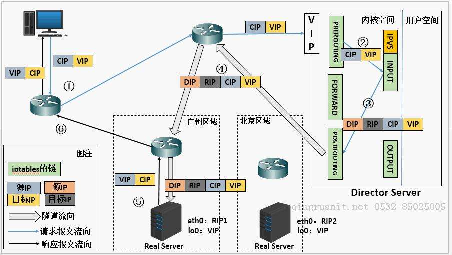
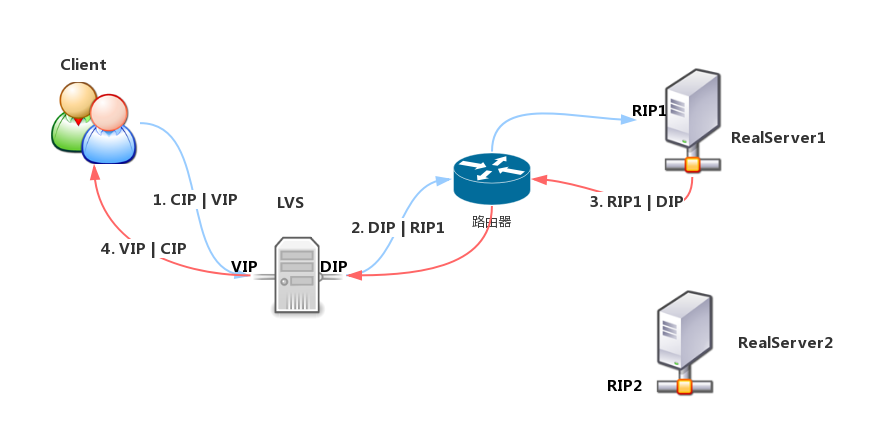
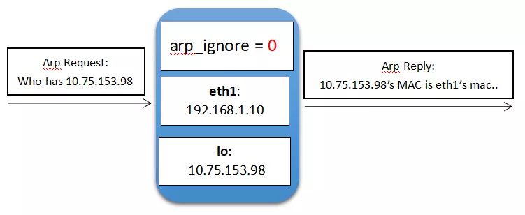
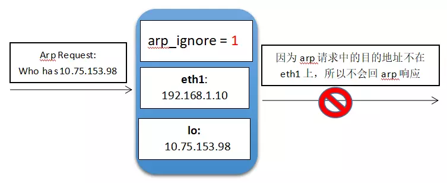
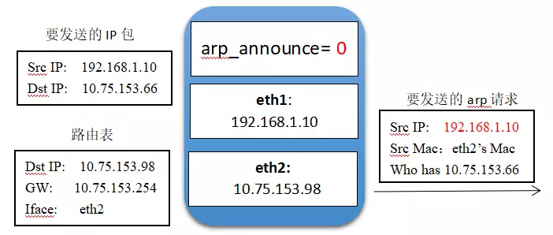
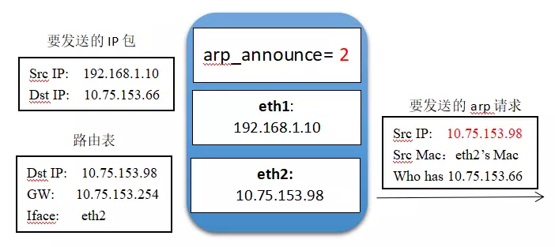

# 27.2 LVS 4层负载均衡原理
本节我们先来讲解 LVS 实现负载均衡的原理，内容包括:
1. LVS nginx 工作层级
2. LVS 负载均衡原理
3. LVS 负载均衡的四种模型

## 1. LVS nginx 工作层级


要想区分 lvs 与 nginx 实现负载均衡的区别，关键是要明白它们工作在TCP/IP 协议哪个层级。[12.1 计算机网络基础知识](../12-计算机网络及Linux网络配置/计算机网络基础知识.md) 我们详细讲解过 TCP/IP 协议。计算机网络被分成两个层次，通信子网和资源子网，应用层是资源子网位于用户空间，下四层位于内核空间。应用层想进行网络通信，必需通过套接子接口向内核发起系统调用，而 Linux 上套接子的数量是有数量限制的。

#### LVS
LVS 是四层的负载均衡器又称为四层路由器，四层交换机，位于内核空间，直接附加在 iptables netfilter 的 nat 表的 INPUT 链上。可直接根据请求报文的目标 IP 和 port 向后端服务器转发报文，无需创建套接字，因此没有套接字数量的限制。

LVS 通过修改请求报文的或IP地址或端口或 MAC 地址直接将报文转发至后端服务器，后端服务器看到的请求依然可能是用户的IP而与中间转发的主机无关。

#### nginx
ngxin/haproxy 则工作在应用层，同时充当服务器端和客户端，作为服务器接收外部用户请求，再作为客户端向后端服务器发起请求，将用户请求转发给后端服务器。整个过程需要创建套接字以完成网络通信，所以存在套接字数量限制。

#### 应用对比
相比于 nginx，LVS 在实际的生产环境中使用相对较少，原因有以下几点:
1. 大多数企业并没有达到使用 LVS 进行负载均衡的规模，通常情况下使用 nginx，haproxy 就可以很好的完整负载均衡任务
2. LVS 工作于内核，没有很好的用户端工具，也没有操作更高应用级别的能力，比如无法通过 cookie 进行转发，所以没有 nginx/haproxy 易用
3. 当企业的并发请求超过套接子的限制时，更加倾向于通过硬件实现负载均衡。

但是 LVS 仍然不失为高并发下负载均衡的有效解决方案，而且LVS 是我们理解其他负载均衡集群非常重要的组件，同时 LVS 也是面试重点，因此我们还是要学好 LVS。

实际工作环境中，如果并发请求达到了使用 LVS 的级别，通常采用二级调度的方式，第一级是 LVS，第二级是 nginx/haproxy.

## 2. LVS 负载均衡原理


如上图所示 LVS 由两个部分组成:
- `ipvs`: 工作于内核空间中 netfilter INPUT 链上的钩子函数
- `ipvsadmin`: ipvs 的用户空间命令行工具，用于向 ipvs 添加集群服务和规则

我们需要通过`ipvsadmin` 向 `ipvs` 添加监听的服务和对应的集群。当请求报文到来时:
1. 经过第一次路由决策，发往本机的报文会由 `PREROUTING` 到达 `INPUT`
2. 附加在 `INPUT` 的 ipvs 会根据 ipvs 上集群服务的IP，协议和端口来判断报文是否需要向后端的集群进行转发
3. 如果是需要转发的报文，LVS 会根据配置的调度算法，选择集群中某一台主机，将请求报文直接送往 `POSTROUTING`链转，转发至该服务器
4. LVS 有 4 种工作类型，不同类型下，LVS 会相应的修改请求报文的 ip，端口或 mac 地址，以将报文转发至目标服务器

因此对于 LVS 而言，报文的在内核的流经顺序为 `PREROUTING --> INPUT --> POSTROUTING`

## 3. LVS 术语及架构
### 3.1 LVS 组成
LVS(Linux Virtual Server) 由 VS, RS 两个部分组成
1. `VS`：Virtual Server, 负载均衡的调度器，又称为 Director, Dispatcher, Balancer
2. `rs`：Real Server, 真正提供服务的集群服务器，又称为 upstream server, backend server

### 3.2 LVS的类型(架构)
LVS 有四种不同的类型，这四中类型的工作流程实现就是我们接下来讲解的重点:
1. `lvs-nat`: Network Address Translation，多目标IP的DNAT，通过修改请求报文的目标IP完整转发
2. `lvs-dr`: Direct Routing，直接路由，通过重新封装新的MAC地址完成转发
3. `lvs-tun`:IP Tunneling，在原请求IP报文之外新加一个IP首部
4. `lvs-fullnat`:修改请求报文的源和目标IP，非标准实现

## 3.3 LVS-NAT(MASQUERADE)


附注: IP 命名:
- `VIP`：Virtual IP
- `DIP`: Director IP
- `RIP`: Real Server IP
- `CIP`：Client IP

`LVS-NAT` 就是一个多用途的 DNAT(iptables) 通过修改请求报文的目标IP地址(端口)至挑选出的某RS IP 地址实现转发。相比与 DNAT 只能将报文转发至固定主机，LVS-NAT 可以根据调度算法选择转发的后端主机。LVS-NAT 具有如下一些特征:
1. RS(RIP),DIP应该使用私有地址；RS的网关必须指向DIP；
2. 请求和响应都要经过Director；高负载场景中，Director易成为性能瓶颈；
3. 支持端口映射；
4. vs必须是Linux系统，rs可以是任意系统；
5. RS 的 RIP 和 Director 的 DIP 必须在同一 IP 网络

### 3.4 LVS-DR(GATEWAY)


LVS-DR 通过修改请求报文的目标 MAC 地址进行转发。如上图所示，报文经过了如下的转发过程:
1. VS 接收到来自用户的请求报文
2. VS 通过调度算法选择一个 RS，通过修改请求报文的目标 MAC 地址为该 VS 的 mac 地址直接向其转发请求报文。因为 VS 必需要能获取 RS 的 MAC 地址，所以 RS 与 VS 必需位于同一物理网络中
3. RS 接收到响应报文后无需经过 VS 直接向客户端进行响应。因为客户端请求的目标地址是 VIP，所以 RS 进行响应的源地址必需是 VIP，否则客户端不会接收响应。

那我们如何确保 RS 响应的源地址是 VIP 呢？
1. 首先我们需要在所有的 RS 的网卡上添加 VIP 的 IP 地址
2. 因为 VS 和 RS 都绑定了 VIP ，我们需要保证前端路由将目标地址为VIP的报文统统发往 VS，而不能发往 RS
3. Linux 上响应报文的源IP，是由其发出的第一块网卡上的IP 地址决定，因此我们必需设置 RS 的路由条目，让所有的响应报文从 VIP 所在的网卡发出。

那我们如何保证前端路由将目标地址为VIP的报文统统发往 VS，而不能是 RS 呢？有三种方法:
1. 在前端路由器上静态绑定 VS VIP 地址所在网卡的 MAC 地址；问题是未必有路由操作权限，且无法为 VS 实现高可用，因为 VS 发生故障转移时，VS 所在的服务器就会发生变化，VIP 所在的网卡也就发生了变化。
2. 使用 aprtables 在 RS 上拒绝对 VIP 的 arp 响应和通告，aprtables 类似防火墙的工作于物理层，可通过 MAC 过滤，使用复杂不便于配置
3. **修改RS上内核参数，将RS上的VIP配置在lo接口的别名上，并限制lo接口的 arp 通告和响应，这样就能阻断 RS 对 VIP 地址的解析请求，这是最佳的解决方案。**

因此 VIP 必需配置的 lo 接口的别名上，同时必需设置路由，强制让响应报文先经过 lo 接口，再通过内核的转发功能从网卡发出。

LVS-DR 具有如下特征:
1. RS可以使用私有地址；但也可以使用公网地址，此时可通过互联网通过RIP对其直接访问；
2. RS跟Directory必须在同一物理网络中，以便能基于物理地址做转发；
3. 请求报文经由Director，但响应报文必须不能经过Director；
4. 不支持端口映射；
5. RS可以是大多数常见的OS；
6. RS的网关绝不允许指向DIP；

### 3.5 LVS-TUN(IPIP)
LVS-NAT 需要 RS 的网关必需指向 DIP，因此 RS 和 VS 必需位于同一网段中，LVS-DR VS 需要能获取到 RS 的 MAC 地址，因此 VS 和 RS 必需位于同一物理网段中；通常的传输介质，比如双绞线最大的传输距离也就只有 100 米，所以 VS 和 RS 必需位于同一机房内，所以如果各 RS 不再同一位置，比如为了灾备在不同地方分别放置了集群服务器，这两种模式就无法使用。

LVS-TUN 类似 LVS-DR 不过其能跨越地理位置的限制。 LVS-TUN 不修改请求报文的 ip 首部，而是通过在原有的 ip 首部之外，在封装一个 ip 首部。真个请求响应过程如下图所示。



与 LVS-DR 相同的是每个 RS 都必须配置 VIP，并将 VIP 所在网卡作为响应报文的出口以确保响应报文的源IP 为 VIP。但是 RS 无需限制 ARP 的通告和响应，因为此时 VS 与 RS 不再同一网络中。RS 上配置的 VIP 不会影响请求报文到达 VS，因为 VIP 不可能位于 RS 的网段中，因此 RS 中 VIP 是不可达网络，不能接收到发送到 VIP 的请求。

因为额外添加一层 IP 首部，因此 RS 必需要支持隧道协议，否则无法解析转发的报文。同时额外增加的 IP 首部会增加报文大小，如果刚好使得报文从小于 MTU 变成大于 MTU，则会发生报文拆分降低传输速度，因此 VS 上最好能针对这种情况自动拆分报文。

LVS-TUN 具有如下特性:
- RIP、VIP、DIP全部是公网地址；
- RS的网关不会也不可能指向DIP；
- 请求报文经由Director，但响应报文必须不能经过Director；
- 不支持端口映射；
- RS的OS必须支持隧道功能；


### 3.6 LVS-FULLNAT
LVS-TUN 虽然能跨越地理位置的限制，但是配置起来不便，很少使用。为了满足跨越机房的需求，LVS 有第四种非标准实现 LVS-FULLNAT。LVS-FULLNAT 未收录进内核，要使用需要自己编译内核才能使用。

LVS-NAT 只修改了请求报文的目标地址，因此 RS 进行响应时，为了让目标地址为 CIP 经过 VS，必需将 RS 的网关设置为 RS。LVS-FULLNAT 会同时修改请求报文的目标地址和源地址进行转发，



这样 RS 的响应报文的目标地址为 DIP 而不是 CIP，报文经过路由一定到达 VS，因此 就可以跨越同一网络的限制。

LVS-FULLNAT具有如下特性:
- VIP 是公网地址，RIP 和 DIP 是私网地址，二者无须在同一网络中
- RS 接收到的请求报文的源地址为 DIP，因此要响应给 DIP
- 请求报文和响应报文都必须经由 Director
- 支持端口映射
- RS 可以使用任意 OS

### 3.7 总结
- `lvs-nat`, `lvs-fullnat`：请求和响应报文都经由Director
  - `lvs-nat`：RIP的网关要指向DIP；
  - `lvs-fullnat`：RIP和DIP未必在同一IP网络，但要能通信；
- `lvs-dr`, `lvs-tun`：请求报文要经由Director，但响应报文由RS直接发往Client
  - `lvs-dr`：通过封装新的MAC首部实现，通过MAC网络转发
  - `lvs-tun`：通过在原IP报文之外封装新的IP首部实现转发，支持远距离通信

## 4. arp 内核控制参数
LVS-DR 模型中，我们说到可以通过内核参数来控制 arp 的通告和响应，arp_ignore, apr_announce 就是控制参数。每个网卡都有对应 arp_ignore, apr_announce 控制参数

```
$ ls  /proc/sys/net/ipv4/conf
all  default  lo  virbr0  virbr0-nic  wlp1s0
# all 表示所有网卡

$ ll /proc/sys/net/ipv4/conf/lo/|grep arp
-rw-r--r--. 1 root root 0 9月   7 09:51 arp_accept
-rw-r--r--. 1 root root 0 9月   7 09:51 arp_announce
-rw-r--r--. 1 root root 0 9月   7 09:51 arp_filter
-rw-r--r--. 1 root root 0 9月   7 09:51 arp_ignore
-rw-r--r--. 1 root root 0 9月   7 09:51 arp_notify
-rw-r--r--. 1 root root 0 9月   7 09:51 proxy_arp
-rw-r--r--. 1 root root 0 9月   7 09:51 proxy_arp_pvlan
```
## 4.1 arp_ignore
`arp_ignore`
- 作用: 控制系统在收到外部的arp请求时，是否要返回arp响应
- 取值: 主要有0，1，2，3~8较少用到
  - `0`: 响应任意网卡上接收到的对本机IP地址的arp请求（包括环回网卡上的地址），而不管该目的IP是否在接收网卡上。
  - `1`: 只响应目的IP地址为接收网卡上的本地地址的arp请求
  - `2`: 只响应目的IP地址为接收网卡上的本地地址的arp请求，并且arp请求的源IP必须和接收网卡同网段。
  - `3`: 如果ARP请求数据包所请求的IP地址对应的本地地址其作用域（scope）为主机（host），则不回应ARP响应数据包，如果作用域为全局（global）或链路（link），则回应ARP响应数据包
  - `4~7`: 保留未使用
  - `8`: 不回应所有的arp请求

### 图示


arp_ignore=1,当 arp 从 eth1 请求 lo 接口上的 IP 地址的 MAC 地址允许响应。



`arp_ignore=1`,当 arp 从 eth1 请求 lo 接口上的 IP 地址的 MAC 地址不允许响应。

## 4.2 arp_announce
`arp_announce`
- 作用: 控制系统在对外发送arp请求时，如何选择arp请求数据包的源IP地址
- 取值:
  - `0`：允许使用任意网卡上的IP地址作为arp请求的源IP，通常就是使用数据包a的源IP。
  - `1`：尽量避免使用不属于该发送网卡子网的本地地址作为发送arp请求的源IP地址。
  - `2`：忽略IP数据包的源IP地址，选择该发送网卡上最合适的本地地址作为arp请求的源IP地址。

### 图示



`arp_announce=0` 时 数据包的源 IP 为 lo 接口的IP 地址，其从 eth2发出时，arp 请求的源地址仍然为 lo 接口的 IP。



`arp_announce=1` 时 数据包的源 IP 为 lo 接口的IP 地址，其从 eth2发出时，arp 请求的源地址重新选择为 eth1 的IP 地址。


## 4.3 修改 arp 参数
```bash
echo  1 > /proc/sys/net/ipv4/conf/all/arp_ignore
echo  1 > /proc/sys/net/ipv4/conf/eth1/arp_ignore
echo  2 > /proc/sys/net/ipv4/conf/all/arp_announce
echo  2 > /proc/sys/net/ipv4/conf/eth1/arp_announce
```
