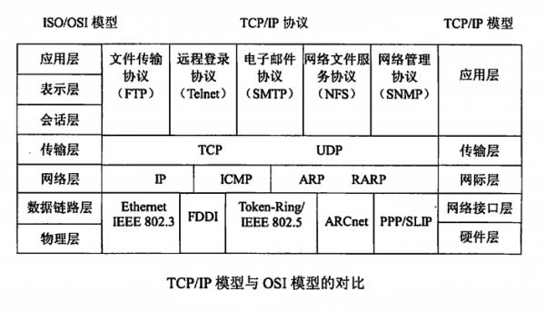
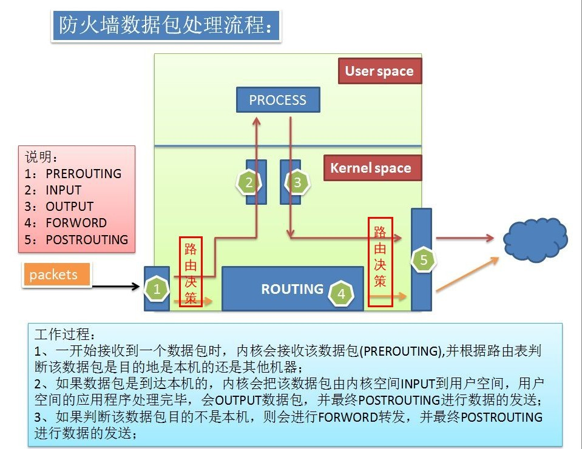
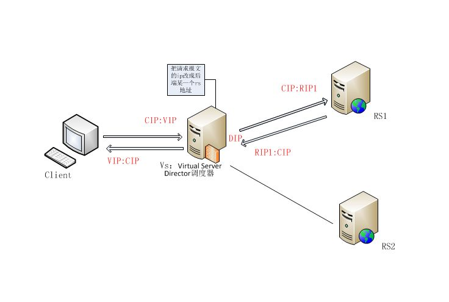
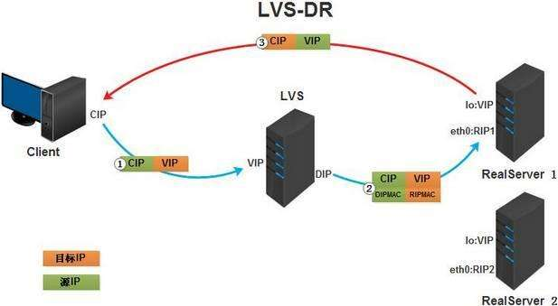

# 27.2 LVS 4层负载均衡原理
LVS 在实际的生产环境中使用相对较少，一是因为大多数企业并没有达到使用 LVS 进行负载均衡的规模，二是相对于ngxin 和 haproxy, LVS 提供的功能有限，所以通常情况下使用 nginx，haproxy 就可以很好的完整负载均衡任务，三是当企业的并发请求超过套接子的限制时，更加倾向于通过硬件实现负载均衡。但是 LVS 仍然不失为高并发下负载均衡的有效解决方案，而且学习 LVS有助于我们深入理解负载均衡，网络协议等知识，同时 LVS 也是面试重点，因此我们还是要学好 LVS。本节我们先来讲解 LVS 实现负载均衡的原理，内容包括:
1. LVS nginx 工作层级
2. LVS 负载均衡原理
3. LVS 负载均衡的四种模型

## 1. LVS nginx 工作层级


在 [12.1 计算机网络基础知识](12-计算机网络及Linux网络配置/计算机网络基础知识.md) 我们详细讲解过 TCP/IP 协议。计算机网络被分成两个层次，通信子网和资源子网，应用层是资源子网位于用户空间，下四层位于内核空间。

#### LVS
LVS 位于内核空间，直接附加在 iptables netfilter 的 nat 表的 INPUT 链上，直接根据请求报文的目标 IP 和 port 将转发至后端主机集群中的某一台主机。因为其直接工作在内核上操作报文，所以无需创建套接字，因此没有套接字数量的限制。

#### nginx
ngxin/haproxy 则工作在应用层，同时充当服务器端和客户端，作为服务器接收用户请求，再作为客户端将用户请求转发给后端主机集群的服务器。因为工作于应用层，需要创建套接字以完成网络通信，所以存在套接字数量限制。

## 2. LVS 负载均衡原理


LVS 有两个部分组成:
- `ipvs`: 工作于内核空间中 netfilter INPUT 链上的钩子函数
- `ipvsadmin`: ipvs 的用户空间命令行工具，用于向 ipvs 添加集群服务和规则

首先，我们需要通过`ipvsadmin` 向 `ipvs` 添加监听的服务和对应的集群。当请求报文到来时:
1. 经过第一次路由决策，发往本机的报文会由 `PREROUTING` 到达 `INPUT`
2. 附加在 `INPUT` 的 ipvs 就会根据事先定义的集群服务来判断报文是否需要向后端的集群进行转发
3. 如果是需要转发的报文，LVS 会根据配置的调度算法，选择集群中某一台主机，将请求报文直接送往 `POSTROUTING`链转，转发至该服务器
4. LVS 有 4 种工作类型，不同类型下，LVS 会相应的修改请求报文的 ip，端口或 mac 地址，以将报文转发至目标服务器

因此对于 LVS 而言，报文的流经顺序为 `PREROUTING --> INPUT --> POSTROUTING`

```
# 查看 ipvs 在内核中是否启用，及其配置
grep -i -A 10 "IP_VS" /boot/config-3.10.0-514.el7.x86_64

CONFIG_IP_VS=m
CONFIG_IP_VS_IPV6=y
# CONFIG_IP_VS_DEBUG is not set
CONFIG_IP_VS_TAB_BITS=12

#
# IPVS transport protocol load balancing support
#
CONFIG_IP_VS_PROTO_TCP=y
CONFIG_IP_VS_PROTO_UDP=y
CONFIG_IP_VS_PROTO_AH_ESP=y
CONFIG_IP_VS_PROTO_ESP=y
CONFIG_IP_VS_PROTO_AH=y
CONFIG_IP_VS_PROTO_SCTP=y

#
# IPVS scheduler
#
CONFIG_IP_VS_RR=m
CONFIG_IP_VS_WRR=m
CONFIG_IP_VS_LC=m
CONFIG_IP_VS_WLC=m
CONFIG_IP_VS_LBLC=m
CONFIG_IP_VS_LBLCR=m
CONFIG_IP_VS_DH=m
CONFIG_IP_VS_SH=m
CONFIG_IP_VS_SED=m
CONFIG_IP_VS_NQ=m
```

## 3. LVS 术语及架构
### 3.1 LVS 组成
LVS(Linux Virtual Server) 由 VS, RS 两个部分组成
1. VS：Virtual Server, 负载均衡的调度器，又称为 Director, Dispatcher, Balancer
2. rs：Real Server, 真正提供服务的集群服务器，又称为 upstream server, backend server

### 3.2 LVS的类型(架构)
LVS 有四种不同的类型，这四中类型的工作流程实现就是我们接下来讲解的重点:
1. `lvs-nat`: Network Address Translation，多目标IP的DNAT，通过修改请求报文的目标IP完整转发
2. `lvs-dr`: Direct Routing，直接路由，通过操纵封装新的MAC地址完成转发
3. `lvs-tun`:IP Tunneling，在原请求IP报文之外新加一个IP首部
4. `lvs-fullnat`:修改请求报文的源和目标IP，非标准实现

### 4， LVS-NAT(MASQUERADE)


附注: IP 命名:
- `VIP`：Virtual IP
- `DIP`: Director IP
- `RIP`: Real Server IP
- `CIP`：Client IP

`LVS-NAT` 就是一个多用途的 DNAT(iptables) 通过修改请求报文的目标IP地址(端口)至挑选出的某RS IP 地址实现转发。相比与 DNAT 只能将报文转发至固定主机，LVS-NAT 可以根据调度算法选择转发的后端主机。LVS-NAT 具有如下一些特征:
1. RS(RIP),DIP应该使用私有地址；RS的网关必须指向DIP；
2. 请求和响应都要经过Director；高负载场景中，Director易成为性能瓶颈；
3. 支持端口映射；
4. vs必须是Linux系统，rs可以是任意系统；
5. RS 的 RIP 和 Director 的 DIP 必须在同一 IP 网络

### 5. LVS-DR(GATEWAY)


LVS-DR 通过修改请求报文的目标 MAC 地址进行转发。如上图所示，报文经过了如下的转发过程:
1. VS 接收到来自用户的请求报文
2. VS 通过调度算法选择一个 RS，通过修改请求报文的目标 MAC 地址为该 VS 的 mac 地址直接向其转发请求报文。因为 VS 必需要能获取 RS 的 MAC 地址，所以 RS 与 VS 必需位于同一物理网络中
3. RS 接收到响应报文后无需经过 VS 直接向客户端进行响应。因为客户端请求的目标地址是 VIP，所以 RS 进行响应的源地址必需是 VIP，否则客户端不会接收响应。

那我们如何确保 RS 响应的源地址是 VIP 呢？
1. 首先我们需要在所有的 RS 的网卡上添加 VIP 的 IP 地址
2. 因为 VS 和 RS 都绑定了 VIP ，我们需要保证前端路由将目标地址为VIP的报文统统发往 VS，而不能发往 RS
3. Linux 上响应报文的源IP，是由其发出的第一块网卡上的IP 地址决定，因此我们必需设置 RS 的路由条目，让所有的响应报文从 VIP 所在的网卡发出。

那我们如何保证前端路由将目标地址为VIP的报文统统发往 VS，而不能是 RS 呢？有三种方法:
1. 静态地址绑定：在前端路由器上操作(问题：未必有路由操作权限)
2. aprtables: 在 RS 上拒绝对VIP的请求做响应，不好用
3. **修改RS上内核参数，将RS上的VIP配置在lo接口的别名上，并限制其不能响应对VIP地址解析请求(最佳)**

因此 VIP 必需配置的 lo 接口的别名上，我们同时必需设置路由，让响应报文优先从 lo 发出，再通过网卡发送给客户端。

LVS-DR 具有如下特征:
1. RS可以使用私有地址；但也可以使用公网地址，此时可通过互联网通过RIP对其直接访问；
2. RS跟Directory必须在同一物理网络中，以便能基于物理地址做转发；
3. 请求报文经由Director，但响应报文必须不能经过Director；
4. 不支持端口映射；
5. RS可以是大多数常见的OS；
6. RS的网关绝不允许指向DIP；

### 6. lvs-tun(IPIP)
- 架构: 不修改请求报文的 ip 首部，而是通过在原有的 ip 首部(cip -- vip)之外，在封装一个 ip 首部(dip -- rip)
- 特性:
    - RIP、VIP、DIP全部是公网地址；
    - RS的网关不会也不可能指向DIP；
    - 请求报文经由Director，但响应报文必须不能经过Director；
    - 不支持端口映射；
    - RS的OS必须支持隧道功能；


### 7. lvs-fullnat
- 架构: director 通过同时修改请求报文的目标地址和源地址进行转发
- 特性:
    - VIP 是公网地址，RIP 和 DIP 是私网地址，二者无须在同一网络中
    - RS 接收到的请求报文的源地址为 DIP，因此要响应给 DIP
    - 请求报文和响应报文都必须经由 Director
    - 支持端口映射
    - RS 可以使用任意 OS
- 注意: 内核默认不支持 fullnat, 使用此功能需要到淘宝开源官网下载并重新编译内核


## 8. lvs 调度算法
### 8.1 session 保持方法
1. session 绑定:
    - 定义: 将来自同一用户的请求始终调度到同一个 RS
    - 方法: source ip_hash/cookie hash
    - 问题: 主机迭机之后，该主机上的所有 session 也会丢失
2. session 集群:
    - 定义: 每一台主机上都保留了所有用户的 session
    - 问题: session 同步问题
3. session 服务器:
    - 定义: 第三方服务持久化存储 session

### 8.2 lvs scheduler
静态方法: 仅根据算法本身进行调度
1. RR: round robin, 轮调
2. WRR: weighted rr, 加权轮调
3. SH: source hash, 源地址哈希，实现 session 保持的机制 -- 来自同一个IP的请求始终调度至同一RS
4. DH: destination hash，目标地址哈希，将对同一个目标的请求始终发往同一RS

动态方法: 根据算法及各 RS 的当前负载(Overhead)状态进行调度
1. LC: Least Connection
    - Overhead = Active * 256 + Inactive
2. WLC: Weighted LC
    - Overhead = (Active * 256 + Inactive) / weight
3. SED: Shortest Expection Delay
    - Overhead = (Active + 1) * 256 / weight
4. NQ: Never Queue, 按照 SED 进行调度，但是被调度的主机，在下次调度时不会被选中 -- SED 算法改进
5. LBLC:
    - 定义: Locality-Based LC，即动态的 DH 算法
    - 作用: 正向代理情形下的 cache server 调度
6. LBLCR: Locality-Based Least-Connection with Replication 带复制的LBLC算法


## 9. ipvsadm 的用法
两步骤:
1. 管理集群服务
2. 管理集群服务中的RS

ipvs 集群服务
- 一个 ipvs 主机可以同时定义多个 cluster service
- 一个 cluster server 上至少应该有一个 real server
- 定义时，要指明 lvs-type，以及 lvs scheduler


### 9.1 管理集群服务
```
# 集群服务增，改，删，查
ipvsadm -A|E -t|u|f service-address [-s scheduler]
              [-p [timeout]] [-M netmask] [-b sched-flags]
ipvsadm -D -t|u|f service-address
ipvsadm -C
ipvsadm -L|l [options]
        -n: 基于数字格式显示ip和端口
        -c: 显示当前已经建立的TCP连接
        --state: 显示统计数据
        --rate:  显示速率
        --exact: 显示统计数据精确值
```

service-address
- tcp: -t ip:port
- udp: -u ip:port
- fwm: -f mark

### 9.2 管理集群服务中的 RS  
```
# 集群服务中的RS 增，改，删
ipvsadm -a|e -t|u|f service-address -r server-address
      [-g|i|m] [-w weight] [-x upper] [-y lower]
ipvsadm -d -t|u|f service-address -r server-address

# 清空和查看
ipvsadm -C             
ipvsadm -L|l [options]

ipvsadm -R      # 重载 == ipvsadm-restore
ipvsadm -S [-n]  # 保存 == ipvsadm-save
ipvsadm -Z [-t|u|f service-address]  # 清空计数器
```
参数:
- server-address: ip[:port]
- lvs-type:
    - -g: gateway, lvs-dr 模型(默认)
    - -i: ipip, lvs-tun 模型
    - -m: masquerade, lvs-nat 模型
- -s scheduler: 指定调度算法，默认 WLC
