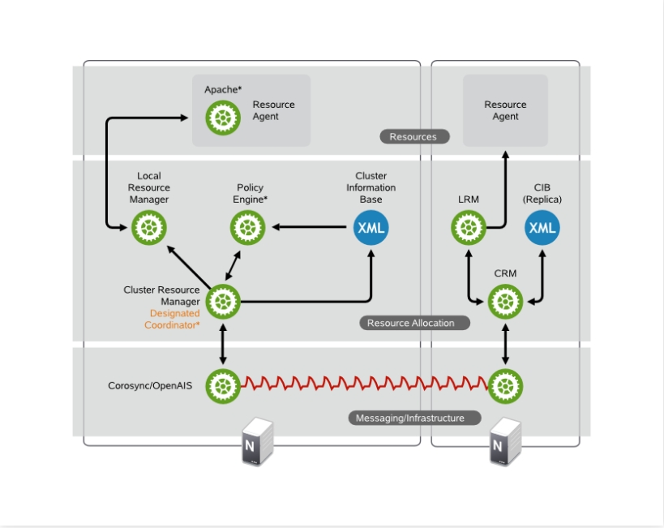
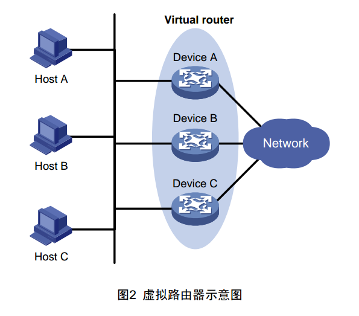
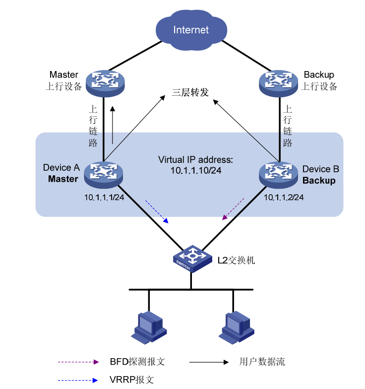
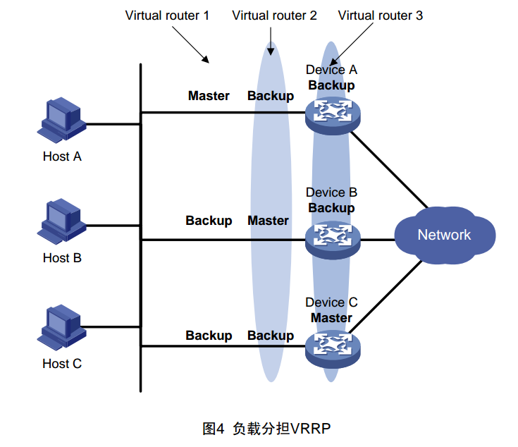
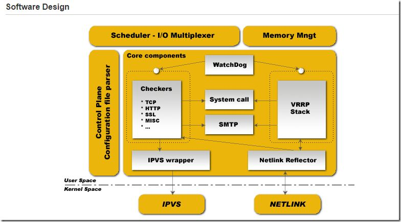

# 29.1 高可用集群介绍以及开源软件应用
高可用集群有众多的解决方案，典型的包括
1. keepalived: 基于 VRRP 协议的实现
2. heartbeat/corosync: 通用的HA集群解决方案，corosync 是 heartbeat 的升级版

heartbeat/corosync 是通用的高可用集群解决方案，因此对于特定服务，它能提供了功能是有限的。因此大多数情况下，不同服务通常有各自特定的高可用解决方案。keepalived 最开始是为专门高可用 LVS 的，也可以用来高可用 nginx。本节我们就来简述这两种解决方案的基本原理。

## 1. 高可用集群面临的问题
所谓的高可用集群就是为主服务，又称为主节点提供了一个冗余的备用节点，当主节点不可用时，备用节点能自动替代主节点对外提供服务。但是这个冗余与替换的过程有许多问题需要解决:

### 1.1 心跳信息
首先备用节点如何判断主节点不可用。为此主节点需要不断的向备用节点发送"心跳"信息(heartbeat)，备用节点通过心跳信息判断主节点是否正常。然而我们面对的集群环境，除了主机异常之外，也很有可能出现网络异常。所以备用节点收到心跳信息时，不一定是主节点故障，而有可能是网络异常，我们称此种状况为网络发生分区(Network partition)。

其次高可用集群中的服务器可能不止一台，应该如何同步心跳信息呢？很显然一对一通信效率太低，我们需要借助组播，因此搭建高可用集群很重要的一步就是配置集群的组播域。

### 1.2 网络分区
当网络发生分区时，原本的集群就会划分成多个集群，此时应该如何决定由哪个部分来提供服务呢？按照少数服从多数的原则，应该由包含超过半数节点的分区网络继续提供服务。确定了提供服务器的分区之后还不够，首先如果主节点并不再此分区网络中，需要重新选举一个主节点；其次为防止其他分区网络争抢资源，需要对剩余的其他分区作服务器隔离。

### 1.3 选举协议
中心节点的选举有众多协议，其中最著名的就是分布式网络中的 Paxos，以及再次基础上衍生出来的 Raft 协议。很建议大家多读一读这两个协议相关的论文和文章。

### 1.4 服务隔离
准确来说，高可用集群高可用的是特定的服务。以 nginx 负载均衡集群来说，我们高可用的是 nginx 调度器这个服务，这个服务由两个核心资源组成一是对外提供服务的 IP 地址，另一个是我们的 nginx 进程。对于 nginx 即成我们只需要在备用节点上配置好相同的 nginx 服务即可。因此对于负载均衡集群来说，最重要的资源是对外提供的 IP 地址。当服务发生分区时，如果不进行服务隔离，不同的分区网络就会争抢 IP，导致服务间歇性不可用。当然这种情况并不是很严重。

我们考虑另一个更加严重的情况，假设所有后端服务器都挂载到了一个共享的块存储设备上，比如 SAN 这种块级别的共享存储区域网络。网络分区发生时，如果一个分区对磁盘块做了删除操作，另一个做了修改操作，那么最终的将对导致文件系统的元数据不可用进而导致整个系统不可用。

服务隔离有两种曾经:
1. STONITH(Shooting The Other Node In The Head)：主机级别的隔离，"爆头"直接将服务器停机处理
2. fence: 资源级别的隔离，限制对特定资源的访问

### 1.5 相关术语
在高可用集群中我们有如下一些专用术语
1. Failover：故障切换，即某资源的主节点故障时，将资源转移至其它节点的操作；
2. Failback：故障移回，即某资源的主节点故障后重新修改上线后，将转移至其它节点的资源重新切回的过程

接下来我们首先来介绍 heartbeat/corosync 架构。

## 2.heartbeat/corosync

如图是 corosync 的结构图，其由三个部分组成，由下而上是
1. `messaging/infrastructure`: 发送心跳信息
2. `ClusterResource Manager(CRM)`: 资源分配层，用于定义集群服务，包括
  - `Cluster Information Base (CIB)`:
    - CIB使用XML表示整个集群的配置和当前状态信息。它包含所有集群选项、节点、资源、约束的定义和彼此之间的关系。
    - 并且CIB同步更新至所有的集群节点。在集群内有一个通过DC维护的主CIB节点。其它所有节点存在一个CIB的副本。
  - `Designated Coordinator (DC)`:
    - 某一个CRM被推选为DC。DC 是群集中唯一可以决定需要在整个群集执行更改（例如节点屏蔽或资源移动）的实体。
    - 其它所有的节点从当前DC获得配置和资源分配信息`
  - `Policy Engine (PE)`:
    - 只要DC需要进行群集范围的更改（对新 CIB 作出反应），PE会根据当前集群状态和配置计算出下一个状态并反馈生成一列指令给DC。
    - PE通常在DC上运行。
  - `Local Resource Manager (LRM)`:
    - LRM是CRM的代理，代表 CRM 调用本地RA.它可以执行start/stop/monitor操作并把结果反馈给CRM。
    - 并且可以隐藏不同RA(OCF,LSB)直接的差异。LRM 是其本地节点上所有资源相关信息的权威来源。
3. `Resource Layer`:
  - RL包含不同的RA。RA是已写入的用来启动、停止和监视某种服务（资源）的程序（通常是shell脚本），仅能被LRM调用

## 3. vrrp 协议
keepalived 是基于 vrrp 协议的，因此在搞清楚 keepalived 之前我们首先需要了解 vrrp 协议。

### 3.1 vrrp 协议概述
VRRP(Virtual Router Redundancy Protocol) 虚拟路由器冗余协议，是一种容错协议，它保证当主机的下一跳路由器出现故障时，由另一台路由器来代替出现故障的路由器进行工作，从而保持网络通信的连续性和可靠性。

vrrp 架构如上图所示，vrrp 通过将多个路由器组成一个虚拟路由器，对外提供路由服务。虚拟路由器有自己的虚拟IP地址和虚拟MAC地址。局域网内的主机将虚拟路由器的IP地址设置为默认网关，通过
虚拟路由器与外部网络进行通信。当主路由器发生故障时，自动选择一个备用路由器继续提供服务。

### 3.2 VRRP 术语
在讲解 VRRP 工作过程之前，我们先来了解一下相关述语:
1. 虚拟路由器：
  - 由一个 Master 路由器和多个 Backup 路由器组成
  - 主机将虚拟路由器当作默认网关。
2. VRID：
  - 虚拟路由器的标识
  - 有相同 VRID 的一组路由器构成一个虚拟路由器。
3. Master 路由器：
  - 虚拟路由器中承担报文转发任务的路由器
4. Backup 路由器：
  - Master 路由器出现故障时，能够代替 Master 路由器工作的路由器
5. 虚拟 IP 地址：
  - 虚拟路由器的 IP 地址
6. IP 地址拥有者：
  - 接口 IP 地址与虚拟 IP 地址相同的路由器被称为 IP 地址拥有者
7. 虚拟 MAC 地址：
  - 一个虚拟路由器拥有一个虚拟 MAC 地址

### 3.3 工作流程

VRRP 工作时，首先需要选举出 Master 路由器，并且Master 路由器需要实时同步自己的状态信息，以让备用节点在主节点故障时及时替换，整个详细过程如下:
1. Master 选举:
  - 虚拟路由器中的路由器根据优先级选举出 Master。
  - Master 路由器通过发送免费 ARP 报文，将自己的虚拟 MAC 地址通知给与它连接的设备或者主机，从而承担报文转发任务
2. 心跳信息:
  - Master 路由器周期性发送 VRRP 报文，以公布其配置信息（优先级等）和工作状况；
3. 故障转移:
  - 如果 Master 路由器出现故障，虚拟路由器中的 Backup 路由器将根据优先级重新选举新的 Master；
4. 虚拟路由器状态切换:
  - Master 路由器由一台设备切换为另外一台设备，新的 Master 路由器只是简单地发送一个携带虚拟路由器的 MAC 地址和虚拟 IP 地址信息的免费 ARP 报文，这样就可以更新与它连接的主机或设备中的ARP 相关信息。网络中的主机感知不到 Master 路由器已经切换为另外一台设备。
5. 抢占/非抢占:
  - Backup 路由器的优先级高于 Master 路由器时，由 Backup 路由器的工作方式（抢占方式和非抢占方式）决定是否重新选举 Master

同时，为了提高安全性， VRRP 还提供了认证功能VRRP提供了三种认证方式：
1. 无认证
2. 简单字符认证：在一个有可能受到安全威胁的网络中，可以将认证方式设置为简单字符认证
3. MD5 认证：在一个非常不安全的网络中，可以将认证方式设置为 MD5 认证

### 3.4 工作模式

如果备用的路由只是备用，将会造成资源浪费，我们可以配置多个虚拟路由器组如上图所示:
1. 三个路由器上配置了，三个虚拟路由器，每个虚拟路由器以某一个路由器为主服务器对外提供服务，另外两台路由器作为其备用路由器
2. 前端主机可以将网关平均指向三个虚拟 IP，这样每个路由器都为部分主机提供了路由服务

这种模式我们称为 VRRP N/M 或 N/N 模式，即在一组路由上提供多个虚拟路由器。

## 4. keepalived
### 4.1 keepalived 功能
keepalived 是 vrrp协议的软件实现，原生设计的目的为了高可用ipvs服务，其提供了如下功能:
1. 基于vrrp协议完成地址流动；
2. 为vip地址所在的节点生成ipvs规则（在配置文件中预先定义）
3. 为ipvs集群的各RS做健康状态检测；
4. 基于脚本调用接口通过执行脚本完成脚本中定义的功能，进而影响集群事务，正是基于此功能，keepalived 才能实现高可用 nginx

### 4.2 keepalived 架构

如图，keepalived 由如下几个部分组成:
- vrrp stack: vrrp 协议的实现
- ipvs wrapper: 生成 ipvs 规则
- checkers: 后端服务器状态检测
- watch dog: 监控进程
- smtp: 邮件服务
