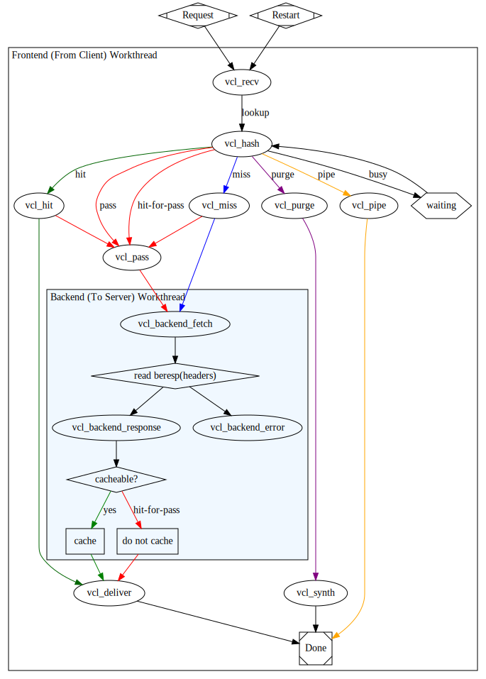

# 30.3 VCL 语法基础
varnish 的缓存配置，使用的是 VCL，一种与 C 类似的域专有类型的配置语言。本节我们先来对 VCL 做一个介绍。

## 1. VCL 组成与处理流程
### 1.1 VCL 组成
```
vcl 4.0;

# Default backend definition. Set this to point to your content server.
backend default {
    .host = "127.0.0.1";
    .port = "8080";
}

sub vcl_recv {
    # Happens before we check if we have this in cache already.
    #
    # Typically you clean up the request here, removing cookies you don't need,
    # rewriting the request, etc.
}

sub vcl_backend_response {
    # Happens after we have read the response headers from the backend.
    #
    # Here you clean the response headers, removing silly Set-Cookie headers
    # and other mistakes your backend does.

```

VCL 可以看作是在 C 语言基础上二次开发的子语言，其保留了 C 语言基本的语法特性，并额外附加了特性:
1. 首先作为一门语言 VCL 具有变量，赋值，条件判断等基本语法特性，需要额外提醒的是 VCL 没有循环
2. 为了在更高层级上抽象缓存处理逻辑， VCL 在 C 基础上添加了"状态引擎"(state engine)
3. VCL有多个状态引擎，状态之间存在相关性，但状态引擎彼此间互相隔离；每个状态引擎可使用`return(x)`指明关联至哪个下一级引擎；每个状态引擎对应于vcl文件中的一个配置段，即为 `subroutine`

### 1.2 VCL 状态引擎
VCL 的状态引擎可以分为三类:
1. `Client Side`：
  - 作用: 客户端请求的状态引擎
  - 包括: `vcl_recv, vcl_pass, vcl_hit, vcl_miss, vcl_pipe, vcl_purge, vcl_synth, vcl_deliver...`
2. `Backend Side`:
  - 作用: 后端服务器响应相关的状态引擎
  - 包括: `vcl_backend_fetch, vcl_backend_response, vcl_backend_error`
3. 两个特殊的引擎：
  - `vcl_init`: 在处理任何请求之前要执行的vcl代码：主要用于初始化VMODs；
  - `vcl_fini`: 所有的请求都已经结束，在vcl配置被丢弃时调用；主要用于清理VMODs；

### 1.2 VCL 处理流程
varnish 已经为状态引擎内置了关联逻辑，这种内在逻辑就是缓存的处理流程。varnish 不同版本缓存处理的流程并不相同，下面是 varnish4.0 流程图。



## 2. VCL 语法
### 2.1 VCL 基础特性
VCL的语法格式：
1. `vcl 4.0;`: 必需位于开头，表示 VCL 的版本
2. `//, #, /* foo */`: 注释;
3. `sub sub_name {}`: 使用 sub 关键字定义状态域,例如`sub vcl_recv { ...}`
4. `return(sub_name)`: 用于实现状态引擎转换；
5. 没有循环, 并且受限于引擎的内建变量

VCL 有限状态机
1. Each request is processed separately;
2. Each request is independent from others at any given time;
3. States are related, but isolated;
4. return(action); exits one state and instructs Varnish to proceed to the next state;
5. Built-in VCL code is always present and appended below your own VCL;

### 2.2 三类主要语法
```
sub subroutine {
  ...
}

if CONDITION {
  ...
} else {
  ...
}

return(), hash_data()
```

### 2.3 变量
#### 内建变量：
1. `req.*`:
  - 作用: request，表示与客户端发来的请求报文相关的变量
2. `req.http.*`
  - 作用: http 首部字段相关变量
  - eg: `req.http.User-Agent, req.http.Referer, ...``
3. `bereq.*`：
  - 作用: 由varnish发往后端主机的httpd请求相关；
4. `bereq.http.*`
5. `beresp.*`: 由BE主机响应给varnish的响应报文相关；
6. `beresp.http.*`
7. `resp.*`: 由varnish响应给client相关；
8. `obj.*`: 存储在缓存空间中的缓存对象的属性；只读；

|变量组|变量|作用|
|:---|:---||
|bereq.*|bereq.http.HEADERS||
||bereq.request|请求方法；|
||bereq.url|请求的url；|
||bereq.proto|请求的协议版本；|
||bereq.backend|指明要调用的后端主机；|
|req.*|req.http.Cookie|客户端的请求报文中Cookie首部的值|
||req.http.User-Agent |~ "chrome"|
|beresp.*|beresp.http.HEADERS||
||beresp.status|响应的状态码|
||beresp.backend.name|BE主机的主机名；|
||beresp.ttl|BE主机响应的内容的余下的可缓存时长|
|resp.*|reresp.proto|协议版本|
|obj.*|obj.hits|此对象从缓存中命中的次数|
|obj.*|obj.ttl|对象的ttl值|
|server.*|server.ip||
||server.hostname||
|client.*|client.ip||					

#### 用户自定义变量
使用 `set, unset` 自定义变量

#### 示例
```
# 示例1：强制对某类资源的请求不检查缓存：
vcl_recv {
  if (req.url ~ "(?i)^/(login|admin)") {
    return(pass);
  }
}


# 示例2：对于特定类型的资源，例如公开的图片等，取消其私有标识，并强行设定其可以由varnish缓存的时长；

# 定义在 vcl_backend_response 中
vcl_backend_response{；
  if (beresp.http.cache-control !~ "s-maxage") {
    if (bereq.url ~ "(?i)\.(jpg|jpeg|png|gif|css|js)$") {
      unset beresp.http.Set-Cookie;
      set beresp.ttl = 3600s;
    }
  }
}

# 定义在vcl_recv中；
vcl_recv{
  if (req.restarts == 0) {
    if (req.http.X-Fowarded-For) {
      set req.http.X-Forwarded-For = req.http.X-Forwarded-For + "," + client.ip;
    } else {
      set req.http.X-Forwarded-For = client.ip;
    }
  }		
}
```

### 2.3 内置操作
#### 内置函数
常用内置函数:
1. regsub(str, regex, sub)
2. regsuball(str, regex, sub)
3. ban(boolean expression)
4. hash_data(input)
5. synthetic(str)

#### 关键字
常见的内置关键子:
1. call
2. subroutine
3. return(action)
4. new
5. set
6. unset

#### 操作符：
1. 判断: `==, !=, ~, >, >=, <, <=`
2. 逻辑操作符: `&&, ||, !`
3. 变量赋值: `=`

```
# obj.hits是内建变量，用于保存某缓存项的从缓存中命中的次数；
if (obj.hits>0) {
  set resp.http.X-Cache = "HIT via " + server.ip;
} else {
  set resp.http.X-Cache = "MISS via " + server.ip;
}
```
