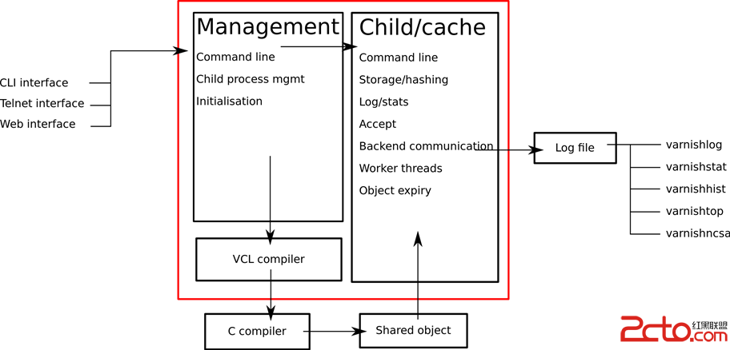

# 30.2 varnish 架构及安装
varnish 是 http 缓存服务器的"新星势力"，它与 squid的关系，类似于 httpd 与 nginx。varnish 有个最大的问题是，它的配置文件随着版本的变化变化非常大。本节我们以 4.0 系列的版本来讲解 varnish 的架构，安装和程序组成


## 1. varnish 基础
官网: https://www.varnish-cache.org

### 1.1 varnish 架构图


varnish 由如下几个部分组成
1. 管理进程(The management process)
  - Varnish主要有两个进程，管理进程和子进程，管理进程负责：管理配置的变更（包括VCL和参数）、编译VCL、监控Varnish运行、初始化Varnish，以及提供命令行接口等。管理进程会每隔几秒钟检查一下子进程，如果发现子进程挂了，会kill掉然后重新启动一个。这些操作都会记录在日志里面，以利于你检查错误。
2. 子进程(The child process) 子进程包括几个不同类型的线程，包括但不限于：
  - Acceptor线程：接受新的连接并代表它们
  - Worker线程：一个会话一个线程，通常会使用数百个Worker线程
  - Expiry线程：负责从缓存中清除旧的内容
3. shared memory log: 为提升性能，日志是直接存放在内存中的，因此需要特定的工具查看和保存
  - varnishlog
  - varnishncsa
  - varnishstat...

### 1.2 配置文件组成
varnish 的配置文件分成两个部分
1. varnish 自身的配置，用于配置 varnish 自身的功能和特性  
2. 缓存策略配置， 用于配置供 Child/cache 进程使用的缓存策略。其配置接口为 VCL(Varnish Configuration Language)，通过 Management 提供的命令行接口进行配置，需要经过 VCL 编译器和 C 编译器编译，最后生成供  Child/cache 使用的共享对象(Share object)

### 2. varnish 程序结构
```
$ rpm -ql  varnish|egrep  -v "(man|doc)"
/etc/varnish
/etc/varnish/default.vcl    # 配置各Child/Cache线程的缓存策略；
/etc/varnish/varnish.params # 配置varnish服务进程的工作特性，例如监听的地址和端口，缓存机制；
/usr/bin/varnishadm            # CLI interface
/usr/bin/varnishhist           # Shared Memory Log交互工具
/usr/bin/varnishlog
/usr/bin/varnishncsa
/usr/bin/varnishstat
/usr/bin/varnishtop
/usr/bin/varnishtest                           # 测试工具程序
/usr/lib/systemd/system/varnish.service        # varnish服务
/usr/lib/systemd/system/varnishlog.service     # 日志持久的服务
/usr/lib/systemd/system/varnishncsa.service
/usr/sbin/varnish_reload_vcl                   # VCL配置文件重载程序：
/usr/sbin/varnishd                             # 主程序
/var/lib/varnish
/var/log/varnish
/run/varnish.pid
/etc/logrotate.d/varnish
```

### 2.1 varnishd
`varnishd [options]`
- 作用: varnish 主程序
- 配置文件: `/etc/varnish/varnish.params`
- 选项:
    - `-a address[:port][,address[:port][...]`: varnish 监听的地址和端口，默认为6081
    - `-T address[:port]`: varnishadm 管理服务监听的地址和端口，默认为6082端口；
    - `-s [name=]type[,options]`: 定义缓存存储机制；
    - `-u user`: 运行用户
    - `-g group`: 运行用户组
    - `-f config`: VCL配置文件；
    - `-F`：运行于前台；
    - `-p param=value`：设定运行参数及其值； 可重复使用多次；
    - `-r param[,param...]`: 设定指定的参数为只读状态；

#### varnish 缓存存储机制
varnish 缓存存储机制(Storage Types)，分三种机制通过 `-s [name=]type[,options]` 指定:
1. `malloc[,size]`: 内存存储，[,size]用于定义空间大小；重启后所有缓存项失效；
2. `file[,path[,size[,granularity]]]`: 磁盘文件存储，黑盒；重启后所有缓存项失效；
3. `persistent,path,size`: 文件存储，黑盒；重启后所有缓存项有效；实验阶段

### 2.2 varnish_reload_vcl
`varnish_reload_vcl`
- 作用: 重载vcl配置文件

### 2.3 varnishadm
`varnishadm [-S secretfile] -T [address]:port command [...]`
- 作用: varnish 命令行接口
- 选项:
  - `-S secretfile`: 指定链接 varnishadm 服务的密钥文件，通常位于 `/etc/varnish/secret`
  - `-T [address]:port`: varnishadm 服务监听的地址和端口
  - `command`: varnish 执行命令后则退出，不会进入交互命令行

```
$ sudo varnishadm -S /etc/varnish/secret
[sudo] tao 的密码：
200        
-----------------------------
Varnish Cache CLI 1.0
-----------------------------
Linux,3.10.0-862.9.1.el7.x86_64,x86_64,-smalloc,-smalloc,-hcritbit
varnish-4.0.5 revision 07eff4c29

Type 'help' for command list.
Type 'quit' to close CLI session.

help
200        
help [<command>]
ping [<timestamp>]
auth <response>
quit
banner
status
start
stop                   
                                             # val 配置相关
vcl.load <configname> <filename>             # 装载，加载并编译 vcl 配置文件
vcl.inline <configname> <quoted_VCLstring>
vcl.use <configname>                         # 激活
vcl.discard <configname>                     # 删除
vcl.list                                     # 查看所有 vcl 配置文件
vcl.show [-v] <configname>                   # 查看指定的配置文件的详细信息

                                             # 运行时参数相关
param.show [-l] [<param>]
param.set <param> <value>
panic.show
panic.clear
storage.list                                 # 缓存存储

backend.list [<backend_expression>]         # 后端服务器
backend.set_health <backend_expression> <state>  # 手动设置后端服务器状态
ban <field> <operator> <arg> [&& <field> <oper> <arg>]...
ban.list
```

## 3. varnish 运行参数
varnish 运行时参数用于指定 Child/cache 子进程的工作特性。有三种配置方式:
1. 通过 `varnishd -p` 选项指定
2. 在 `varnishadm` 中使用 `param.set` 子命令配置
3. `/etc/varnish/varnish.params` 配置文件中使用 `DEAMON_OPTS` 选项配置，永久有效

```
$ cat /etc/varnish/varnish.params |grep DAEMO
#DAEMON_OPTS="-p thread_pool_min=5 -p thread_pool_max=500 -p thread_pool_timeout=300"
```

varnish有众多的运行时参数，通常需要配置包括
1. 线程相关的参数
2. Timer 与超时相关的参数

### 3.1 线程相关的参数
在线程池内部，其每一个请求由一个线程来处理； 其worker线程的最大数决定了varnish的并发响应能力；
1. `thread_pools`: 线程池数量，默认值为2，其值取决于 CPU 的核心数
2. `thread_pool_max`：每个线程池创建最大线程的数量，默认5000，
3. `thread_pool_min`：每个线程池保持最少线程的数量；额外意义为“最大空闲线程数”；默认100
4. `thread_pool_timeout`： 线程空闲时间，超过阈值则摧毁线程
5. `thread_pool_add_delay`：创建一个新线程的延迟时间，默认值为0s
6. `thread_pool_destroy_delay`：摧毁一个线程的延迟时间，默认值为2s；

varnish最大并发连接数=thread_pools * thread_pool_max，最大的并发连接数最好不要超过 3 万，否则 varnish 将不稳定。

### 3.2 Timer相关的参数
Timer 参数用于控制 varnish 内部的各种超时时长：
1. `send_timeout`：向客户端发送响应的超时时间
2. `timeout_idle`：客户端链接最大的空闲时长
3. `timeout_req`： 从客户端接收请求的超时时长
4. `cli_timeout`：child 子进程向 Management 的命令行接口进行响应的超时时长
