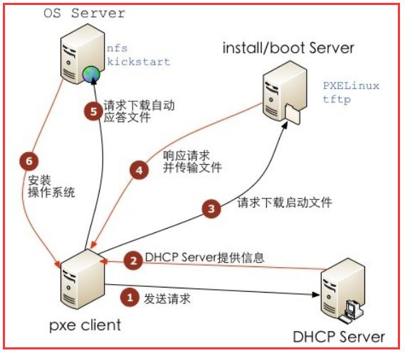

# 32.2 PXE 系统自动化部署
PXE 全称是 `preboot execute environment` 由 Intel 公司开发，用于为完成基于网络的引导安装。


## 1. PXE 工作过程


pxe 要求客户端主机的网卡必需支持网络引导机制，并将网络设置为第一引导设备。整个过程如上图所示:
1. 未安装操作系统的主机启动时，网卡首先发送一个 rarp 协议报文，从局域网中的 dhcp 服务获取一个 IP 地址，并同时获取引导文件，和引导文件所在的文件服务器(dhcp 的 filename,next-server 参数指定)
2. 主机加载引导文件后，会依据引导文件继续向文件服务器获取内核和 initrd 文件，启动Linux 内核，并依据之前获取的 IP 地址，配置好网络属性
3. 内核加载完成之后，会依据开机启动配置文件中指定的 yum 仓库获取各种 rpm 包并启动操作系统的安装过程
4. 此后的安装过程就与我们通过硬盘安装操作系统的过程类似，Centos 系可借助 kickstart 完成自动安装，这部分请参阅 [15.2 Centos安装过程](15-Linux内核定制以及系统自动化安装实战/Centos安装过程.md)

因此整个 PXE 依赖于以下服务:
1. dhcp: 提供 IP 地址，引导文件和文件服务器的指向(执行 tftp server)
2. tftp: 文件服务器，用于提供引导文件，操作系统内核，initrd
3. yum repository: 一个 yum 仓库，为系统安装提供源，可通过 http,https, ftp,nfs 任意服务提供

## 2. tftp server
tftp 监听在 udp 的 69 号端口上

```bash
# 安装
yum install  tftp-server tftp

rpm -ql tftp-server|egrep -v "(man|doc)"
/etc/xinetd.d/tftp
/usr/lib/systemd/system/tftp.service
/usr/lib/systemd/system/tftp.socket
/usr/sbin/in.tftpd
/var/lib/tftpboot    # tftp 默认文件目录


# centos 7 启动
systemctl start tftp.socket

# centos 6 启动
chkconfig tftp on
service xinetd restart
```


## 3. CentOS 7 PXE
```bash
# 1. 配置 DHCP 服务，配置见上节

# 2. 配置 tftp 服务
yum install -y dhcp
yum -y install syslinux tftp-server

# 2.1 复制内核，开机启动的所需的配置文件
mount /dev/cdrom /cdrom
cp /usr/share/syslinux/pxelinux.0 /var/lib/tftpboot/
cp /cdrom/images/pxelinux/{vmlinuz,initrd.img} /var/lib/tftp/boot/
cp /usr/share/syslinux/{chain.c32,mboot.c32,menu.c32,memdisk} /var/lib/tftpboot/

# 2.2 配置开机启动菜单
mkdir /var/lib/tftpboot/pxelinux.cfg/
vim /var/lib/tftpboot/pxelinux.cfg/default
default menu.c32
  prompt 5
  timeout 30
  MENU TITLE CentOS 7 PXE Menu

  LABEL linux
  MENU LABEL Install CentOS 7 x86_64
  KERNEL vmlinuz
  APPEND initrd=initrd.img inst.repo=http://172.16.0.2/centos ks=http://172.16.0.2/ks.cfg		

# 3. 准备 yum 仓库
yum install httpd
mount -B /cdrom /var/www/html/centos

# 4. 准备 kickstart 文件
vim /var/www/html/ks.cfg
# ks 文件内需要通过  url --url="http://172.16.0.2/centos" 指明 yum 源
```

## 4. CentOS 6 PXE
```bash
# 2.1 复制内核，开机启动的所需的配置文件
yum -y install syslinux tftp-server
cp /usr/share/syslinux/pxelinux.0 /var/lib/tftpboot/
cp /media/cdrom/images/pxelinux/{vmlinuz,initrd.img} /var/lib/tftp/boot/
cp /media/cdrom/isolinux/{boot.cfg,vesamenu.c32,splash.png} /var/lib/tftp/boot/

# 2.2 配置开机启动菜单
mkdir /var/lib/tftpboot/pxelinux.cfg/
cp /media/cdrom/isolinux/isolinux.cfg /var/lib/tftpboot/pxelinux.cfg/default

```
