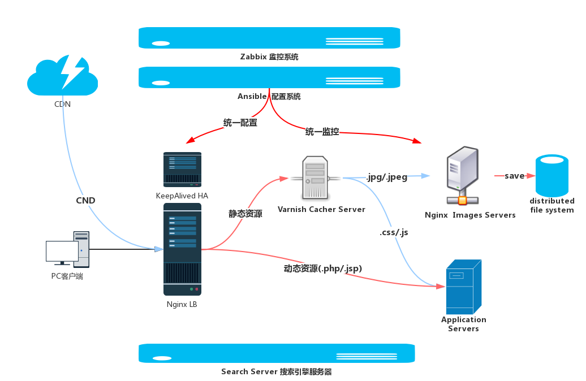

# 32.自动运维

当集群内的主机达到一定规模时，我们就需要由手动运维转向自动化运维，以提高我们运维的效率，同时也是为减少我们平均故障修复时间。自动化运维的最新技术是docker，而更加传统的方法则是以 ansible 为代表的配置系统。配置系统的基础是标准化，我们需要为我们的主机配置同样的操作系统，并为相同服务集群内的主机提供相同的配置文件。

不考虑虚拟技术，我们的自动化运维工具可以如下几个层面:
1. BootStraping: 用于引导安装操作系统的，os isntallation，常用工具就是 pxe，cobbler
2. Configuration: 配置系统，定义好了每一个被管理主机的目标状态，被管理主机能基于 agent 或 ssh 被配置系统所管理， 常用工具包括 ansible，puppet,saltstack
3. Command & Control: 批量运行程序，常用工具包括 ansible

本章的内容主要包括两个部分
1. 自动化安装: 基于 PXE 自动化安装系统
2. 配置系统: 基于 ansible 的配置系统
