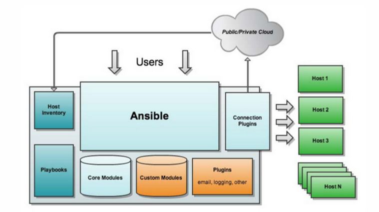

# 32.5 ansible简介
在本章的开篇我们说过自动化运维的几个层次
1. BootStraping: 引导安装操作系统
2. Configuration: 配置系统，定义好了每一个被管理主机的目标状态，被管理主机能基于 agent 或 ssh 被配置系统所管理
3. Command & Control: 批量运行程序

ansible 正是配置系统，和批量命令执行两个层面的轻量级强大的解决方案。

为了批量的管理主机，我们需要与本管控主机进行通信，目前"通信"存在两种方式。一种是以 saltstack 为代表的 agent 模式，及在被管控主机之上必需部署客户端代理，由其接收指令并在被管控主机之上执行。另一种是以 ansible 为代表的 less agent 模式，通过 ssh 连接直接远程执行命令。本节开始我们就来学习 ansible 的安装配置及使用。

## 1. ansible 简介
### 1.1 程序框架


上图是 ansible 架构示意图，ansible 是高度模块化，由如下几个部分组成
1. `Ansible`：
  - 作用: Ansible的核心程序
2. `Host Inventory`：
  - 作用: 记录了每一个由Ansible管理的主机信息，信息包括ssh端口，root帐号密码，ip地址等等
3. `Connection Plugins`：
  - 作用: 连接插件，Ansible和Host通信使用
4. `Core Modules`：
  - 作用: Ansible执行任何管理任务都不是由Ansible自己完成，而是由核心模块完成；Ansible管理主机之前，先调用core Modules中的模块，然后指明管理Host Inventory中的主机，就可以完成管理主机。
5. `Custom Modules`:
  - 作用: 自定义模块，完成Ansible核心模块无法完成的功能，此模块支持任何语言编写。
6. `Playbooks`：
  - 作用: YAML格式文件，多个任务定义在一个文件中，使用时可以统一调用，类似于“剧本”用来定义那些主机需要调用那些模块来完成的功能.

#### 模块
Ansible 任务的执行则是通过模块实现的，ansible 的模块通常是 Linux 中的命令是或者特定工具是一一对应，要学习 ansible 配置主要内容之一就是学习常见模块的应用。

#### playbook
Ansible提供了两种方式去完成任务,一是 `ad-hoc` 命令,一是写 `Ansible playbook`，两者的关系类似于在命令行敲入shell命令和 写shell scripts

playbook 中最重要的概念称为role(角色)，角色是一个自包涵的任务集合，不仅包含 playbook，也包含 playbook 内每一个命令所需的文件。role 存在的目的是让 ansible 更加容易移植。


### 1.2 ansible 安装
```
$ sudo yum install ansible
$ ansible --version

$ rpm -ql ansible |egrep -v "(python|man|doc)"
/etc/ansible
/etc/ansible/ansible.cfg       # ansible 自身的配置文件
/etc/ansible/hosts             # Host Inventory
/etc/ansible/roles             # roles 所在目录
/usr/bin/ansible               # ad-hoc 执行命令
/usr/bin/ansible-2
/usr/bin/ansible-2.7
/usr/bin/ansible-config
/usr/bin/ansible-connection   
/usr/bin/ansible-console
/usr/bin/ansible-console-2
/usr/bin/ansible-console-2.7
/usr/bin/ansible-galaxy
/usr/bin/ansible-galaxy-2
/usr/bin/ansible-galaxy-2.7
/usr/bin/ansible-inventory
/usr/bin/ansible-playbook      # playbook 执行命令
/usr/bin/ansible-playbook-2
/usr/bin/ansible-playbook-2.7
/usr/bin/ansible-pull
/usr/bin/ansible-pull-2
/usr/bin/ansible-pull-2.7
/usr/bin/ansible-vault
/usr/bin/ansible-vault-2
/usr/bin/ansible-vault-2.7
```

### 1.3 ansible 认证机制
使用 ansible 之前最主要的任务是配置 `Host Inventory`，即定义 ansible 管控的主机。但是在定义 `Host Inventory` 之前，我们有必要先了解一下 Ansible是如何通过SSH与远程服务器连接。

备注: [参考马哥Linux Ansible 权威教程](http://www.ansible.com.cn/docs/intro_getting_started.html)

#### Ansible 1.3及之后
Ansible 1.3及之后的版本默认会在本地的 OpenSSH可用时会尝试用其进行远程通讯.这会启用ControlPersist(一个性能特性),Kerberos,和在~/.ssh/config中的配置选项如 Jump Host setup。

然而,当你使用Linux企业版6作为主控机(红帽企业版及其衍生版如CentOS),其OpenSSH版本可能过于老旧无法支持ControlPersist. 在这些操作系统中,Ansible将会退回并采用 paramiko (由Python实现的高质量OpenSSH库). 如果你希望能够使用像是Kerberized SSH之类的特性,烦请考虑使用Fedora, OS X, 或 Ubuntu 作为你的主控机直到相关平台上有更新版本的OpenSSH可供使用,或者启用Ansible的“accelerated mode”.参见 Accelerated Mode.

#### Ansible 1.2 及之前
在Ansible 1.2 及之前的版本,默认将会使用 paramiko. 本地OpenSSH必须通过-c ssh 或者 在配置文件中设定.

偶尔会遇到不支持SFTP的设备.虽然这很少见,但你会有概率中奖.你可以通过在配置文件(Ansible的配置文件)中切换至 SCP模式来与之链接.

说起远程设备,Ansible会默认假定你使用 SSH Key(我们推荐这种)但是密码也一样可以.通过在需要的地方添加 –ask-pass选项 来启用密码验证.如果使用了sudo 特性,当sudo需要密码时,也同样适当的提供了–ask-sudo-pass选项.

### 1.4 ansible 初始化配置
ansible 初始化配置很容易分为两步:
1. 配置主控机与被管控主机基于 SSH 密钥通信
2. 在 `Host Inventory` 定义被管控的主机

下面是一个配置示例
```
# SSH Key 免密码登陆
ssh-kengen -t rsa -P ""
ssh-copy-id ~/.ssh/id_rsa.pub root@172.168.0.3

# 配置 Host Inventory
vim /etc/ansible/hosts
[webservers]
172.16.0.3

# 测试
ansible webservers --list-hosts
ansible webservers -m ping
```

## 2. 配置 Host Inventory
Host Inventory 用于定义 ansible 管理的主机及主机组。默认的文件路径为 `/etc/ansible/hosts` 除默认文件外,你还可以同时使用多个 inventory 文件,也可以从动态源,或云上拉取 inventory 配置信息。下面是 `Host Inventory` 配置示例

```
mail.example.com

[webservers]
foo.example.com
bar.example.com
```

`Host Inventory` 是 ini 风格的配置文件，使用 `[组名]` 定义组。组用于对系统进行分类，便于对不同系统进行统一管理。一个主机可以属于不同组。

### 2.1 主机定义
```
mail.example.com                                 # 1. 标准形式
172.16.0.1
badwolf.example.com:5309                         # 2. 自定义端口
www[01:50].example.com                           # 3. 扩展形式
db-[a:f].example.com
jumper ansible_ssh_port=5555 ansible_ssh_host=192.168.1.50  # 4. 通过参数定义

[targets]
localhost              ansible_connection=local
other1.example.com     ansible_connection=ssh        ansible_ssh_user=mpdehaan
```

`Host Inventory` 内主机有多种定义方式，我的理解核心就是  `IP/FQDN [Lnventory 参数]`
1. `IP/FQDN`: 指明管控的主机，可以 ip 地址也可以是域名
2. `Inventory 参数`: 控制 ansible 与远程主机的交互方式

在 `jumper ansible_ssh_port=5555 ansible_ssh_host=192.168.1.50` 的示例中 `jumper` 是主机的别名，通过参数 `ansible_ssh_host` 设置主机的 IP 地址。

#### Inventory 参数
Inventory 有如下常用参数

```
ansible_ssh_host
      将要连接的远程主机名.与你想要设定的主机的别名不同的话,可通过此变量设置.

ansible_ssh_port
      ssh端口号.如果不是默认的端口号,通过此变量设置.

ansible_ssh_user
      默认的 ssh 用户名

ansible_ssh_pass
      ssh 密码(这种方式并不安全,我们强烈建议使用 --ask-pass 或 SSH 密钥)

ansible_sudo_pass
      sudo 密码(这种方式并不安全,我们强烈建议使用 --ask-sudo-pass)

ansible_sudo_exe (new in version 1.8)
      sudo 命令路径(适用于1.8及以上版本)

ansible_connection
      与主机的连接类型.比如:local, ssh 或者 paramiko. Ansible 1.2 以前默认使用 paramiko.
      1.2 以后默认使用 'smart','smart' 方式会根据是否支持 ControlPersist, 来判断'ssh' 方式是否可行.

ansible_ssh_private_key_file
      ssh 使用的私钥文件.适用于有多个密钥,而你不想使用 SSH 代理的情况.

ansible_shell_type
      目标系统的shell类型.默认情况下,命令的执行使用 'sh' 语法,可设置为 'csh' 或 'fish'.

ansible_python_interpreter
      目标主机的 python 路径.适用于的情况: 系统中有多个 Python, 或者命令路径不是"/usr/bin/python",
      比如  \*BSD, 或者 /usr/bin/python 不是 2.X 版本的 Python.我们不使用 "/usr/bin/env" 机制,
      因为这要求远程用户的路径设置正确,且要求 "python" 可执行程序名不可为 python以外的名字(实际有可能名为python26).

      与 ansible_python_interpreter 的工作方式相同,可设定如 ruby 或 perl 的路径....
```


### 2.1 变量定义
除了定义主机和组，Inventory 内还能主机和组定义特定的变量。这些变量定义后可在 playbooks 中使用。但是不建议在`Inventory` 中定义变量。变量定义的其他方式我们会在 playbook 中在详细介绍。

#### 主机变量
```
[atlanta]
host1 http_port=80 maxRequestsPerChild=808
host2 http_port=303 maxRequestsPerChild=909
```

#### 组变量
```
[atlanta]
host1
host2

[atlanta:vars]
ntp_server=ntp.atlanta.example.com
proxy=proxy.atlanta.example.com
```
