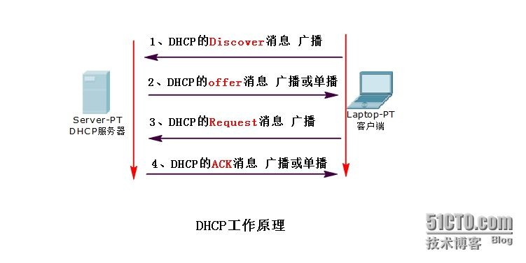
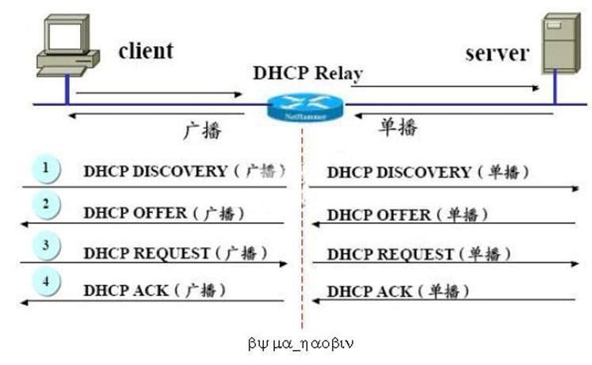

# 32.1 dhcp服务简介
DHCP(Dynamic Host Configuration Protocol) 全称是动态主机配置协议，主要用于为主机配置IP 地址。将一台主机接入互联网时，我们需要为其配置 `IP/Netmask`,`Gateway`,`DNS Server`等等网络参数。我们可以手动配置，也可以借助于 DHCP 协议实现动态分配。dhcp 的前身是 `bootp` 引导协议，出现于无盘工作站，这种类型的机器没有硬盘，所以操作系统不会安装在本地。此时需要借助网卡的特定功能，它能在开机时被唤醒，并能作为 bootp 协议客户端去请求服务端去获取地址，并加载属于自己的操作系统文件。第一次获取地址时是动态，之后获取的地址则是固定的，因为要实现客户端操作系统与 IP 地址绑定。

## 1. DHCP 简介
### 1.1  工作过程
dhcp 可以理解成引入租约概念的 bootp 协议，能在主机开机时自动分配地址，并在主机关机时收回临时分配的 IP 地址并在分配，同时也保留了 bootp 保留地址的功能。

dhcp 在动态分配地址的过程中，首先在局域网中有一台 dhcp 服务，其维护着一组可用地址列表(地址池)，也包含要为其他主机配置的网关，DNS 服务器等等。某主机开机之后如果其配置了通过 DHCP 动态获取地址，其将发送一个 RARP 的广播报文
1. arp: address resolving Protocol，IP -> MAC
2. rarp: reverse arp, MAC -> IP

服务器收到，主机的 Rarp 请求之后，就会为其提供一个地址，整个过程如下所示:




dhcp 提供的 IP 地址时存在续租期限的，一般主机要在租约期限到一半时进行续租，此时
1. Client: 向服务器发送一个 dhcp request
2. Server: 如果同意续租则回复 dhcp ack，不同意在回复 dhcp nak

服务器端不允许续租的原因可能是因为管理员更改了可用的地址池，客户端的IP 地址已经不可用。如果不能续租，此时客户端要重新进行广播获取 IP 地址。

如果客户端在续租时服务器端没有响应，客户端会在剩余时间过去一半的时候再次发起续租直至到达一个足够小的时间，此时将认定服务器不可用，客户端将重新广播获取 IP 地址。

需要注意的是开机获取 IP 地址是广播的，续租则是单播的。

### 1.2 dhcp 中继服务
dhcp 服务不能穿越网关(路由器)，所以要为不同物理网络中的主机分配地址时，需要借助于 dhcp 的中继服务。中继的过程如下



dhcp 中继服务用的很少，了解即可。

### 1.3 dhcp 作用域
dhcp 每一个可分配的地址范围称为一个作用域，不同的作用域可以为不同的网络分配地址，还可以定义超级作用域。

dhcp 在分配地址时，还可以告诉客户端一个网络文件服务器地址，并告诉其到这个文件服务器上请求什么文件，这就是通过网络引导系统的基础。

## 2. dhcp 服务
Linux DHCP协议的实现程序
1. dhcp
2. dnsmasq: 同时实现了dns 和dhcp 服务，用于嵌入式环境中

### 2.1 程序组成
```
# rpm -ql dhcp|egrep -v "(share|man)"
/etc/NetworkManager
/etc/NetworkManager/dispatcher.d
/etc/NetworkManager/dispatcher.d/12-dhcpd
/etc/dhcp/dhcpd.conf              # ipv4 的配置文件
/etc/dhcp/dhcpd6.conf             # ipv6 地址分配相关的配置文件
/etc/dhcp/scripts
/etc/dhcp/scripts/README.scripts
/etc/openldap/schema/dhcp.schema
/etc/sysconfig/dhcpd
/usr/bin/omshell
/usr/lib/systemd/system/dhcpd.service      # ipv4 unit file
/usr/lib/systemd/system/dhcpd6.service     # ipv6 unit file
/usr/lib/systemd/system/dhcrelay.service
/usr/sbin/dhcpd                           # dhcp 服务的主程序
/usr/sbin/dhcrelay                        # dhcp 中继服务的主程序
/var/lib/dhcpd
/var/lib/dhcpd/dhcpd.leases               # 已经分配的的 IP 地址的相关信息
/var/lib/dhcpd/dhcpd6.leases
```

dhcp 的服务器端监听在 udp 的 67 号端口，dhcp 的客户端则监听在 `68/udp`，因为dhcp 协议的客户端与服务器端随时需要相互通信，所以其客户端也必须作为一个守护进程监听在特定端口上。

### 2.2 服务配置
dhcp 的 rpm 包提供了一个dhcp 配置的参考文件 `/usr/share/doc/dhcp-4.2.5/dhcpd.conf.example`，可复制直接使用

```
# dhcpd.conf
#
# Sample configuration file for ISC dhcpd
#

# option definitions common to all supported networks...
option domain-name "tao.com";                    # 搜索域
option domain-name-servers 172.16.0.1;  # DNS 服务器地址，可指定多个，最多三个，逗号分隔

default-lease-time 600;                    # 默认租约期限
max-lease-time 7200;                       # 最大租约期限
log-facility local7;


subnet 172.16.0.0 netmask 255.255.255.0 {  # subnet 定义一个作用域即一个子网
	range 172.16.0.3 172.16.0.10;            # 可分配的ip 地址池
	option broadcast-address 172.16.0.255;   # 广播地址
	option routers 172.16.0.1;               # 默认网关
	filename "pxelinux.0";                   # 指明引导文件名称
	next-server 172.16.0.2;                  # 提供引导文件的服务器IP地址；tftp server
}

host fantasia {                         # 为特定主机始终分配固定的 IP 地址
  hardware ethernet 08:00:07:26:c0:a5;  # 主机网卡的 MAC 地址
  fixed-address 172.16.100.6;           # 为其分配的固定 IP，不能在地址池内
}
```

dhcp option 定义的参数可位于子域中，也可以位于全局配置中，子域中的配置优先级更高。

### 2.3 dhclient
`dhclient options`
- 作用: dhcp 客户端程序，可手动发起 dhcp 请求
- 选项:
  - `-d`: 将 dhclient 工作于前台，显示 dhcp 的工作过程

### 2.4 已分配地址
```
cat /var/lib/dhcpd/dhcpd.leases
# The format of this file is documented in the dhcpd.leases(5) manual page.
# This lease file was written by isc-dhcp-4.2.5

lease 172.16.0.3 {
  starts 2 2018/09/25 09:34:08;
  ends 2 2018/09/25 09:44:08;
  tstp 2 2018/09/25 09:44:08;
  cltt 2 2018/09/25 09:34:08;
  binding state free;
  hardware ethernet 08:00:27:f4:d9:52;
}

```
