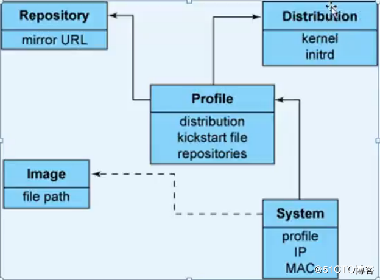

# 31.3 pxe与cobbler
cobbler 就是 pex 环境的二次封装，为用户提供了一个管理工具，能将多个 pxe 环境整合在一起，让用户自行选择安装的系统。

## 1， cobbler 安装
### 1.1 rpm 包组成
```
yum install cobbler
$ rpm -ql cobbler|egrep -v "(man|python|doc)"
/etc/cobbler                                # 配置文件
/etc/cobbler/settings                       # 自身运行的配置文件
/etc/cobbler/auth.conf
/etc/cobbler/cheetah_macros
/etc/cobbler/cobbler_bash
/etc/cobbler/completions
/etc/cobbler/dhcp.template
/etc/cobbler/dnsmasq.template
/etc/cobbler/import_rsync_whitelist
/etc/cobbler/iso
/etc/cobbler/iso/buildiso.template
/etc/cobbler/ldap
/etc/cobbler/ldap/ldap_authconfig.template
/etc/cobbler/modules.conf
/etc/cobbler/mongodb.conf
/etc/cobbler/named.template
/etc/cobbler/power                           # 服务的配置模板
/etc/cobbler/power/fence_apc_snmp.template
........
/etc/cobbler/pxe
/etc/cobbler/pxe/bootcfg_esxi5.template
........
```

## 2. cobbler 环境配置
### 2.1 cobbler 启动
cobbler 配置文件提供了对多种环境的配置，默认配置通常就可以直接使用。我们可以根据 cobbler 启动时的报错信息对必要的参数作出调整即可。

```
systemctl restart httpd
systemctl start cobblerd.service

cobbler check   #
1 : The 'server' field in /etc/cobbler/settings must be set to something other than localhost, or kickstarting features will not work.  This should be a resolvable hostname or IP for the boot server as reachable by all machines that will use it.
2 : For PXE to be functional, the 'next_server' field in /etc/cobbler/settings must be set to something other than 127.0.0.1, and should match the IP of the boot server on the PXE network.
3 : SELinux is enabled. Please review the following wiki page for details on ensuring cobbler works correctly in your SELinux environment:
    https://github.com/cobbler/cobbler/wiki/Selinux
4 : change 'disable' to 'no' in /etc/xinetd.d/tftp
5 : Some network boot-loaders are missing from /var/lib/cobbler/loaders, you may run 'cobbler get-loaders' to download them, or, if you only want to handle x86/x86_64 netbooting, you may ensure that you have installed a *recent* version of the syslinux package installed and can ignore this message entirely.  Files in this directory, should you want to support all architectures, should include pxelinux.0, menu.c32, elilo.efi, and yaboot. The 'cobbler get-loaders' command is the easiest way to resolve these requirements.
6 : enable and start rsyncd.service with systemctl
7 : debmirror package is not installed, it will be required to manage debian deployments and repositories
8 : The default password used by the sample templates for newly installed machines (default_password_crypted in /etc/cobbler/settings) is still set to 'cobbler' and should be changed, try: "openssl passwd -1 -salt 'random-phrase-here' 'your-password-here'" to generate new one
9 : fencing tools were not found, and are required to use the (optional) power management features. install cman or fence-agents to use them
```

cobbler 启动之后使用 check 对 cobbler 环境进行检查，会显示当前 cobbler 环境存在的问题，我们只要相应的修改配置文件解决这些问题，我们的 cobbler 环境也就准备好了。现在我们来解决这些问题

### 2.2 环境配置
```bash
# 1. server 绑定地址，改为外网地址，以便其他主机能访问到
vim  /etc/cobbler/settings
server: 172.16.0.2

# 2. next server 指向改为 tftp server 地址
vim  /etc/cobbler/settings
next_server: 172.16.0.2

# 3. SELinux 设置为 Permissive，无影响

# 4. 编辑 /etc/xinetd.d/tftp 启动 tftp 服务
vim /etc/xinetd.d/tftp
service tftp
{
        socket_type             = dgram
        protocol                = udp
        wait                    = yes
        user                    = root
        server                  = /usr/sbin/in.tftpd
        server_args             = -s /var/lib/tftpboot
        disable                 = no                      # disable 改为 no
        per_source              = 11
        cps                     = 100 2
        flags                   = IPv4
}

# 5. 某些 bootloader 不在  /var/lib/cobbler/loaders 文件夹内
yum install syslinux
cp /usr/share/syslinux/{menu.c32, pxelinux.0} /var/lib/cobbler/loaders

# 6. 启用 rsync 服务
systemctl start rsyncd.service
systemctl enable rsyncd.service

# 7. 安装 debmirror 包
yum install debmirror

# 8. 修改 default_password_crypted 为超级用户设置的密码
# openssl passwd -1 -salt 'random-phrase-here' 'your-password-here'
openssl passwd -1 -salt dgea 1234
$1$dgea$nPoeNaw5o4mv6kkXjhzVI1

vim  /etc/cobbler/settings
default_password_crypted: $1$dgea$nPoeNaw5o4mv6kkXjhzVI1

# 9. 安装 fence-agents，这个是高可用集群所使用的组件，此处可以先忽略
```

### 2.3 配置 pxe 所依赖的服务
cobbler 虽然依赖于 pxe 环境，但是对 pxe 支持自动配置，只需要提供 pex 对应服务的配置文件，cobbler 能实现自动安装，配置和启动。相比于使用 cobber 自动安装，可能我们手动配置其他服务器可能更熟悉快捷。所以接下来我们也是以手动配置为主。

手动管理 pxe 所需服务，还是由 cobbler 自己管理需要在配置文件中进行配置。如果是由 cobbler 自动配置，还需要在 `/etc/cobbler/modules.conf` 配置文件内为各服务提供配置参数。

```
vim  /etc/cobbler/settings
manage_dhcp: 0   # 0 表示手动配置，1 表示 cobbler 自动配置
manage_dns: 0
manage_tftpd: 1
manage_rsync: 0

# 为各服务配置服务参数
$ cat /etc/cobbler/modules.conf |grep "^\["
[authentication]
[authorization]
[dns]
[dhcp]
[tftpd]
```

## 3. 配置 cobbler 服务
### 3.1 cobbler 服务组成
如下图，cobbler 服务由如下几个部分组成，我们的目的就是配置好这几个组成部分。



1. Disribution : **distro**, 表示一个发行版，包括内核，initrd
2. Repository: **repo** 创建仓库，比如yum仓库等，可以直接创建，也可以导入光盘的 yum 仓库
3. system： **system** 通过mac地址来定制化系统
4. profile： **profile** 对需要安装某个系统的所有配置，包括 kickstart 配置文件

### 3.2 cobbler 命令使用
```
# cobbler
usage
=====
cobbler <distro|profile|system|repo|image|mgmtclass|package|file> ...
        [add|edit|copy|getks*|list|remove|rename|report] [options|--help]
cobbler <aclsetup|buildiso|import|list|replicate|report|reposync|sync|validateks|version|signature|get-loaders|hardlink> [options|--help]
```

#### 子命令
首先 cobbler 有众多字命令，每一个子命令用于配置 cobbler 服务的一部份
- `distro`: 用于配置 Disribution，核心是定义 kernel 和 initrd
- `profile`: 配置 profile
- `repo`: 配置 Repository yum 源
- `system`: 配置 system 定制系统

#### 操作
其次每个组件都有相关的管理操作:
- add
- edit
- copy
- getks*
- list
- remove
- rename
- report

```
cobbler distro list
cobbler distro add --help
```

### 辅助命令
最后剩下的部分是 cobbler 的辅助命令，可以基于当前已有的光盘和 yum 仓库快速配置相应组件，也包括其他一些辅助功能
- `buildiso`
- `import`: 通过导入光盘自动生成一个 distro
- `sync`: cobbler 同步，每次执行新的操作之后最好都同步一次

### 3.2 distro 管理
`cobbler import [options]`
- 作用: 通过导入光盘自动生成一个 distro
- 过程:
  - 会在 `/var/www/cobbler/ks_mirror` 下自动创建一个`--name`参数的文件夹，将光盘内的所有内容复制到该目录下
  - import 会自动为导入的 distro 生成一个 profile
- Options:
  - `-h, --help`: 帮助
  - `--arch=ARCH`: 被导入操作系统的平台架构
  - `--breed=BREED`:  the breed being imported
  - `--os-version=OS_VERSION`: the version being imported
  - `--path=PATH`: 光盘镜像挂载点
  - `--name=NAME`: distro 名称
  - `--available-as=AVAILABLE_AS`: tree is here, don't mirror
  - `--kickstart=KICKSTART_FILE`: assign this kickstart file
  - `--rsync-flags=RSYNC_FLAGS`: pass additional flags to rsync

```
cobbler import --name=Centos-7.1-x86_64  --path=/cdrom

ls /var/www/cobbler/ks_mirror
Centos-7.1-x86_64

cobbler distro list
cobbler profile list
cobbler sync
```

### 3.3 profile 管理
```
# cobbler profile --help
usage
=====
cobbler profile add
cobbler profile copy
cobbler profile dumpvars
cobbler profile edit
cobbler profile find
cobbler profile getks
cobbler profile list
cobbler profile remove
cobbler profile rename
cobbler profile report
```

#### add
`cobbler profile add options`
- 作用: 添加 profile
- options:
  - `--name`  
  - `--distro`
  - `--kickstart`

```
cobbler profile add --name=Centos-7.1-x86_64_service
                    --distro=Centos-7.1-x86_64
                    --kickstart=/var/lib/cobbler/kickstarts/ks.cfg
cobbler sync  # 将新增的 profile 添加到 /var/lib/tfpt/pexlinux.cfg/default 的开机菜单中
```

#### edit
`cobbler profile edit options`


#### rename
`cobbler profile rename options`
- `--name`
- `--newname`


## 4. cobbler web
cobbler web 提供了以web 界面供我们配置 cobbler 服务使用。在使用 cobbler web 之前我们需要进行认证配置。其认证分为如下几种形式

### 4.1 cobbler web 认证
#### auth_pam 认证
此配置是基于系统帐户完成认证

```
vim /etc/cobbler/modules.conf
[authentication]
module = authn_pam

# 添加帐户
useradd cblradmin
echo cblpass |passwd --stdin cblradmin

# 将用户添加至 cobbler user 组中
vim /etc/cobbler/users
[admins]
admin = cblradmin

# 重启服务
systemctl restart cobblerd
```

#### authn_configfile
此认证是基于帐号密码文件完成认证

```
vim /etc/cobbler/modules.conf
[authentication]
module = authn_configfile

# 创建认证文件
htdigest -c /etc/cobbler/users.digest Cobbler cblradmin

# 重启服务
systemctl restart cobblerd
```

`htdigest [-c] passwordfile realm username`


### 4.2 cobbler web 配置
```
# 1. 安装
yum install cobbler-web

# 2. 配置 authn_configfile 认证
htdigest -c /etc/cobbler/users.digest Cobbler cblradmin
Adding password for cblradmin in realm Cobbler.
New password:
Re-type new password:

# 3. 重启 httpd
systemctl restart httpd

# 4. 访问
http://ip/colbbler_web
```
