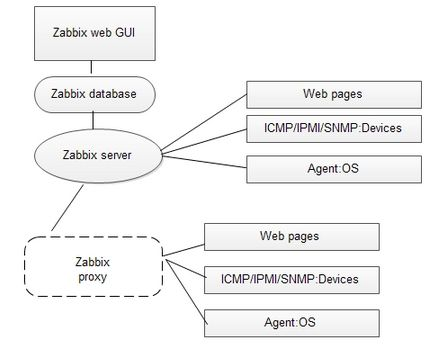
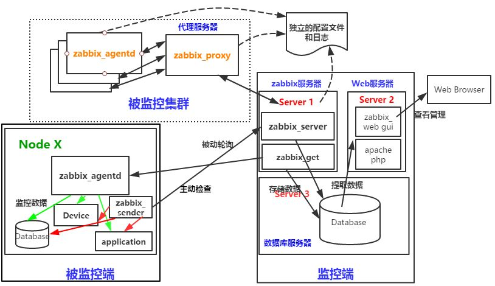
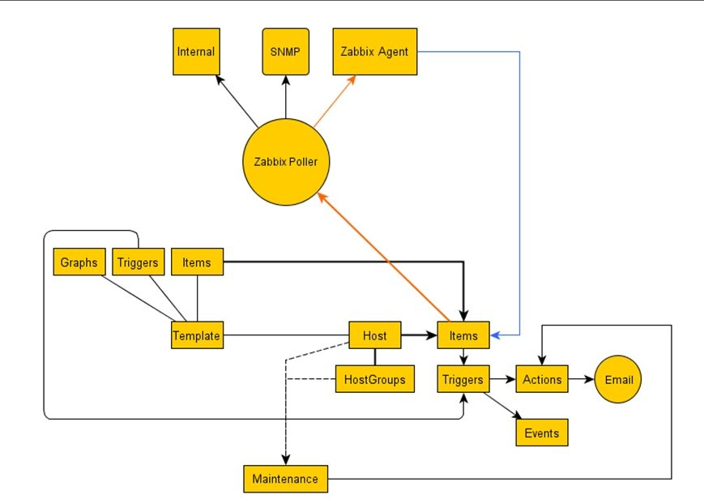

# 33.2 zabbix安装与入门
前面我们对一个完整的监控系统包含的内容做了一个简单概述，各种监控系统的开源实现无非都是围绕我们介绍的内容展开。在监控系统的众多实现中 zabbix 最为常见，功能也最为强大，本节我们首先对 zabbix 做个详细介绍，内容包括:
1. zabbix 的框架与组成
2. zabbix 的安装和配置

## 1. zabbix
[zabbix](https://www.zabbix.com/download) 当前长期维护的版本有三个，2.2，3.0，4.0，本节我们就以3.0 为例来讲解。

### 1.1 zabbix 特性
zabbix 支持以下特性:
1. 数据采样: snmp, agent, ipmi, jmv
2. 报警升级功能
3. 数据存储: mysql, pgsql
4. 展示: php 程序，实时绘图，支持
5. 支持模板:
6. 支持网络主机自动发现
7. 通过监控代理，支持分布式监控
8. 支持二次开发

### 1.2 zabbix 系统架构


#### agent 监控模式


数据采集的有两种方式:
1. 被动模式: zabbix server 向 zabbix agent pull 数据
2. 主动模式: zabbix agent 主动向 zabbix server push 数据

### 1.3 zabbix 逻辑组件



## 2. zabbix 安装配置
### 2.1 zabbix serve 安装配置
默认的 epel 在配置 zabbix 过程中出现了问题，因此需要为 zabbix 配置 yum 源。参考 [zabbix document](https://www.zabbix.com/download?zabbix=3.4&os_distribution=centos&os_version=7&db=MySQL)

```
# 1. zabbix database - mysql
## 1.1 安装配置 mysql
yum install mariadb-server
vim /etc/my.cnf
 [mysqld]
 skip_name_resolve = ON
 innodb_file_per_table = ON

systemctl start mariadb-server
systemctl enabled mariadb-server

mysql_secure_installation

### 1.2 为 zabbix 创建 mysql 用户
mysql -uroot -p1234
> create database zabbix character set utf8 collate utf8_bin;
> grant all on zabbix.* to 'zabbix'@'192.168.%.%' identified by 'zbxpass';
> grant all on zabbix.* to 'zabbix'@'127.0.0.1' identified by 'zbxpass';
> flush privileges;

# 2. zabbix server
## 2.1 配置 zabbix yum 源
rpm -i http://repo.zabbix.com/zabbix/3.0/rhel/7/x86_64/zabbix-release-3.0-1.el7.noarch.rpm

## 2.2 安装 zabbix server
$ yum list zabbix-*

已安装的软件包
zabbix-release.noarch                 3.0-1.el7              installed
可安装的软件包
zabbix-agent.x86_643.0.22-1.el7           zabbix   
zabbix-get.x86_64  3.0.22-1.el7           zabbix   
zabbix-java-gateway.x86_64            3.0.22-1.el7           zabbix   
zabbix-proxy-mysql.x86_64             3.0.22-1.el7           zabbix   
zabbix-proxy-pgsql.x86_64             3.0.22-1.el7           zabbix   
zabbix-proxy-sqlite3.x86_64           3.0.22-1.el7           zabbix   
zabbix-sender.x86_64                  3.0.22-1.el7           zabbix   
zabbix-server-mysql.x86_64            3.0.22-1.el7           zabbix   
zabbix-server-pgsql.x86_64            3.0.22-1.el7           zabbix   
zabbix-web.noarch  3.0.22-1.el7           zabbix   
zabbix-web-japanese.noarch            3.0.22-1.el7           zabbix   
zabbix-web-mysql.noarch               3.0.22-1.el7           zabbix   
zabbix-web-pgsql.noarch               3.0.22-1.el7           zabbix

yum install zabbix-server-mysql.x86_64

$ rpm -ql zabbix-server-mysql.x86_64
/etc/zabbix/zabbix_server.conf                  # zabbix server 配置文件
/usr/lib/systemd/system/zabbix-server.service   # unit file
/usr/lib/zabbix/alertscripts
/usr/lib/zabbix/externalscripts
/usr/sbin/zabbix_server_mysql
/usr/share/doc/zabbix-server-mysql-3.0.22
/usr/share/doc/zabbix-server-mysql-3.0.22/create.sql.gz  # zabbix 数据库初始化


## 2.3 导入数据库脚本生成数据库环境
gzip -d /usr/share/doc/zabbix-server-mysql-3.0.22/create.sql -c >>/root/create.sql
mysql -uroot -p1234  zabbix <  /root/create.sql

## 2.4 zabbix serve 配置启动
$ grep ^##### /etc/zabbix/zabbix_server.conf
############ GENERAL PARAMETERS #################
############ ADVANCED PARAMETERS ################
####### LOADABLE MODULES #######
####### TLS-RELATED PARAMETERS #######

SourceIP=192.168.1.106
LogFile=/var/log/zabbix/zabbix_server.log
LogFileSize=0
PidFile=/var/run/zabbix/zabbix_server.pid
DBHost=192.168.1.106
DBName=zabbix
DBUser=zabbix
DBPassword=zbxpass
SNMPTrapperFile=/var/log/snmptrap/snmptrap.log
Timeout=4
AlertScriptsPath=/usr/lib/zabbix/alertscripts
ExternalScripts=/usr/lib/zabbix/externalscripts
LogSlowQueries=3000

## 2.5 服务启动
systemctl start zabbix-server

# 3. 安装 zabbix web gui
## 3.1 安装 lamp 以及 zabbix web
yum install zabbix-web.noarch zabbix-web-mysql.noarch
yum install httpd php php-mysql php-mbstring php-gd php-bcmath php-ldap php-xml -y

## 3.2 zabbix web httpd 配置文件
rpm -ql zabbix-web
/etc/httpd/conf.d/zabbix.conf
/etc/zabbix/web   # web 根目录

vim /etc/httpd/conf.d/zabbix.conf
 php_value date.timezone Asia/ShangHai # 根改时区

## 3.3 启动 httpd
systemctl start httpd

## 3.4 web  初始化
http://192.168.1.106/zabbix/setup.php

## 3.5 初始化生成的配置文件位于
/etc/zabbix/web/zabbix.conf.php

## 3.6 登陆，初始化的帐号: Admin 密码: zabbix
## 密码保存在 mysql zabbix.users 中
## select * from zabbix.users
```

## 2.2 zabbix agent 配置
```
# 1. 安装
yum install zabbix-sender.x86_64 zabbix-agent.x86_64 -y

# 2. 配置
$ rpm -ql zabbix-agent
/etc/logrotate.d/zabbix-agent
/etc/zabbix/zabbix_agentd.conf                  # agent 配置文件
/etc/zabbix/zabbix_agentd.d
/etc/zabbix/zabbix_agentd.d/userparameter_mysql.conf
/usr/lib/systemd/system/zabbix-agent.service    # unit file
/usr/lib/tmpfiles.d/zabbix-agent.conf
/usr/sbin/zabbix_agentd

$ grep -i "^####" /etc/zabbix/zabbix_agentd.conf
############ GENERAL PARAMETERS #################
##### Passive checks related    # 被动监控配置项
##### Active checks related     # 主动监控配置
############ ADVANCED PARAMETERS #################
####### USER-DEFINED MONITORED PARAMETERS ####### # 用户自定义的监控参数 UserParamter
####### LOADABLE MODULES #######
####### TLS-RELATED PARAMETERS #######

##### Passive checks related
Server=IP1,IP2... # 访问控制授权，允许哪些主机过来采集数据
ListenIP=0.0.0.0
StartAgents=3

##### Active checks related
ServerActive=IP1,IP2...  # 主动报告的目标主机地址
Hostname=node1           # 当前被监控主机在 zabbix 中的 id

# 3. 启动服务
systemctl start zabbix-agent
```

## 3. 监控配置
在 zabbix 中快速配置一个监控需要按照如下顺序:
1. 监控配置: `host group--> host--> application--> item-->trriger--->action(conditons, operations)`
2. 展示配置:
  - `item --> simple graph`
  - `items --> graphs ---> screen --> slide show`

每一个监控项 item 对应着一个 item key，其代表了在被检控主机上要执行的命令。


### 3.1 zabbix 监控测试
```
yum install zabbix-get.x86_64
zabbix_get -s 192.168.1.155 -k "system.cpu.switches"
```
