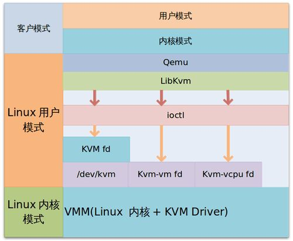
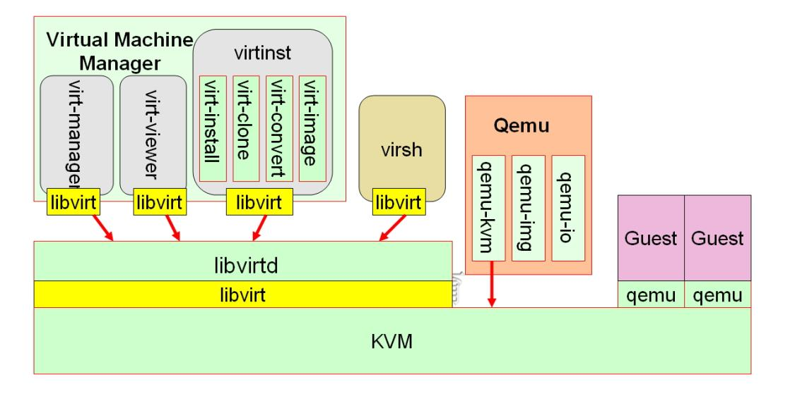

# 44.2 KVM 入门
KVM 属于主机虚拟化实现的解决方案之一，本节我们就来学习 kvm 虚拟化的原理以及如何使用 KVM 生成和管理虚拟机。

## 1. KVM 简介
### 1.1 KVM 架构图


KVM由两部分组成
- `(kvm.ko)/dev/kvm`：工作为hypervisor，在用户空间可通过系统调用ioctl()与内核中的kvm模块交互，从而完成虚拟机的创建、启动、停止、删除等各种管理功能；
- `qemu-kvm` 进程：工作于用户空间，用于实现IO设备模拟；用于实现一个虚拟机实例；

KVM 只能模拟 CPU和内存，不能模拟 I/O 设置。因此虚拟机中的IO设备，必须通过用户空间的 `qemu-kvm` 进行模拟。

IO 设备的虚拟化有三种方式，完全虚拟化，半虚拟化，IO透传。qemu是 完全虚拟化的解决方案，但是完全虚拟化的效率不高，因此红帽联合了其他产商开发了 virtio 这种半虚拟化技术，用于模拟各种 IO设备。

需要注意的是 KVM 支持 x86 平台，且要求 CPU 必须支持硬件虚拟化。


### 1.2 KVM 管理工具


kvm 有两套工具栈:
1. kvm 的原生工具栈: qemu，任何其他辅助的管理工具必须以此为基础
	- qemu-kvm: IO 模拟，并将虚拟机实例运行为一个进程
	- qemu-img: 磁盘映像文件管理(虚拟机的硬盘)
	- qemu-io: 对虚拟机磁盘设备文件使用的统计
2. libvirt 家族
	- GUI：
		- virt-manager: 虚拟机管理工具
		- virt-viewer: 虚拟机查看器
		- virtinst: virt-manager 配套的命令工具
	- CLI:
		- virsh: 管理和查看虚拟的统一命令行工具

libvirt 是 C/S服务，要想使用必须先安装和启动 libvirtd			

## 2. KVM  安装配置
### 2.1 KVM 安装
```
# 1. 确保CPU支持HVM
grep -E --color=auto "(vmx|svm)" /proc/cpuinfo
# 2. 装载模块
modprobe kvm
modprobe kvm-intel
# 3. 验正：
/dev/kvm
```

### 2.2 KVM管理工具栈安装：
```
yum install libvirt libvirt-daemon-kvm qemu-kvm virt-manager

rpm -ql  qemu-kvm
ln -sv /usr/libexec/qemu-kvm  /bin/qemu-kvm
```          

### 2.3 使用 libvirt 创建虚拟机
我们可以 qemu 提供的原生工具 qemu-kvm 创建和管理虚拟机，也可以使用更高级的 libvirt。下面是使用 libvirt 创建虚拟机的一个简单示例。

```
# 1. kvm 依赖硬件虚拟化，在使用前，需要检查CPU是否支持硬件虚拟化
grep -E -i "(svm|vmx)" /proc/cpuinfo

# 2. 安装 kvm
yum install libvirt libvirt-daemon-kvm qemu-kvm virt-manager
modprobe kvm
lsmod|grep kvm
ls /dev/kvm

# 3. 启动 libvirtd 服务
systemctl start libvirtd.service

# 4. IO虚拟化: 半虚拟化 - 创建网桥(交换机)
# virsh iface-bridge INTERFACE BRIDGE_NAME
# virt-manager
```

运行中的一个kvm虚拟机就是一个qemu-kvm进程，运行qemu-kvm程序并传递给它合适的选项及参数即能完成虚拟机启动，终止此进程即能关闭虚拟机；
