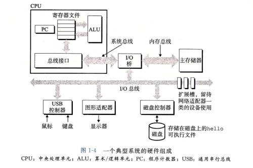

# 44.1 虚拟化技术概述
虚拟化涉及到很多的硬件和操作系统知识，而本文的目的是希望带你搞明白虚拟化是怎么在现有的计算机架构上构建起来了。虚拟化技术只是对当前操作系统管理硬件资源的一种更高层次的抽象，因此想弄清楚虚拟化技术的实现必须先明白现代操作系统。

## 1. 现代操作系统
### 1.1 计算的组成

### 1.2 现代操作系统组成概述
1. 计算由五大部件组成，这些就是组成计算机的硬件资源，包括CPU，内存，各种 I/O 设备
2. 操作系统的目的就是为管理和使用这些硬件资源提供统一的接口
3. 为了实现一个多任务系统，操作系统本身就对计算机的硬件资源进行的抽象，将CPU抽象为时间片，将内存抽象成虚拟地址空间，将磁盘抽象为文件系统等等，从而让多个应用程序能同时执行在一组硬件之上而互不影响。
4. 为了防止应用程序在运行时破坏操作系统的执行，CPU 按照指令的权限划分为多个环，内存被划分为用户空间和内核空间，操作系统位于 CPU环 0 上，用于执行管理硬件的特权操作，操作系统所在的内存称为内核空间，用户空间的应用程序无法访问到。

如果你不了解操作系统，上述的描述显然不能帮你建立对操作系统的整体认识，建议你读一读《操作系统》，这些都是计算机的底层知识，当你深入学习时都是必须知道。

虚拟化技术所实现的就是对操作系统不同层级的“模拟”
1. 主机级虚拟化: 对整个操作系统的模拟，从而在一组硬件上运行多个彼此隔离的操作系统
2. 容器级虚拟化: 对用户空间的模拟，多个用户空间彼此隔离，但是公用同一个内核空间

虚拟化之所以有不同的实现层级，是对虚拟化技术执行效率的考虑。模拟的层次越高，程序执行的中间层就越多效率越低。虚拟化技术的发展就是不断优化虚拟化执行效率以及虚拟化管理效率效率。

## 2. 虚拟化的硬件优化
在 x86 系统设计之初起始并没有虚拟化的实现需求，为提高虚拟化执行的效率，在硬件层级上也在不断优化。但是要想说清楚现在有哪些硬件优化，以及优化的方式，我们就得深入了解每个计算机每个硬件，显然一篇文章根本没法说清楚。因此这里就不在阐述，想要知道大家可以查阅其他资料。

CPU 中的虚拟化技术:
- AMD-V
- INTEL-VT

I/O:
- 完全性虚拟化: 虚拟机的操作系统位于模拟的环 0 上
- 半虚拟化: 虚拟机的操作系统知道自己运行在虚拟化技术上，从而将部分内核功能直接由硬件上的宿主机操作系统来提供
- I/O 透传

## 3. 虚拟化技术类型
- 主机类型虚拟化
	1. 一型虚拟化: 没有位于硬件之上的宿主操作系统，位于硬件上的是虚拟机软件(hyppervisor)，由hyppervisor创建和管理虚拟机
	2. 二型虚拟化: 在硬件之上存在一个操作系统，称为宿主机，并且宿主机上存在一个专门管理和创建虚拟的软件(VMM),常见的 VirtualBox， VMWare 都属于 二型虚拟化
- 容器级虚拟化: 
	- 只虚拟化出用户空间，而没有虚拟化内核空间，一个内核上存在多个用户空间，每个虚拟出的内核空间为一个容器。特点是隔离性没那么好，但是性能损失很少
- 库级别虚拟化: 
	- 没有虚拟化任何东西，只是额外提供了程序运行的所需的额外库，比如wine
- 程序级虚拟化: java 虚拟机

### 3.1 主机虚拟化
主机虚拟化：
	CPU：
		模拟：emulation, 虚拟机的arch与物理平台的arch可以不相同；qemu；
		虚拟：virtualization
			完全虚拟化（full-virt）
				BT: 二进制转换 （软件）
				HVM：硬件辅助的虚拟化（硬件）
			半(准)虚拟化 (para-virt)
				GuestOS得明确知道自己运行于虚拟化技术

	内存：
		MMU virtualization：
			Intel: EPT, Extended Page Table
			AMD: NPT, Nested Page Table

		TLB virtualization：
			tagged TLB

	IO：
		Emulation
		Para-virtualization
		IO-through：IO透传

主机虚拟化的类型：
	TYPE-I：
		于硬件级别直接运行hypervisor；
		xen, vmware ESX/ESXI
	TYPE-II:
		于硬件级别运行一个OS（Host OS），而此OS上运行一个VMM；
		vmware workstation, virtualbox, kvm

Linux目前流行的开源虚拟化技术解决方案：
	主机虚拟化：xen, kvm, virtualbox
	容器级：lxc, libcontainer, runC, openvz
	模拟器：qemu
