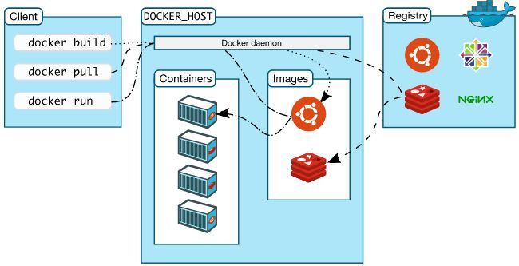
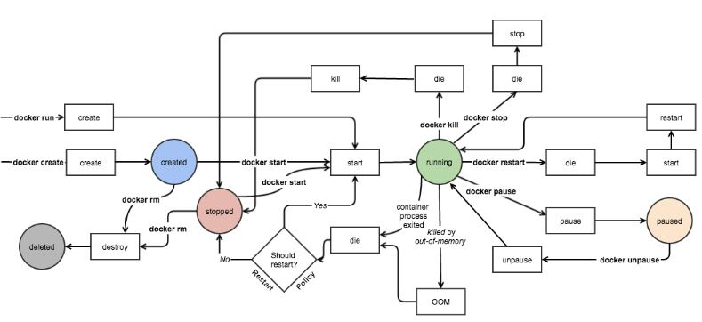

# 45.1 docker 安装与使用入门


## 1. docker 简介
### 1.1 docker 架构

C/S 架构的服务，restful 风格的 api 接口。

#### register
一个应用程序
1. 镜像存储的仓库
	- 一个 register 有多个仓库，一个仓库只放一个应用程序，包含一个应用的多个版本
	- 镜像标识: 仓库名:标签，eg: nginx:1.10
2. 用户认证
3. 当前可用镜像的索引


### 1.2 docker 安装
#### 依赖环境
- 64 bits CPU
- Linux Kernel 3.10+
- Linux Kernel cgroups and namespaces

#### 安装
```
# 1. 配置 yum 源
sudo yum-config-manager --add-repo https://download.docker.com/linux/centos/docker-ce.repo

sudo yum-config-manager --enable docker-ce-edge
sudo yum-config-manager --enable docker-ce-test

# 2. 安装
yum install docker-ce

# 3. 配置镜像加速器 -- 去阿里云申请，这里是我的
sudo mkdir -p /etc/docker
sudo tee /etc/docker/daemon.json <<-'EOF'
{
  "registry-mirrors": ["https://oaafakad.mirror.aliyuncs.com"]
}
EOF

# 4. 启动服务
sudo systemctl daemon-reload
sudo systemctl restart docker

# 5. 测试安装
docker info
docker version
```


## 2. docker 使用入门
docker 有多个对象，对每个对象支持增删改查。常用的对象包括 images,containers, networks, volumes, plugins


`docker [OPTIONS] Management COMMAND`
- 作用: docker 管理
- 参数:
	- `Management`: docker 内可管理的对象
	- `COMMAND`: 每个可管理对象能执行的操作
- 选项:
	-
#### Management
`Management`: docker 内可管理的对象
- `builder`:     Manage builds
- `config`:      Manage Docker configs
- `container`   Manage containers
- `engine`:      Manage the docker engine
- `image`:  Manage images
- `network`:     Manage networks
- `node`:        Manage Swarm nodes
- `plugin`:      Manage plugins
- `secret`:      Manage Docker secrets
- `service`:     Manage services
- `stack`:       Manage Docker stacks
- `swarm`:       Manage Swarm
- `system`:      Manage Docker
- `trust`:       Manage trust on Docker images
- `volume`:      Manage volumes

## 2.1 images 管理
`docker image COMMAND`
- 作用: 管理 docker 镜像
- `Commands`:
    - `build`:       Build an image from a Dockerfile
    - `history`:     Show the history of an image
    - `import`:      Import the contents from a tarball to create a filesystem image
    - `inspect`:     Display detailed information on one or more images
    - `load`:        Load an image from a tar archive or STDIN
    - `ls`:          List images
    - `prune`:       Remove unused images
    - `pull`:        Pull an image or a repository from a registry
    - `push`:        Push an image or a repository to a registry
    - `rm`:          Remove one or more images
    - `save`:        Save one or more images to a tar archive (streamed to STDOUT by default)
    - `tag`:         Create a tag TARGET_IMAGE that refers to SOURCE_IMAGE

```
docker image pull busybox
```

### 2.2 container 管理
`docker container COMMAND`
- 作用: 容器管理
- `Commands`:
    - `attach`:      Attach local standard input, output, and error streams to a running container
    - `commit`:      Create a new image from a container's changes
    - `cp`:          Copy files/folders between a container and the local filesystem
    - `create`:      Create a new container
    - `diff`:        Inspect changes to files or directories on a container's filesystem
    - `exec`:        Run a command in a running container
    - `export`:      Export a container's filesystem as a tar archive
    - `inspect`:     Display detailed information on one or more containers
    - `kill`:        Kill one or more running containers
    - `logs`:        Fetch the logs of a container
    - `ls`:          List containers
    - `pause`:       Pause all processes within one or more containers
    - `port`:        List port mappings or a specific mapping for the container
    - `prune`:       Remove all stopped containers
    - `rename`:      Rename a container
    - `restart`:     Restart one or more containers
    - `rm`:          Remove one or more containers
    - `run`:         Run a command in a new container
    - `start`:       Start one or more stopped containers
    - `stats`:       Display a live stream of container(s) resource usage statistics
    - `stop`:        Stop one or more running containers
    - `top`:         Display the running processes of a container
    - `unpause`:     Unpause all processes within one or more containers
    - `update`:      Update configuration of one or more containers
    - `wait`:        Block until one or more containers stop, then print their exit codes

```
docker container ls
# 启动一个 busybox
docker container run --name b1 -it busybox:latest

docker ps
CONTAINER ID   IMAGE     COMMAND        CREATED    STATUS    PORTS     NAMES
37a58b795cab   busybox:latest      "sh"      About a minute ago   Up About a minute        b1

docker inspect b1

docker ps -a
docker start -ai b1

docker container rm b1

# 启动一个 nginx
docker container run --name nginx -d nginx

docker ps
CONTAINER ID   IMAGE     COMMAND        CREATED        STATUS    PORTS     NAMES
b3073b9901fc   nginx     "nginx -g 'daemon of…"   5 seconds ago  Up 4 seconds   80/tcp    nginx
# 说明: nginx 在容器内必需不能运行为后台进程，否则容器会任务当前容器没有进程而自动停止

# 进入 nginx 容器
docker container exec -it nginx /bin/bash

# 查看 nginx 日志
docker container logs nginx  # nginx 运行为前台，所以日志保存在终端  
```

#### docker container run
`docker container run [OPTIONS] IMAGE [COMMAND] [ARG...]`
- 作用: 创建并运行一个容器
- 参数:
- 选项:
	- `-t, --tty`: 附加一个终端
	- `-i`: 交互式访问
	- `--name`: 容器名称
	- `--network`: 容器被添加到的网络，默认添加到 `bridge`
	- `--rm`: 容器一旦停止自动删除
	- `-d, --detach`: 剥离容器与当前终端的联系

### 2.3 network 管理
`docker network COMMAND`
- 作用: 创建和管理虚拟网络
